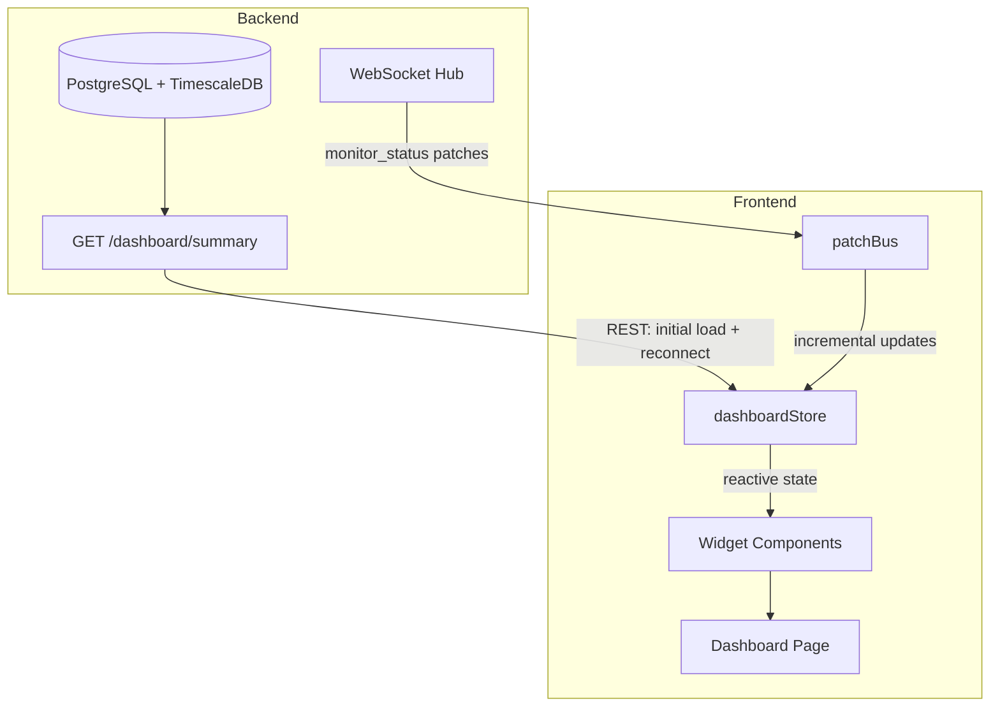
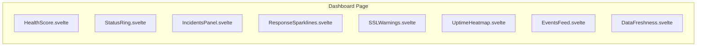
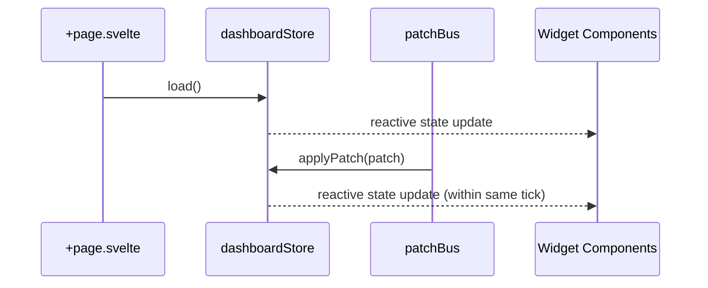

# Design Document: Dashboard Refactor

## Overview

This design transforms the Dashboard page (`/`) from a redundant monitor list into an operational health overview. The new Dashboard answers "is everything OK right now?" through aggregated signals — a global health score, status distribution ring, active incidents, response time trends, SSL warnings, an uptime heatmap, and a real-time events feed.

The Dashboard consumes data from a **new aggregate endpoint** (`GET /api/v1/dashboard/summary`) to avoid N+1 per-monitor API calls. Real-time updates flow through the existing WebSocket `monitor_status` patches and the `patchBus` for widget-level reactivity.

**Key design decision**: Introduce a dedicated backend endpoint that pre-aggregates stats, rather than calling per-monitor endpoints client-side. At 500+ monitors, N+1 calls to `/monitors/{id}/stats` would generate 500+ HTTP requests on every page load — unacceptable for both latency and server load.

## Architecture

### High-Level Data Flow



### Widget Architecture

Each widget is an isolated Svelte 5 component with:
- Its own loading/error/ready states (error isolation per Requirement 8.4)
- Reactive derivation from `dashboardStore` state
- No direct API calls — all data flows through the store layer



### Data Strategy: Hybrid REST + WebSocket

1. **Initial load**: Single `GET /dashboard/summary` returns all widget data in one response
2. **Real-time updates**: WebSocket `monitor_status` patches update `dashboardStore` incrementally
3. **Reconnection recovery**: On WS reconnect, re-fetch `/dashboard/summary` and replace local state (Requirement 9.2)
4. **Sparkline history**: Fetched separately via existing `GET /monitors/{id}/history?step=900` for the top-5 monitors identified in the summary response

## Components and Interfaces

### New Backend Endpoint

```
GET /api/v1/dashboard/summary
Authorization: Bearer <token>

Response 200:
{
  "health_score": {
    "uptime_percent": 99.95,
    "active_monitor_count": 47,
    "partial_data": false
  },
  "status_distribution": {
    "up": 45,
    "down": 1,
    "unknown": 1,
    "total": 47
  },
  "active_incidents": [
    {
      "monitor_id": "uuid",
      "monitor_name": "API Gateway",
      "started_at": "2024-01-15T10:30:00Z",
      "cause": "Connection refused on port 443",
      "state": "down"
    }
  ],
  "top_latency_monitors": [
    {
      "monitor_id": "uuid",
      "monitor_name": "Payment Service",
      "avg_latency_ms": 342
    }
  ],
  "ssl_expiry": [
    {
      "monitor_id": "uuid",
      "monitor_name": "Main Site",
      "days_remaining": 12,
      "expires_at": "2024-02-01T00:00:00Z"
    }
  ],
  "heatmap": [
    {
      "hour_start": "2024-01-15T00:00:00Z",
      "up_count": 47,
      "down_count": 0,
      "unknown_count": 0
    }
  ],
  "recent_events": [
    {
      "monitor_id": "uuid",
      "monitor_name": "DB Replica",
      "from_state": "up",
      "to_state": "down",
      "occurred_at": "2024-01-15T14:22:00Z"
    }
  ],
  "generated_at": "2024-01-15T14:30:00Z"
}
```

### New Frontend Store: `dashboardStore`

**Path**: `frontend/src/lib/stores/dashboard.svelte.ts`

```typescript
interface DashboardState {
  healthScore: HealthScoreData | null;
  statusDistribution: StatusDistribution | null;
  activeIncidents: ActiveIncident[];
  topLatencyMonitors: TopLatencyMonitor[];
  sslExpiry: SSLExpiryEntry[];
  heatmap: HeatmapHour[];
  recentEvents: RecentEvent[];
  lastUpdated: Date | null;
  widgetErrors: Map<WidgetId, string>;
  widgetLoading: Map<WidgetId, boolean>;
}
```

The store provides:
- `load()` — fetches `/dashboard/summary` and populates state
- `applyPatch(patch: MonitorPatch)` — incrementally updates health score, status distribution, incidents panel, and events feed from a WebSocket patch
- `markStale()` / `clearStale()` — staleness indicator management
- Per-widget error/loading state for isolated error handling

### New Svelte Components

| Component | Path | Responsibility |
|-----------|------|----------------|
| `HealthScore.svelte` | `components/dashboard/` | Displays percentage with stepped color |
| `StatusRing.svelte` | `components/dashboard/` | SVG donut with ARIA labels |
| `IncidentsPanel.svelte` | `components/dashboard/` | Active incidents list with live duration |
| `ResponseSparklines.svelte` | `components/dashboard/` | Top-5 latency charts using canvas |
| `SSLWarnings.svelte` | `components/dashboard/` | Certificate expiry list |
| `UptimeHeatmap.svelte` | `components/dashboard/` | 24-block hourly heatmap |
| `EventsFeed.svelte` | `components/dashboard/` | Recent state transitions |
| `DataFreshness.svelte` | `components/dashboard/` | "Last updated" + stale indicator |
| `WidgetShell.svelte` | `components/dashboard/` | Shared loading/error/retry wrapper |

### Widget Communication Pattern



## Data Models

### Frontend Types (`frontend/src/lib/types.ts` additions)

```typescript
/** Dashboard summary response from GET /dashboard/summary */
export interface DashboardSummary {
  health_score: HealthScoreData;
  status_distribution: StatusDistribution;
  active_incidents: ActiveIncident[];
  top_latency_monitors: TopLatencyMonitor[];
  ssl_expiry: SSLExpiryEntry[];
  heatmap: HeatmapHour[];
  recent_events: RecentEvent[];
  generated_at: string;
}

export interface HealthScoreData {
  uptime_percent: number;
  active_monitor_count: number;
  partial_data: boolean;
}

export interface StatusDistribution {
  up: number;
  down: number;
  unknown: number;
  total: number;
}

export interface ActiveIncident {
  monitor_id: string;
  monitor_name: string;
  started_at: string;
  cause: string | null;
  state: 'down';
}

export interface TopLatencyMonitor {
  monitor_id: string;
  monitor_name: string;
  avg_latency_ms: number;
}

export interface SSLExpiryEntry {
  monitor_id: string;
  monitor_name: string;
  days_remaining: number;
  expires_at: string;
}

export interface HeatmapHour {
  hour_start: string;
  up_count: number;
  down_count: number;
  unknown_count: number;
}

export interface RecentEvent {
  monitor_id: string;
  monitor_name: string;
  from_state: 'up' | 'down' | 'unknown';
  to_state: 'up' | 'down' | 'unknown';
  occurred_at: string;
}

export type WidgetId =
  | 'health-score'
  | 'status-ring'
  | 'incidents'
  | 'sparklines'
  | 'ssl-expiry'
  | 'heatmap'
  | 'events-feed';
```

### Backend Query (Go + sqlc)

The `/dashboard/summary` endpoint executes a single composite query or a small set of queries against PostgreSQL:

1. **Health score + distribution**: `SELECT state, COUNT(*) FROM monitors WHERE status='active' GROUP BY state` combined with `SELECT AVG(uptime_percent) FROM monitor_stats_24h WHERE monitor_id IN (active monitors)`
2. **Active incidents**: `SELECT m.name, i.started_at, i.cause FROM incidents i JOIN monitors m ON ... WHERE i.resolved_at IS NULL ORDER BY i.started_at ASC LIMIT 10`
3. **Top latency**: `SELECT monitor_id, monitor_name, avg_latency_ms FROM monitor_stats_24h ORDER BY avg_latency_ms DESC NULLS LAST LIMIT 5`
4. **SSL expiry**: `SELECT monitor_id, monitor_name, ssl_days_remaining, ssl_expires_at FROM monitor_stats WHERE ssl_days_remaining <= 30 ORDER BY ssl_days_remaining ASC`
5. **Heatmap**: TimescaleDB `time_bucket('1 hour', checked_at)` aggregation over last 24h
6. **Recent events**: `SELECT * FROM incidents ORDER BY started_at DESC LIMIT 10` (including resolved ones for transitions)

All queries run in parallel with `errgroup` and results are assembled into the response struct.

## Correctness Properties

*A property is a characteristic or behavior that should hold true across all valid executions of a system — essentially, a formal statement about what the system should do. Properties serve as the bridge between human-readable specifications and machine-verifiable correctness guarantees.*

### Property 1: Health score is correct average

*For any* non-empty array of active monitors with `uptime_percent` values in range [0, 100], the computed health score SHALL equal the arithmetic mean of those values rounded to exactly two decimal places.

**Validates: Requirements 1.1**

### Property 2: Health score color mapping follows stepped thresholds

*For any* health score percentage value in range [0, 100], the color function SHALL return `--color-success` when value >= 99, `--color-warning` when value >= 95 and < 99, and `--color-error` when value < 95.

**Validates: Requirements 1.2**

### Property 3: Partial data health score uses only successful monitors

*For any* set of monitors where a subset has successfully retrieved stats and the remainder has failed, the health score SHALL be computed exclusively from the successful subset's uptime values, and the `partial_data` flag SHALL be true when the failed subset is non-empty.

**Validates: Requirements 1.5**

### Property 4: Status ring arc angles are proportional and sum to 360°

*For any* distribution of monitors across states (up, down, unknown) where total > 0, each state's arc angle SHALL equal `(state_count / total_count) × 360` degrees, and all arc angles SHALL sum to exactly 360 degrees.

**Validates: Requirements 2.1, 2.4, 2.6**

### Property 5: Status ring ARIA label describes all states and counts

*For any* non-zero distribution of monitors across states, the rendered ARIA label string SHALL contain each state name that has a non-zero count paired with its numeric count value.

**Validates: Requirements 2.7**

### Property 6: Incident cause truncation preserves content within limit

*For any* cause string, if its length exceeds 120 characters the displayed value SHALL be the first 120 characters followed by an ellipsis ("…"), and if its length is 120 or fewer the displayed value SHALL equal the original string unchanged.

**Validates: Requirements 3.1**

### Property 7: Incidents ordered by duration descending with name tiebreaker

*For any* list of active incidents, the displayed order SHALL satisfy: for every adjacent pair (a, b), either duration(a) > duration(b), or duration(a) == duration(b) and name(a) <= name(b) alphabetically.

**Validates: Requirements 3.3**

### Property 8: Incidents panel capped at 10 entries with overflow count

*For any* list of N active incidents where N > 0, the displayed list SHALL contain min(N, 10) entries, and when N > 10 the component SHALL display a summary showing the total count N.

**Validates: Requirements 3.6**

### Property 9: Top-5 latency selection picks highest non-null values in descending order

*For any* set of monitors with varying `avg_latency_ms` values (some null, some non-null), the sparkline selection SHALL contain at most 5 monitors, all with non-null latency, ordered by latency descending, and these SHALL be the highest-latency monitors available.

**Validates: Requirements 4.1, 4.4, 4.5, 4.6**

### Property 10: Sparkline entry formatting applies truncation and integer suffix

*For any* monitor name string and `avg_latency_ms` float, the displayed name SHALL be truncated to 40 characters with ellipsis if longer, and the latency SHALL be displayed as a rounded integer followed by " ms".

**Validates: Requirements 4.2**

### Property 11: SSL expiry filter includes only monitors with days_remaining <= 30

*For any* set of monitors with varying `ssl_days_remaining` values (including null/absent), the SSL warnings list SHALL contain exactly those monitors where `ssl_days_remaining` is present and <= 30.

**Validates: Requirements 5.1, 5.7**

### Property 12: SSL entries ordered by days remaining ascending with name tiebreaker

*For any* list of SSL expiry entries, the displayed order SHALL satisfy: for every adjacent pair (a, b), either days_remaining(a) < days_remaining(b), or days_remaining(a) == days_remaining(b) and name(a) <= name(b) alphabetically.

**Validates: Requirements 5.3**

### Property 13: SSL urgency tier correctly categorizes days remaining

*For any* `days_remaining` integer value, the urgency tier SHALL be "expired" (red) when value <= 0, "critical" (red) when value is 1–7, and "warning" (amber) when value is 8–30.

**Validates: Requirements 5.5**

### Property 14: Heatmap always produces exactly 24 hourly blocks

*For any* heatmap data (including empty arrays, partial data, or full 24-entry arrays), the rendered heatmap SHALL produce exactly 24 blocks representing consecutive hours.

**Validates: Requirements 6.1**

### Property 15: Heatmap block color follows worst-state priority

*For any* hourly block with counts (up_count, down_count, unknown_count), the color SHALL be red if down_count > 0, amber if unknown_count > 0 and down_count == 0, green if up_count > 0 and down_count == 0 and unknown_count == 0, and grey if all counts are 0.

**Validates: Requirements 6.2**

### Property 16: Events feed bounded at 10 in reverse chronological order

*For any* sequence of events (initial + real-time), the displayed list SHALL contain at most 10 entries, ordered by `occurred_at` descending (most recent first). When a new event is added and the list exceeds 10, the oldest event SHALL be removed.

**Validates: Requirements 7.1, 7.3**

### Property 17: Initial events feed filtered to 24-hour window

*For any* set of incident-derived events with varying `occurred_at` timestamps, the initial feed population SHALL include only events whose `occurred_at` is within the last 24 hours from current time, limited to the 10 most recent.

**Validates: Requirements 7.4**

### Property 18: Relative timestamp formatting produces correct human-readable duration

*For any* timestamp in the past relative to "now", the relative format function SHALL produce a string that correctly represents the elapsed duration using appropriate units (seconds, minutes, hours, days) with correct pluralization.

**Validates: Requirements 7.2, 9.3**

### Property 19: Widget error isolation preserves other widgets

*For any* subset of widgets that experience data fetch failures, all remaining widgets SHALL continue to render their data independently and SHALL NOT enter error state due to another widget's failure.

**Validates: Requirements 8.4**

## Error Handling

### Per-Widget Error Isolation

Each widget tracks its own loading/error state via `dashboardStore.widgetErrors` and `dashboardStore.widgetLoading` maps. The `WidgetShell` wrapper component renders:
- **Loading state**: Animated skeleton placeholder (Tailwind `animate-pulse` on grey boxes)
- **Error state**: Error message with the failure reason + a "Retry" button that re-fetches only that widget's data
- **Ready state**: The actual widget content

A widget failure does NOT propagate to sibling widgets. The `load()` function uses `Promise.allSettled()` to fetch all widget data in parallel, handling individual rejections per widget.

### Network and API Errors

| Error Type | Handling |
|-----------|----------|
| `/dashboard/summary` 401 | Redirect to login (existing `apiRequest` behavior) |
| `/dashboard/summary` 500 | All widgets show error state, single retry refetches all |
| `/dashboard/summary` timeout | Same as 500, toast notification via existing `toastStore` |
| Individual history fetch failure (sparklines) | Sparkline widget shows error, other widgets unaffected |
| WebSocket disconnect | `DataFreshness` shows stale indicator after 60s, reconnect recovery refetches all data |

### Graceful Degradation

- If the backend `/dashboard/summary` endpoint is not yet deployed, the Dashboard shows a full-page error with a message suggesting the backend needs updating. No crash or blank screen.
- If a monitor referenced in the summary response has been deleted between the REST fetch and a WebSocket patch, the patch is silently discarded (existing `monitorStore` behavior).

## Testing Strategy

### Unit Tests (Vitest + @testing-library/svelte)

Unit tests cover specific examples and edge cases:
- Empty state rendering (no monitors, no incidents, no events)
- Correct DOM structure (widget order, no MonitorRow presence)
- Loading skeleton display during fetch
- Error state rendering with retry button
- WebSocket patch application triggers reactive updates
- Timer-based updates (duration refresh every 60s, staleness after 60s)
- Locale-specific date formatting for SSL expiry
- Color token usage matches theme (success/warning/error)
- Reconnection recovery triggers full data reload

### Property-Based Tests (Vitest + fast-check)

Property-based tests verify universal correctness properties across many generated inputs. Each property test maps to a Correctness Property above.

**Configuration**:
- Library: `fast-check` (already in use in the project — 218 existing tests include property-based)
- Minimum iterations: 100 per property
- Tag format: `Feature: dashboard-refactor, Property {N}: {title}`

**Properties to implement**:
1. Health score average computation (P1)
2. Health score color threshold mapping (P2)
3. Partial data health score computation (P3)
4. Status ring arc angle proportionality (P4)
5. Status ring ARIA label completeness (P5)
6. Incident cause truncation (P6)
7. Incident ordering invariant (P7)
8. Incidents panel bounded at 10 (P8)
9. Top-5 latency selection (P9)
10. Sparkline entry name/latency formatting (P10)
11. SSL expiry filter correctness (P11)
12. SSL expiry ordering invariant (P12)
13. SSL urgency tier mapping (P13)
14. Heatmap 24-block invariant (P14)
15. Heatmap worst-state coloring (P15)
16. Events feed bounded reverse-chronological (P16)
17. Events feed 24h window filter (P17)
18. Relative timestamp formatting (P18)
19. Widget error isolation (P19)

### Integration Tests

- Full Dashboard render with mocked API responses
- WebSocket patch flow from `patchBus` through `dashboardStore` to widget re-render
- Reconnection scenario: disconnect → reconnect → verify data reload
- Responsive layout at 320px, 768px, and 1280px viewports

### Backend Tests (Go)

- `GET /dashboard/summary` handler returns correct aggregate data
- Parallel query execution with `errgroup` completes within acceptable time
- Partial failures in sub-queries return partial results with appropriate flags
- Authorization check (401 without valid token)

