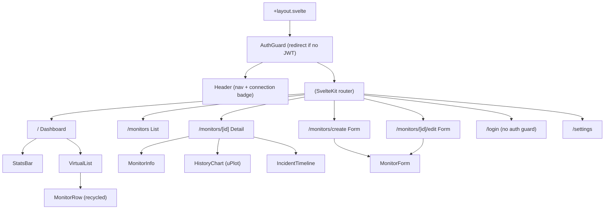
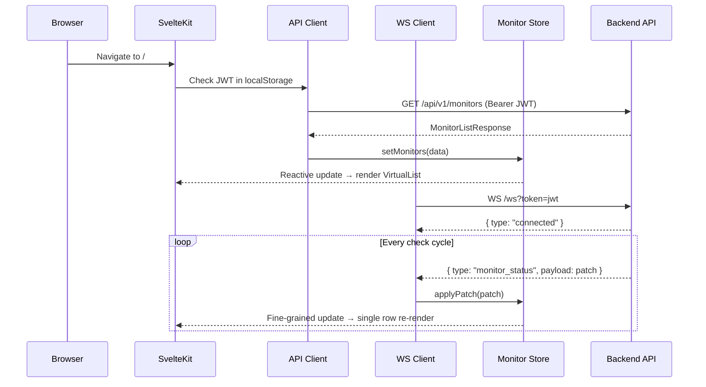
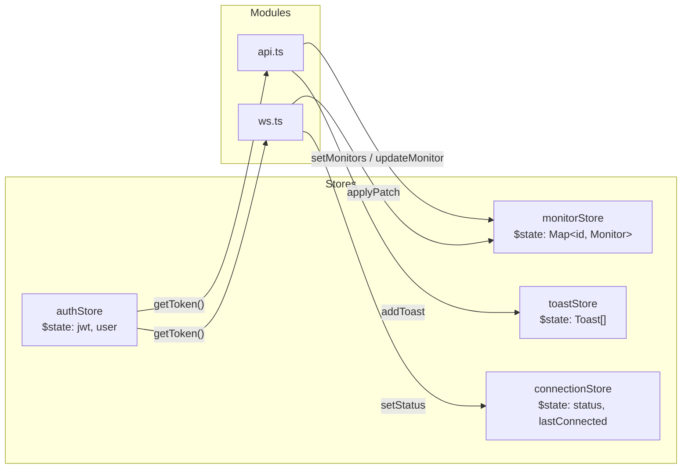

# Design Document: Frontend Product (Milestone G)

## Overview

This design covers the complete Pulse frontend product layer — a static SvelteKit 5 application that provides operators with real-time uptime monitoring through a virtualized dashboard, monitor CRUD forms, detail views with response-time charts, WebSocket-driven live updates, and session management. The frontend is built as a static site (via `@sveltejs/adapter-static`) embedded into the Go binary at compile time.

The architecture prioritizes:
- **Performance at scale**: Virtual list with DOM recycling handles 500+ monitors without frame drops
- **Real-time consistency**: Deterministic patch-merge keeps UI state synchronized with the backend via WebSocket diff payloads
- **Security**: JWT-based session management with route guards; secret values never enter the frontend
- **Resilience**: Exponential backoff reconnection and graceful degradation during connectivity loss

### Key Design Decisions

| Decision | Rationale |
|----------|-----------|
| Custom virtual list (not library) | Svelte 5 reactivity model makes thin wrappers simpler than adapting React-oriented virtualizers; keeps bundle small |
| uPlot for charting | Lightweight (~35KB), GPU-accelerated, handles 1440 points within 200ms render budget |
| Patch-merge in store layer | Deterministic field-level merge avoids full-state re-fetches; matches backend WebSocket protocol |
| localStorage for JWT | SPA with static adapter cannot use httpOnly cookies; token needed for WS query param |
| Svelte 5 runes for stores | `$state` and `$derived` runes replace legacy `writable`/`derived` stores with fine-grained reactivity |

## Architecture

### Component Tree



### Data Flow



### Store Architecture



## Components and Interfaces

### API Client (`frontend/src/lib/api.ts`)

```typescript
export interface ApiError {
  code: string;
  message: string;
}

export interface ApiResponse<T> {
  data: T;
  requestId: string;
}

export interface PaginatedResponse<T> {
  data: T[];
  total: number;
  page: number;
  limit: number;
  total_pages: number;
}

export interface ApiClientConfig {
  baseUrl: string;
  timeout: number; // ms, default 15000
  getToken: () => string | null;
  onUnauthorized: () => void;
  onError: (message: string, requestId: string | null) => void;
}

// Core function — wraps fetch with auth, timeout, error envelope parsing
export async function apiRequest<T>(
  method: string,
  path: string,
  body?: unknown,
  config?: Partial<ApiClientConfig>
): Promise<T>;
```

### WebSocket Client (`frontend/src/lib/ws.ts`)

```typescript
export interface WsClientOptions {
  url: string;           // Built as /ws?token=<jwt>
  onMessage: (msg: WsMessage) => void;
  onStatusChange: (status: ConnectionStatus) => void;
  connectTimeout: number; // ms, default 5000
}

export type ConnectionStatus = 'connecting' | 'connected' | 'disconnected' | 'auth_expired';

export interface WsMessage {
  type: 'connected' | 'monitor_status';
  payload: ConnectedPayload | MonitorStatusPayload;
}

export interface ConnectedPayload {
  client_id: string;
  timestamp: string;
}

export interface MonitorStatusPayload {
  monitor_id: string;
  state: 'up' | 'down' | 'unknown';
  latency_ms: number;
  status_code?: number;
  ssl_days_remaining?: number;
  error?: string;
  checked_at: string;
  timestamp: string;
}

export function createWsClient(options: WsClientOptions): {
  connect: () => void;
  disconnect: (code?: number) => void;
  readonly status: ConnectionStatus;
};
```

### Monitor Store (`frontend/src/lib/stores/monitors.ts`)

```typescript
import type { Monitor } from '$lib/types';

export interface MonitorStoreState {
  monitors: Map<string, Monitor>;
  loading: boolean;
  error: string | null;
}

// Svelte 5 runes-based store
export function createMonitorStore(): {
  // State (reactive via $state)
  readonly monitors: Map<string, Monitor>;
  readonly loading: boolean;
  readonly error: string | null;
  
  // Derived (reactive via $derived)
  readonly list: Monitor[];
  readonly totalCount: number;
  readonly healthyCount: number;
  readonly unhealthyCount: number;
  
  // Actions
  setMonitors: (monitors: Monitor[]) => void;
  applyPatch: (patch: MonitorStatusPayload) => void;
  updateMonitor: (monitor: Monitor) => void;
  removeMonitor: (id: string) => void;
  clear: () => void;
};
```

### Virtual List Component (`frontend/src/components/VirtualList.svelte`)

```typescript
// Props interface
interface VirtualListProps<T> {
  items: T[];
  itemHeight: number;       // Fixed row height in pixels
  bufferCount?: number;     // Buffer rows above/below viewport (default 10, min 5, max 20)
  containerHeight?: number; // Override container height (default: parent height)
}

// Exposed via bind:this
interface VirtualListAPI {
  scrollToIndex: (index: number) => void;
  scrollToTop: () => void;
}
```

### Monitor Form Component (`frontend/src/components/MonitorForm.svelte`)

```typescript
interface MonitorFormProps {
  mode: 'create' | 'edit';
  initialValues?: Partial<MonitorFormValues>;
  onSubmit: (values: MonitorFormValues) => Promise<void>;
  onCancel: () => void;
}

interface MonitorFormValues {
  name: string;
  type: 'http' | 'https' | 'tcp' | 'udp' | 'websocket';
  target: string;
  interval_seconds: number;
  timeout_seconds: number;
  status: 'active' | 'paused';
  settings: MonitorSettings;
}

type MonitorSettings =
  | { expected_status_codes?: number[] }           // http/https
  | { payload?: string }                            // udp
  | { handshake_message?: string }                  // websocket
  | Record<string, never>;                          // tcp
```

### Toast Notification Component

```typescript
interface Toast {
  id: string;
  type: 'error' | 'success' | 'info';
  message: string;
  requestId?: string;
  dismissible: boolean;
  persistent: boolean; // Network errors stay until dismissed
}
```

### Route Structure

| Route | File | Auth Required | Description |
|-------|------|---------------|-------------|
| `/login` | `src/routes/login/+page.svelte` | No | Login form |
| `/` | `src/routes/+page.svelte` | Yes | Dashboard with VirtualList + stats |
| `/monitors` | `src/routes/monitors/+page.svelte` | Yes | Paginated monitor list |
| `/monitors/create` | `src/routes/monitors/create/+page.svelte` | Yes | Create form |
| `/monitors/[id]` | `src/routes/monitors/[id]/+page.svelte` | Yes | Detail + chart + incidents |
| `/monitors/[id]/edit` | `src/routes/monitors/[id]/edit/+page.svelte` | Yes | Edit form |
| `/settings` | `src/routes/settings/+page.svelte` | Yes | Settings (secrets, tokens) |

## Data Models

### Core TypeScript Types (`frontend/src/lib/types.ts`)

```typescript
// Monitor — matches OpenAPI Monitor schema
export interface Monitor {
  id: string;
  name: string;
  type: MonitorType;
  target: string;
  interval_seconds: number;
  timeout_seconds: number;
  status: 'active' | 'paused';
  state: 'up' | 'down' | 'unknown';
  last_checked_at: string | null;
  next_check_at: string | null;
  settings: Record<string, unknown>;
  created_at: string;
  updated_at: string;
}

export type MonitorType = 'http' | 'https' | 'tcp' | 'udp' | 'websocket';

// History point — from GET /monitors/{id}/history
export interface HistoryPoint {
  state: 'up' | 'down';
  latency_ms: number | null;
  status_code: number | null;
  error: string | null;
  checked_at: string;
}

// Incident — from GET /monitors/{id}/incidents
export interface Incident {
  id: string;
  monitor_id: string;
  started_at: string;
  resolved_at: string | null;
  cause: string | null;
  created_at: string;
}

// Secret — metadata only, no value
export interface Secret {
  id: string;
  name: string;
  created_at: string;
  updated_at: string;
}

// Paginated API response envelope
export interface PaginatedList<T> {
  data: T[];
  total: number;
  page: number;
  limit: number;
  total_pages: number;
}

// WebSocket envelope
export interface WsEnvelope<T = unknown> {
  type: string;
  payload: T;
}

// Patch payload from WebSocket monitor_status messages
export interface MonitorPatch {
  monitor_id: string;
  state: 'up' | 'down' | 'unknown';
  latency_ms: number;
  status_code?: number;
  ssl_days_remaining?: number;
  error?: string;
  checked_at: string;
  timestamp: string;
}
```

### Patch Merge Algorithm

The patch merge is a shallow field-level overwrite. Only fields present in the patch overwrite the target; all other fields are preserved.

```typescript
/**
 * Merges a MonitorPatch into an existing Monitor object.
 * Returns a new Monitor with patched fields applied.
 * 
 * Rules:
 * 1. Only fields present in the patch overwrite the target
 * 2. monitor_id and timestamp are metadata — not merged into Monitor fields
 * 3. The merge is non-destructive: original fields not in the patch are preserved
 * 4. The merge is deterministic: same monitor + same patch = same result regardless of call order for distinct fields
 */
export function applyMonitorPatch(monitor: Monitor, patch: MonitorPatch): Monitor {
  return {
    ...monitor,
    state: patch.state,
    last_checked_at: patch.checked_at,
    ...(patch.latency_ms !== undefined && { latency_ms: patch.latency_ms }),
    ...(patch.error !== undefined && { error: patch.error }),
  };
}
```

### Virtual List Implementation Approach

The virtual list uses a **fixed-height row** strategy with DOM node recycling:

1. **Measurement**: Container height / row height = visible count. Add buffer (configurable 5-20) above and below.
2. **Window calculation**: On scroll, compute `startIndex = Math.floor(scrollTop / rowHeight) - buffer` and `endIndex = startIndex + visibleCount + 2*buffer`.
3. **DOM recycling**: Use Svelte's `{#each}` with a keyed slice of the items array. The slice changes on scroll, but Svelte's keyed diffing reuses DOM nodes for items that remain visible.
4. **Spacer elements**: A top spacer (`height = startIndex * rowHeight`) and bottom spacer (`height = (totalItems - endIndex) * rowHeight`) maintain scroll position and scrollbar size.
5. **Performance**: `requestAnimationFrame`-throttled scroll handler prevents excessive recalculations. The rendered node count never exceeds `visibleCount + 2*buffer` (max 60 at configured limits).

### Reconnection Backoff Algorithm

```typescript
// Exponential backoff with jitter
function getBackoffDelay(attempt: number): number {
  const base = 1000;      // 1 second initial
  const max = 30000;      // 30 seconds maximum
  const multiplier = 2;
  const delay = Math.min(base * Math.pow(multiplier, attempt), max);
  // Add ±25% jitter to prevent thundering herd
  const jitter = delay * 0.25 * (Math.random() * 2 - 1);
  return delay + jitter;
}
```


## Correctness Properties

*A property is a characteristic or behavior that should hold true across all valid executions of a system — essentially, a formal statement about what the system should do. Properties serve as the bridge between human-readable specifications and machine-verifiable correctness guarantees.*

### Property 1: Virtual list rendered row count invariant

*For any* collection of N monitor items (0 ≤ N ≤ 10000), any viewport height, and any scroll position, the number of rendered DOM rows SHALL equal `min(N, visibleCount + 2 * clamp(buffer, 5, 20))` and SHALL never exceed 60.

**Validates: Requirements 1.1, 1.3**

### Property 2: Dashboard statistics derivation

*For any* collection of monitors with arbitrary `state` values (`up`, `down`, `unknown`), the derived statistics SHALL satisfy: `totalCount == collection.length`, `healthyCount == count(state == 'up')`, `unhealthyCount == count(state == 'down')`, and all three are non-negative integers summing to at most `totalCount`.

**Validates: Requirements 1.4**

### Property 3: Monitor form field validation

*For any* string `name`, the validator SHALL reject it if and only if `name.trim().length == 0` or `name.length > 255`. *For any* integer `interval_seconds`, it SHALL be accepted if and only if `10 ≤ interval_seconds ≤ 86400`. *For any* integer `timeout_seconds`, it SHALL be accepted if and only if `1 ≤ timeout_seconds ≤ 300`. *For any* string `target`, it SHALL be rejected if and only if `target.trim().length == 0` or `target.length > 2048`. *For any* `type` value, it SHALL be accepted if and only if it is one of `['http', 'https', 'tcp', 'udp', 'websocket']`.

**Validates: Requirements 2.3**

### Property 4: Monitor list row displays all required fields

*For any* Monitor object with non-null fields, the rendered list row SHALL contain the monitor's name, type label, target, state indicator, and a formatted last_checked_at timestamp. *For any* Monitor where `last_checked_at` is null, the rendered row SHALL contain a "Not checked yet" placeholder instead of a timestamp.

**Validates: Requirements 3.2**

### Property 5: Pagination boundary controls

*For any* pagination state with `page` (1-based) and `total_pages` (≥ 1), the "previous" control SHALL be disabled if and only if `page == 1`, and the "next" control SHALL be disabled if and only if `page == total_pages`.

**Validates: Requirements 3.5**

### Property 6: Monitor detail displays all specified fields

*For any* Monitor object, the detail view render SHALL include: name, type, target, interval_seconds, timeout_seconds, status, state, last_checked_at (or placeholder if null), next_check_at (or placeholder if null), settings representation, created_at, and updated_at.

**Validates: Requirements 4.6**

### Property 7: Patch merge preserves non-patched fields

*For any* valid Monitor object `M` and any valid MonitorPatch `P`, applying `applyPatch(M, P)` SHALL produce a result where: (a) fields specified in the patch (`state`, `checked_at`, `latency_ms`) are updated to the patch values, and (b) all other fields of `M` (`id`, `name`, `type`, `target`, `interval_seconds`, `timeout_seconds`, `status`, `settings`, `created_at`, `updated_at`) remain identical to the original.

**Validates: Requirements 5.2**

### Property 8: Patch merge commutativity for distinct fields

*For any* valid Monitor object `M` and any two valid MonitorPatch payloads `P1` and `P2` where `P1` and `P2` modify non-overlapping mutable fields, `applyPatch(applyPatch(M, P1), P2)` SHALL produce the same result as `applyPatch(applyPatch(M, P2), P1)`.

**Validates: Requirements 5.3**

### Property 9: Reconnection backoff delay bounds

*For any* reconnection attempt number `n` (0 ≤ n ≤ 100), the computed backoff delay SHALL satisfy: `delay ≥ 750` (base minus jitter for attempt 0) and `delay ≤ 37500` (max plus jitter), and specifically: for `n == 0` the base delay is 1000ms, for each subsequent attempt the base doubles, and the base never exceeds 30000ms.

**Validates: Requirements 5.4**

### Property 10: Patch for unknown monitor_id is discarded

*For any* Monitor_Store state `S` and any MonitorPatch `P` where `P.monitor_id` is not a key in `S`, applying the patch SHALL leave the store state identical to `S` (no new entries, no modifications).

**Validates: Requirements 5.6**

### Property 11: API client attaches Bearer token

*For any* API request made while a JWT is stored, the request SHALL include an `Authorization` header with value `Bearer <token>` where `<token>` is the stored JWT string exactly.

**Validates: Requirements 6.2**

### Property 12: Login form input validation

*For any* string `email`, the login form SHALL disable submission if `email` does not match a valid email format (contains `@` with local and domain parts). *For any* string `password`, the login form SHALL disable submission if `password` is empty.

**Validates: Requirements 6.6**

### Property 13: Secret reference display format

*For any* secret with name `N` and UUID `U` referenced in monitor settings or forms, the rendered display SHALL match exactly the format `Secret: N (U)` with no additional value-like content, no input fields, and no placeholders suggesting a decrypted value.

**Validates: Requirements 7.2, 7.4**

### Property 14: Error toast content from API responses

*For any* API error response with header `X-Request-ID: R`: (a) if the response body contains a valid error envelope `{ error: { code, message } }`, the toast SHALL contain the `message` value and `R`; (b) if the response body does not conform to the error envelope schema, the toast SHALL contain a generic connectivity error message and `R`.

**Validates: Requirements 8.2, 8.4, 8.5**

## Error Handling

### Error Handling Strategy

| Layer | Error Type | Handling |
|-------|-----------|----------|
| API Client | Network timeout (15s) | Persistent toast with "Connection failed" + X-Request-ID |
| API Client | HTTP 400 | Surface `error.message` to calling component for inline display |
| API Client | HTTP 401 | Clear JWT, close WS, redirect to `/login`, suppress toast |
| API Client | HTTP 404 | Surface to component for "not found" state |
| API Client | HTTP 5xx | Toast with `error.message` + X-Request-ID |
| API Client | Malformed response | Toast with generic error + X-Request-ID |
| WS Client | Connection timeout (5s) | Trigger reconnection, show disconnected badge |
| WS Client | Unexpected close | Trigger backoff reconnection |
| WS Client | Close code 4401 | Redirect to login, no reconnect |
| WS Client | Invalid message JSON | Log warning, discard message (don't crash) |
| Store | Patch for unknown ID | Discard silently (log in dev mode) |
| Forms | Validation failure | Inline field errors, disable submit button |
| Forms | Submission failure | Error summary above form, preserve field values |
| Chart | Zero data points | Placeholder message instead of empty chart |
| Route | Missing auth | Redirect to `/login` |

### Toast Notification Lifecycle

1. **Network errors**: Persistent until manually dismissed (operator must acknowledge connectivity issue)
2. **Server errors (4xx/5xx)**: Auto-dismiss after 8 seconds, or manual dismiss
3. **Success notifications**: Auto-dismiss after 4 seconds
4. **Maximum visible toasts**: 5 stacked (oldest dismissed when exceeded)

### Graceful Degradation

- **WS disconnected**: Dashboard continues to function with stale data; badge indicates "Live updates paused"
- **API unreachable**: Cached store data remains visible; retry actions available on all error states
- **Chart render failure**: Fallback to text-based "last latency" display

## Testing Strategy

### Testing Framework

- **Unit tests**: Vitest (already available via Vite ecosystem)
- **Property-based tests**: [fast-check](https://github.com/dubzzz/fast-check) — most mature PBT library for TypeScript
- **Component tests**: Vitest + `@testing-library/svelte` for DOM assertions
- **E2E tests**: Out of scope for this milestone (deferred to Milestone H)

### Property-Based Testing Configuration

- Library: `fast-check` (npm package `fast-check`)
- Minimum iterations: 100 per property test
- Each property test tagged with: `Feature: frontend-product, Property {N}: {title}`
- Tests located in `frontend/src/lib/__tests__/` for logic, `frontend/src/components/__tests__/` for component properties

### Test Organization

```
frontend/
├── src/
│   ├── lib/
│   │   ├── __tests__/
│   │   │   ├── monitors.store.test.ts    # Properties 7, 8, 10 (patch merge)
│   │   │   ├── monitors.derived.test.ts  # Property 2 (stats derivation)
│   │   │   ├── validation.test.ts        # Properties 3, 12 (form validation)
│   │   │   ├── api.test.ts               # Properties 11, 14 (API client)
│   │   │   ├── backoff.test.ts           # Property 9 (reconnection)
│   │   │   └── secrets.format.test.ts    # Property 13 (secret display)
│   │   └── ...
│   └── components/
│       └── __tests__/
│           ├── VirtualList.test.ts        # Property 1 (row count invariant)
│           ├── MonitorRow.test.ts         # Property 4 (list row fields)
│           ├── MonitorDetail.test.ts      # Property 6 (detail fields)
│           └── Pagination.test.ts         # Property 5 (boundary controls)
```

### Unit Test Coverage Targets

- **Store logic** (patch merge, derivations): 100% branch coverage
- **API client** (error handling, auth headers): 100% branch coverage
- **Validation functions**: 100% branch coverage
- **Components**: Key rendering paths and state transitions
- **WS client**: Connection lifecycle, backoff logic

### What NOT to Property-Test

- DOM rendering performance (use example-based benchmarks)
- Navigation side effects (use example-based integration tests)
- uPlot chart rendering (use example-based visual checks)
- WebSocket protocol (use example-based mock tests)
