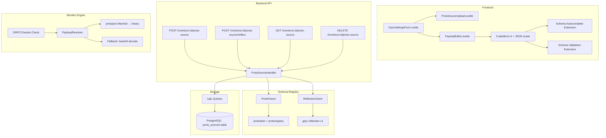

# Design Document: gRPC Proto Payload

## Overview

This feature replaces the raw base64 textarea for gRPC request payloads with a schema-aware system. It introduces three proto source mechanisms (file upload, FileDescriptorSet upload, Server Reflection), a backend schema registry that parses and stores protobuf type information, Proto JSON payload conversion, and a frontend editor with autocompletion and validation.

The design follows Pulse's existing patterns: Go backend with gin handlers, sqlc-generated queries, PostgreSQL storage, and a Svelte 5 frontend with TypeScript strict mode.

### Key Design Decisions

1. **Single proto source per monitor** — simplifies the data model and avoids complex multi-source resolution. Users replace rather than accumulate sources.
2. **FileDescriptorSet as canonical storage format** — regardless of source type (upload, reflection), we always store the parsed result as a serialized `google.protobuf.FileDescriptorSet`. This unifies downstream processing.
3. **`google.golang.org/protobuf` for all proto operations** — the project already depends on `google.golang.org/protobuf` (transitive via grpc). We use `protodesc`, `protojson`, and `protoregistry` packages for schema resolution and JSON ↔ binary conversion.
4. **Server Reflection via `grpc-go` reflection client** — uses `google.golang.org/grpc/reflection/grpc_reflection_v1alpha` for discovery.
5. **CodeMirror 6 for the payload editor** — lightweight, extensible, supports custom autocompletion and lint extensions. Already used in similar tools (grpcui, Postman).

## Architecture



### Request Flow: Proto JSON Check Execution

1. Scheduler triggers `GRPCChecker.Check(ctx, target, settings)`
2. Settings now include `payload_format: "proto_json"` and `proto_source_id`
3. `PayloadResolver` loads the stored FileDescriptorSet from DB (cached per monitor)
4. Resolves the request message descriptor from `service_method`
5. Unmarshals Proto JSON → `dynamicpb.Message` using `protojson.Unmarshal`
6. Marshals to binary via `proto.Marshal`
7. Passes binary bytes to `conn.Invoke` (existing rawCodec path)

### Request Flow: Server Reflection

1. User clicks "Use Server Reflection" in the UI
2. Frontend calls `POST /api/v1/monitors/{id}/proto-source/reflect`
3. Handler connects to monitor target using monitor's TLS settings
4. Sends reflection ListServices request
5. For each service, fetches FileDescriptor containing the service
6. Assembles a complete FileDescriptorSet with all transitive dependencies
7. Stores in `proto_sources` table, returns metadata to frontend

## Components and Interfaces

### Backend Components

#### 1. ProtoSourceHandler (`backend/internal/api/handlers/proto_source.go`)

```go
type ProtoSourceHandler struct {
    queries *db.Queries
    pool    *pgxpool.Pool
}

func (h *ProtoSourceHandler) Register(rg *gin.RouterGroup)
func (h *ProtoSourceHandler) Upload(c *gin.Context)        // POST /monitors/:id/proto-source
func (h *ProtoSourceHandler) Reflect(c *gin.Context)       // POST /monitors/:id/proto-source/reflect
func (h *ProtoSourceHandler) Get(c *gin.Context)           // GET /monitors/:id/proto-source
func (h *ProtoSourceHandler) Delete(c *gin.Context)        // DELETE /monitors/:id/proto-source
```

#### 2. Schema Registry (`backend/internal/proto/registry.go`)

Core parsing and resolution logic, independent of HTTP layer.

```go
package proto

// Registry provides protobuf schema parsing, storage resolution, and JSON conversion.
type Registry struct{}

// ParseProtoFiles parses .proto file contents and returns a FileDescriptorSet.
// Returns error if imports are unresolved or files are invalid.
func (r *Registry) ParseProtoFiles(files map[string][]byte) (*descriptorpb.FileDescriptorSet, error)

// ParseFileDescriptorSet validates and returns a FileDescriptorSet from binary input.
func (r *Registry) ParseFileDescriptorSet(data []byte) (*descriptorpb.FileDescriptorSet, error)

// ExtractMetadata extracts services, methods, and message types from a FileDescriptorSet.
func (r *Registry) ExtractMetadata(fds *descriptorpb.FileDescriptorSet) (*ProtoSourceMetadata, error)

// ResolveMessageDescriptor finds a message descriptor by fully-qualified name.
func (r *Registry) ResolveMessageDescriptor(fds *descriptorpb.FileDescriptorSet, fullName string) (protoreflect.MessageDescriptor, error)

// ProtoJSONToBytes converts Proto JSON to binary protobuf given a message descriptor.
func (r *Registry) ProtoJSONToBytes(msgDesc protoreflect.MessageDescriptor, jsonPayload []byte) ([]byte, error)

// BytesToProtoJSON converts binary protobuf to Proto JSON given a message descriptor.
func (r *Registry) BytesToProtoJSON(msgDesc protoreflect.MessageDescriptor, data []byte) ([]byte, error)

// GenerateTemplate generates a Proto JSON template with zero-value fields.
func (r *Registry) GenerateTemplate(msgDesc protoreflect.MessageDescriptor) ([]byte, error)
```

#### 3. Reflection Client (`backend/internal/proto/reflect.go`)

```go
// ReflectServices connects to a gRPC server and discovers schemas via Server Reflection.
// Uses the provided TLS config and respects the context deadline.
func ReflectServices(ctx context.Context, target string, tlsCfg *tls.Config) (*descriptorpb.FileDescriptorSet, error)
```

#### 4. Payload Resolver (integrated into `backend/internal/monitor/grpc.go`)

```go
// resolvePayload returns binary protobuf bytes from either base64 or Proto JSON format.
// When format is "proto_json", it loads the proto source from DB, resolves the
// message descriptor, and converts JSON to binary.
func resolvePayload(ctx context.Context, queries *db.Queries, monitorID uuid.UUID, settings GRPCSettings) ([]byte, error)
```

### Frontend Components

#### 1. ProtoSourceUpload (`frontend/src/components/ProtoSourceUpload.svelte`)

- File drop zone accepting `.proto` and `.desc` files (max 20)
- "Use Server Reflection" button (enabled when target is set)
- Displays current proto source info if configured
- Service/method selector after successful upload or reflection

#### 2. PayloadEditor (`frontend/src/components/PayloadEditor.svelte`)

- CodeMirror 6 with JSON language support
- Custom autocompletion extension fed by schema metadata
- Custom lint extension for real-time validation
- Falls back to plain textarea when no proto source is configured
- Debounced validation (500ms) and autocompletion (200ms)

#### 3. Updated GrpcSettingsForm

- Integrates `ProtoSourceUpload` and `PayloadEditor`
- Adds `payload_format` toggle (raw / proto_json)
- Passes schema metadata to PayloadEditor for autocompletion

### API Response Types

```typescript
// Proto source metadata returned by API
interface ProtoSourceMeta {
  source_type: 'upload' | 'reflection';
  filenames: string[];
  services: ProtoService[];
  created_at: string;
  size_bytes: number;
}

interface ProtoService {
  full_name: string;
  methods: ProtoMethod[];
}

interface ProtoMethod {
  name: string;
  full_name: string;
  input_type: string;
  output_type: string;
}

interface ProtoMessageSchema {
  full_name: string;
  fields: ProtoField[];
}

interface ProtoField {
  name: string;
  json_name: string;
  type: string;
  repeated: boolean;
  map_key_type?: string;
  map_value_type?: string;
  enum_values?: string[];
  message_fields?: ProtoField[];
  comment?: string;
}
```

## Data Models

### Database Schema

New table `proto_sources` with migration `012_proto_sources.up.sql`:

```sql
CREATE TABLE proto_sources (
    id UUID PRIMARY KEY DEFAULT gen_random_uuid(),
    monitor_id UUID NOT NULL UNIQUE REFERENCES monitors(id) ON DELETE CASCADE,
    source_type TEXT NOT NULL CHECK (source_type IN ('upload', 'reflection')),
    descriptor_bytes BYTEA NOT NULL,
    metadata JSONB NOT NULL DEFAULT '{}',
    created_at TIMESTAMPTZ NOT NULL DEFAULT now(),
    updated_at TIMESTAMPTZ NOT NULL DEFAULT now()
);

-- Enforce 5MB max size at application level (CHECK constraint on bytea length is possible but
-- we prefer application-level for better error messages)
CREATE INDEX idx_proto_sources_monitor_id ON proto_sources(monitor_id);
```

The `UNIQUE` constraint on `monitor_id` enforces the one-proto-source-per-monitor invariant at the database level.

### Metadata JSON Structure (stored in `metadata` JSONB column)

```json
{
  "filenames": ["service.proto", "common.proto"],
  "services": [
    {
      "full_name": "mypackage.MyService",
      "methods": [
        {
          "name": "GetItem",
          "full_name": "mypackage.MyService/GetItem",
          "input_type": "mypackage.GetItemRequest",
          "output_type": "mypackage.GetItemResponse"
        }
      ]
    }
  ],
  "message_types": ["mypackage.GetItemRequest", "mypackage.GetItemResponse"]
}
```

### Extended GRPCSettings (monitor settings JSON)

```go
type GRPCSettings struct {
    // ... existing fields ...
    
    // PayloadFormat selects payload interpretation: "raw" (base64) or "proto_json".
    // Default: "raw" (backward compatible).
    PayloadFormat string `json:"payload_format,omitempty"`
}
```

### sqlc Queries (`backend/internal/store/postgres/queries/proto_sources.sql`)

```sql
-- name: UpsertProtoSource :one
INSERT INTO proto_sources (monitor_id, source_type, descriptor_bytes, metadata, updated_at)
VALUES ($1, $2, $3, $4, now())
ON CONFLICT (monitor_id) DO UPDATE SET
    source_type = EXCLUDED.source_type,
    descriptor_bytes = EXCLUDED.descriptor_bytes,
    metadata = EXCLUDED.metadata,
    updated_at = now()
RETURNING *;

-- name: GetProtoSource :one
SELECT * FROM proto_sources WHERE monitor_id = $1;

-- name: DeleteProtoSource :exec
DELETE FROM proto_sources WHERE monitor_id = $1;

-- name: ProtoSourceExists :one
SELECT EXISTS(SELECT 1 FROM proto_sources WHERE monitor_id = $1);
```

## Correctness Properties

*A property is a characteristic or behavior that should hold true across all valid executions of a system — essentially, a formal statement about what the system should do. Properties serve as the bridge between human-readable specifications and machine-verifiable correctness guarantees.*

### Property 1: Proto Source Upsert Replaces Previous Data

*For any* monitor and any sequence of N valid proto source upserts (N ≥ 1), after all upserts complete, there SHALL exist exactly one proto source row for that monitor, and its content SHALL equal the data from the last upsert in the sequence.

**Validates: Requirements 1.1, 1.2, 8.1, 8.5**

### Property 2: Unresolved Imports Cause Rejection

*For any* set of `.proto` file contents where at least one file contains an `import` statement referencing a path not present in the uploaded file set, the Schema_Registry SHALL reject the upload, and the error message SHALL contain every unresolved import path.

**Validates: Requirements 1.3**

### Property 3: Invalid Proto Content Causes Rejection

*For any* byte sequence that is neither valid `.proto` text (parseable by the protobuf compiler) nor a valid serialized FileDescriptorSet, the Schema_Registry SHALL reject it with an error, and the error SHALL reference the filename of the invalid input.

**Validates: Requirements 1.4, 7.6**

### Property 4: Metadata Extraction Completeness

*For any* valid FileDescriptorSet containing one or more service definitions, the extracted metadata SHALL list every service's fully-qualified name, every method within each service, and the fully-qualified input and output message type names for each method.

**Validates: Requirements 1.6**

### Property 5: Proto JSON Serialization Round-Trip

*For any* valid message descriptor and any Proto JSON object that conforms to that descriptor's schema, serializing the JSON to binary protobuf and then deserializing back to Proto JSON SHALL produce a semantically equivalent JSON object (same field values after type normalization, regardless of key order or whitespace).

**Validates: Requirements 3.1, 7.1, 7.2, 7.4**

### Property 6: Invalid JSON Fields Cause Rejection

*For any* message descriptor and any JSON object containing at least one field name not present in the descriptor (or a value whose type does not match the field's declared type), the Schema_Registry SHALL reject serialization with an error that identifies the mismatched field name.

**Validates: Requirements 3.2, 7.5**

### Property 7: Semantic Equivalence Under Normalization

*For any* valid Proto JSON object conforming to a message schema, reordering its keys, adding or removing whitespace, or toggling between explicit-zero representation and omitted-default representation SHALL produce a semantically equivalent object (identical after parse-normalize).

**Validates: Requirements 7.3**

### Property 8: Template Generation Contains All Fields with Zero Values

*For any* message descriptor, the generated Proto JSON template SHALL contain every scalar field set to its proto3 zero value (0 for numerics, empty string for strings, false for bools, first declared value for enums), every nested message field as an empty object `{}`, every repeated field as an empty array `[]`, and every map field as an empty object `{}`.

**Validates: Requirements 4.1, 7.7**

### Property 9: DELETE Proto Source Is Idempotent

*For any* monitor ID (whether or not it currently has a proto source stored), calling DELETE on the proto-source endpoint SHALL return a success response. Calling DELETE N times (N ≥ 1) for the same monitor SHALL always return success, and after all calls, no proto source row SHALL exist for that monitor.

**Validates: Requirements 5.5**

## Error Handling

### Backend Error Categories

| Error Code | HTTP Status | Condition |
|-----------|-------------|-----------|
| `PROTO_PARSE_ERROR` | 400 | Invalid .proto syntax or invalid FileDescriptorSet binary |
| `PROTO_UNRESOLVED_IMPORTS` | 400 | .proto files reference imports not in the upload set |
| `PROTO_SIZE_EXCEEDED` | 400 | Upload exceeds 5MB limit |
| `PROTO_PAYLOAD_SIZE_EXCEEDED` | 400 | Proto JSON payload exceeds 1MB |
| `PROTO_VALIDATION_ERROR` | 400 | Proto JSON doesn't conform to message schema |
| `PROTO_SOURCE_REQUIRED` | 400 | payload_format=proto_json but no proto source configured |
| `PROTO_SOURCE_NOT_FOUND` | 404 | GET proto source when none exists |
| `REFLECTION_UNAVAILABLE` | 400 | Target server doesn't support Server Reflection |
| `REFLECTION_TIMEOUT` | 504 | Reflection operation exceeded 10s |
| `REFLECTION_CONNECTION_FAILED` | 502 | Cannot reach target gRPC server |
| `REFLECTION_NO_SERVICES` | 400 | Reflection found only the reflection service itself |
| `MONITOR_NOT_FOUND` | 404 | Monitor ID doesn't exist |

### Error Response Format

All errors follow the existing Pulse error envelope:

```json
{
  "error": {
    "code": "PROTO_VALIDATION_ERROR",
    "message": "Proto JSON validation failed",
    "details": [
      { "field": "unknown_field", "reason": "unknown_field_name" },
      { "field": "count", "reason": "type_mismatch", "expected": "int32", "got": "string" }
    ]
  }
}
```

### Error Handling Strategy

1. **Parse errors** — Return immediately with detailed parse failure info. Do not store partial results.
2. **Size limit errors** — Check size before parsing. Reject early to avoid unnecessary CPU work.
3. **Reflection errors** — Never modify existing stored proto source on reflection failure. The user's current schema configuration remains intact.
4. **Validation errors during check** — Log validation error, report monitor as "down" with the validation error as cause. Do not suppress — the operator needs to know their payload config is broken.
5. **Concurrent access** — The UNIQUE constraint + upsert pattern handles races. Two concurrent uploads for the same monitor result in one winner (last write wins), which is acceptable.

## Testing Strategy

### Unit Tests (Go — `go test`)

- `proto/registry_test.go` — ParseProtoFiles, ParseFileDescriptorSet, ExtractMetadata, ProtoJSONToBytes, BytesToProtoJSON, GenerateTemplate
- `proto/reflect_test.go` — ReflectServices with mock gRPC server
- `monitor/grpc_test.go` — resolvePayload with both formats, error cases
- `api/handlers/proto_source_test.go` — HTTP handler tests with mock DB

### Property-Based Tests (Go — `pgregory.net/rapid`)

The project already uses `pgregory.net/rapid` for property-based testing. Each property test runs a minimum of 100 iterations.

**Property test file:** `backend/internal/proto/registry_prop_test.go`

| Property | Test Function | Min Iterations |
|----------|--------------|----------------|
| Property 1: Upsert replaces | `TestProperty_UpsertReplaces` | 100 |
| Property 2: Unresolved imports rejection | `TestProperty_UnresolvedImportsRejected` | 100 |
| Property 3: Invalid content rejection | `TestProperty_InvalidContentRejected` | 100 |
| Property 4: Metadata extraction completeness | `TestProperty_MetadataComplete` | 100 |
| Property 5: Proto JSON round-trip | `TestProperty_ProtoJSONRoundTrip` | 100 |
| Property 6: Invalid JSON fields rejected | `TestProperty_InvalidJSONFieldsRejected` | 100 |
| Property 7: Semantic equivalence | `TestProperty_SemanticEquivalence` | 100 |
| Property 8: Template generation | `TestProperty_TemplateGeneration` | 100 |
| Property 9: DELETE idempotence | `TestProperty_DeleteIdempotent` | 100 |

Each test is tagged with a comment:
```go
// Feature: grpc-proto-payload, Property 5: Proto JSON round-trip
// For any valid message descriptor and conforming JSON, serialize → deserialize
// produces semantically equivalent output.
```

**Generator strategy:**
- Message descriptors generated using `rapid.Custom` building random `descriptorpb.DescriptorProto` with 1–10 fields of various types
- Proto JSON generated by creating `dynamicpb.Message` instances with random field values matching the descriptor
- Invalid inputs generated with `rapid.SliceOf(rapid.Byte())` for binary and `rapid.String()` with injected unknown field names for JSON

### Frontend Tests (Vitest + fast-check)

- `ProtoSourceUpload.test.ts` — Upload flow, error states, button enable/disable
- `PayloadEditor.test.ts` — Schema-aware mode vs textarea mode, validation display
- Property tests for schema-to-completion-items mapping (fast-check)

### Integration Tests

- Full API flow: upload → get → use in check → delete
- Server Reflection against test gRPC server
- Monitor deletion cascades proto source
- Concurrent upload race behavior

### Test Dependencies

**Backend:**
- `pgregory.net/rapid` (already in go.mod) — property-based testing
- `google.golang.org/protobuf` (already transitive) — proto manipulation
- `google.golang.org/grpc` (already in go.mod) — test gRPC server for reflection tests

**Frontend:**
- `codemirror` + `@codemirror/lang-json` — editor component
- `fast-check` (already used in frontend) — property-based testing

