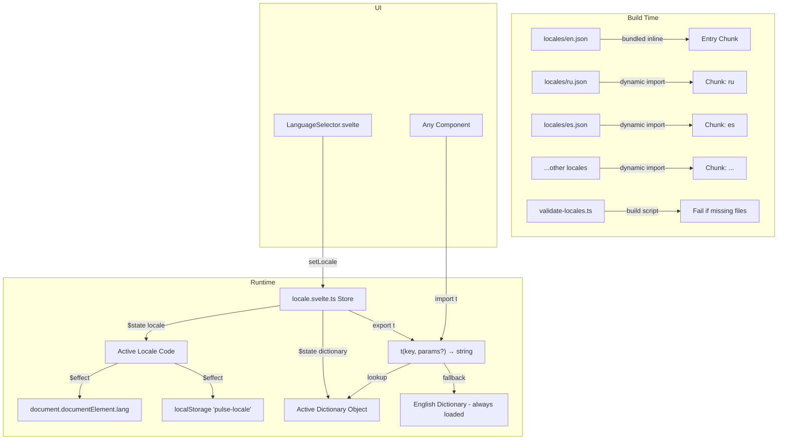
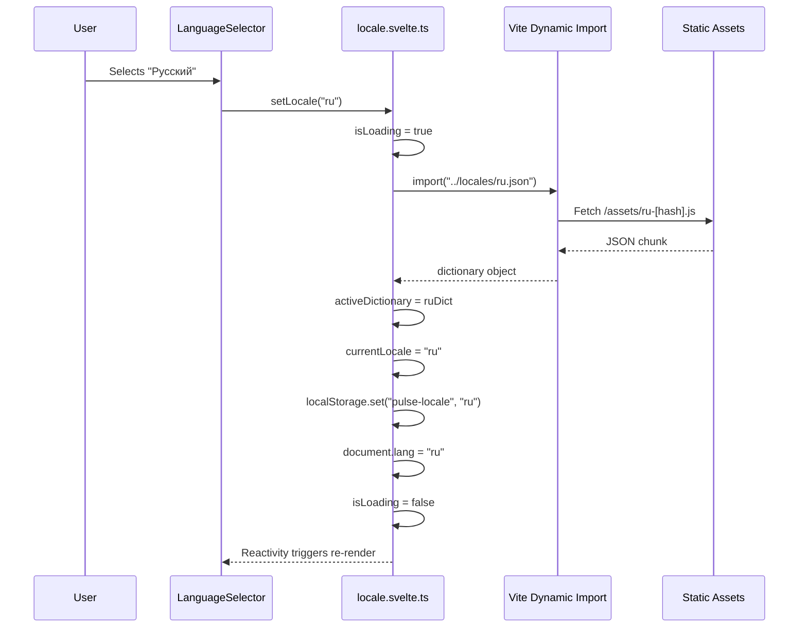

# Design Document: i18n-localization

## Overview

This design introduces a lightweight, custom internationalization system for the Pulse frontend. The system provides reactive locale switching using Svelte 5 runes, lazy-loaded translation dictionaries (code-split per locale), a `t()` function with interpolation support, and a fallback chain to English.

The design avoids external i18n libraries (like `svelte-i18n` or `i18next`) to keep the bundle minimal and fully compatible with the static adapter build that gets embedded into the Go binary. The entire system is approximately 150–200 lines of core logic, with no runtime dependencies beyond what SvelteKit already provides.

### Key Design Decisions

1. **No external i18n library** — The requirements are simple enough (flat key lookup + interpolation + fallback) that a custom solution avoids dependency bloat and version churn. Libraries like `svelte-i18n` add 8KB+ gzipped and bring complexity (ICU MessageFormat, plurals engine) not needed here.

2. **English bundled in entry chunk, others lazy-loaded** — English is the fallback locale and default, so it must be immediately available. Other locales use Vite's dynamic `import()` for code splitting, producing separate chunks loaded on demand.

3. **Module-level Svelte 5 runes** — Following the existing store pattern (`auth.svelte.ts`, `toast.svelte.ts`), the locale store uses `$state` and `$derived` at module scope in a `.svelte.ts` file.

4. **Synchronous `t()` after load** — Once a locale dictionary is loaded, all `t()` calls resolve synchronously from an in-memory object. No Promises, no loading spinners for individual strings.

## Architecture



## Components and Interfaces

### 1. Locale Configuration (`frontend/src/lib/i18n/config.ts`)

Central configuration defining supported locales and their native display names.

```typescript
export interface LocaleEntry {
  code: string;       // BCP-47 tag: "en", "ru", "es", etc.
  name: string;       // Native name: "English", "Русский", "Español"
}

export const SUPPORTED_LOCALES: readonly LocaleEntry[] = [
  { code: 'en', name: 'English' },
  { code: 'ru', name: 'Русский' },
  { code: 'es', name: 'Español' },
  { code: 'fr', name: 'Français' },
  { code: 'pt', name: 'Português' },
  { code: 'de', name: 'Deutsch' },
  { code: 'zh', name: '中文' },
  { code: 'ja', name: '日本語' },
  { code: 'ko', name: '한국어' },
  { code: 'tr', name: 'Türkçe' },
  { code: 'it', name: 'Italiano' },
] as const;

export const FALLBACK_LOCALE = 'en';
export const STORAGE_KEY = 'pulse-locale';

export type LocaleCode = (typeof SUPPORTED_LOCALES)[number]['code'];

export function isSupportedLocale(code: string): code is LocaleCode {
  return SUPPORTED_LOCALES.some((l) => l.code === code);
}
```

### 2. Translation Dictionary Type (`frontend/src/lib/i18n/types.ts`)

```typescript
/**
 * Nested string dictionary with max 4 levels of nesting.
 * Leaf values are translation strings, possibly containing {variable} placeholders.
 */
export type TranslationDictionary = {
  [key: string]: string | TranslationDictionary;
};
```

### 3. Translation Resolution (`frontend/src/lib/i18n/resolve.ts`)

Pure functions for key lookup and interpolation, separated from reactive state for testability.

```typescript
/**
 * Resolve a dot-notation key from a dictionary.
 * Returns undefined if key not found or intermediate segment is not an object.
 */
export function resolveKey(
  dictionary: TranslationDictionary,
  key: string
): string | undefined;

/**
 * Interpolate {variable} placeholders in a template string.
 * Unmatched placeholders remain as literal text.
 */
export function interpolate(
  template: string,
  params?: Record<string, string | number>
): string;
```

**Implementation approach:**
- `resolveKey` splits on `.` and walks the nested object. If any segment resolves to a non-object (string/number/null/undefined) before reaching the final segment, returns `undefined`.
- `interpolate` uses a single regex replace: `/\{(\w+)\}/g` — for each match, look up the key in `params`. If found, substitute; if not, leave the placeholder unchanged.

### 4. Locale Store (`frontend/src/lib/i18n/locale.svelte.ts`)

The reactive store following existing project patterns (module-level `$state`).

```typescript
import type { TranslationDictionary } from './types';
import type { LocaleCode } from './config';

// --- State ---
let currentLocale = $state<LocaleCode>('en');
let activeDictionary = $state<TranslationDictionary>(enDictionary);
let isLoading = $state<boolean>(false);
let loadError = $state<string | null>(null);

// --- Exported API ---

/** Current active locale code */
export function getLocale(): LocaleCode;

/** Translation function */
export function t(key: string, params?: Record<string, string | number>): string;

/** Change active locale (triggers lazy load if needed) */
export function setLocale(code: LocaleCode): Promise<void>;

/** Initialize store: read from localStorage, apply, sync HTML lang */
export function initLocale(): void;

/** Whether a locale chunk is currently loading */
export function isLocaleLoading(): boolean;

/** Current load error message, if any */
export function getLoadError(): string | null;
```

**Fallback chain in `t()`:**
1. Look up key in `activeDictionary`
2. If not found, look up key in `enDictionary` (always in memory)
3. If not found in either, return the key string itself
4. If found, apply `interpolate(value, params)` before returning
5. In dev mode (`import.meta.env.DEV`), emit `console.warn` if key was missing from active (non-en) dictionary

**`setLocale()` flow:**
1. If `code === currentLocale`, no-op
2. If `code === 'en'`, set `activeDictionary = enDictionary` (already loaded)
3. Otherwise, dynamically import the locale chunk: `import(`../../../locales/${code}.json`)`
4. On success: update `activeDictionary`, `currentLocale`, persist to localStorage, update `document.documentElement.lang`
5. On failure: keep current dictionary, set `loadError`, show toast notification

**`initLocale()` flow (called once at app startup):**
1. Read `localStorage.getItem('pulse-locale')`
2. If value is a supported locale → `setLocale(value)`
3. If value is unsupported → remove from localStorage, use 'en'
4. If localStorage throws or empty → use 'en'
5. Set `document.documentElement.lang` to resolved locale

### 5. HTML Lang Synchronization

Integrated into the locale store via `$effect`:

```typescript
$effect(() => {
  if (typeof document !== 'undefined') {
    document.documentElement.lang = currentLocale;
  }
});
```

This fires synchronously during Svelte's effect scheduling whenever `currentLocale` changes, ensuring the `lang` attribute is always in sync before re-rendered content paints.

### 6. Language Selector Component (`frontend/src/components/LanguageSelector.svelte`)

A dropdown `<select>` element placed in the Settings page:

```svelte
<script lang="ts">
  import { getLocale, setLocale } from '$lib/i18n/locale.svelte';
  import { SUPPORTED_LOCALES } from '$lib/i18n/config';
  import { t } from '$lib/i18n/locale.svelte';

  let selected = $derived(getLocale());

  function handleChange(event: Event) {
    const target = event.target as HTMLSelectElement;
    setLocale(target.value as LocaleCode);
  }
</script>

<div class="space-y-2">
  <label
    for="language-select"
    id="language-select-label"
    class="block text-sm font-medium text-[var(--color-text-primary)]"
  >
    {t('settings.language.label')}
  </label>
  <select
    id="language-select"
    aria-labelledby="language-select-label"
    value={selected}
    onchange={handleChange}
    class="rounded-md border ..."
  >
    {#each SUPPORTED_LOCALES as locale}
      <option value={locale.code}>{locale.name}</option>
    {/each}
  </select>
</div>
```

**Accessibility:**
- `<label>` with `for` attribute linking to select's `id`
- `aria-labelledby` on the select
- Full keyboard navigation (native `<select>` provides Tab, Arrow, Enter/Space)
- Options displayed in fixed order from `SUPPORTED_LOCALES` array

### 7. Settings Page Integration

The Language section is added above the existing API Token section:

```svelte
<!-- frontend/src/routes/settings/+page.svelte -->
<script lang="ts">
  import ApiTokenSection from './ApiTokenSection.svelte';
  import LanguageSelector from '../../components/LanguageSelector.svelte';
  import { t } from '$lib/i18n/locale.svelte';
</script>

<div class="mx-auto max-w-4xl space-y-8 px-4 py-6">
  <div>
    <h1>{t('settings.title')}</h1>
    <p>{t('settings.description')}</p>
  </div>

  <!-- Language Section -->
  <section>
    <h2>{t('settings.language.title')}</h2>
    <LanguageSelector />
  </section>

  <ApiTokenSection />
</div>
```

### 8. Lazy Loading Strategy



**Vite handles code splitting automatically** when using dynamic `import()` with a template literal. Each locale JSON file becomes a separate chunk in the build output. The static adapter bundles all chunks into the `build/` directory, which is embedded into the Go binary — so they're always available locally.

### 9. Build-Time Validation (`frontend/scripts/validate-locales.ts`)

A script run during CI/build that:
1. Reads `SUPPORTED_LOCALES` config
2. Verifies each locale has a corresponding `.json` file in `locales/`
3. Verifies all keys in `en.json` exist (warns about missing keys in other locales)
4. Verifies no key path exceeds 4 levels of nesting
5. Exits with non-zero code on failure

Added to `package.json`:
```json
{
  "scripts": {
    "validate-locales": "tsx scripts/validate-locales.ts",
    "build": "svelte-kit sync && pnpm validate-locales && vite build"
  }
}
```

## Data Models

### Translation Dictionary File Structure

Location: `frontend/src/locales/{locale_code}.json`

```json
{
  "nav": {
    "dashboard": "Dashboard",
    "monitors": "Monitors",
    "settings": "Settings",
    "logout": "Logout"
  },
  "settings": {
    "title": "Settings",
    "description": "Manage your account and API access.",
    "language": {
      "title": "Language",
      "label": "Display language"
    }
  },
  "monitors": {
    "create": "Create Monitor",
    "edit": "Edit Monitor",
    "status": {
      "up": "Up",
      "down": "Down",
      "pending": "Pending"
    },
    "empty": "No monitors yet. Create one to get started.",
    "count": "{count} monitors"
  },
  "common": {
    "save": "Save",
    "cancel": "Cancel",
    "delete": "Delete",
    "confirm": "Confirm",
    "error": "Something went wrong",
    "loading": "Loading..."
  }
}
```

**Key naming conventions:**
- Top level: feature area (`nav`, `settings`, `monitors`, `common`, `login`, `dashboard`)
- Second level: page or sub-feature
- Third level: specific element
- Fourth level (max): variant or state
- Interpolation: `{variableName}` syntax for dynamic values

### Locale Store State Shape

```typescript
interface LocaleStoreState {
  currentLocale: LocaleCode;           // "en" | "ru" | "es" | ...
  activeDictionary: TranslationDictionary;  // Current locale's dict
  enDictionary: TranslationDictionary;      // Always loaded (fallback)
  isLoading: boolean;                       // True during chunk load
  loadError: string | null;                 // Error message if load failed
}
```

## Correctness Properties

*A property is a characteristic or behavior that should hold true across all valid executions of a system — essentially, a formal statement about what the system should do. Properties serve as the bridge between human-readable specifications and machine-verifiable correctness guarantees.*

### Property 1: Interpolation substitutes provided variables and preserves unmatched placeholders

*For any* template string containing `{variable}` placeholders and *for any* `Record<string, string | number>` of parameters, the `interpolate` function SHALL replace every placeholder whose key exists in the parameters with the corresponding value, and SHALL leave every placeholder whose key is NOT in the parameters as the literal `{variable}` text.

**Validates: Requirements 1.3, 1.6, 2.5**

### Property 2: Fallback chain resolves to English for missing keys

*For any* dot-notation key that exists in the English dictionary but does NOT exist in the active locale's dictionary, the `t()` function SHALL return the English translation string (with interpolation applied) rather than `undefined`, an empty string, or the key itself.

**Validates: Requirements 3.1, 6.3, 7.5**

### Property 3: Terminal fallback returns the key string

*For any* dot-notation key that does NOT exist in either the active locale's dictionary or the English dictionary, the `t()` function SHALL return the key string itself unmodified.

**Validates: Requirements 1.5, 3.2**

### Property 4: Broken path treated as missing

*For any* dictionary where an intermediate segment of a dot-notation key path is a string (not an object), the `resolveKey` function SHALL return `undefined`, treating the entire key as missing and triggering the fallback chain.

**Validates: Requirements 3.3**

### Property 5: Locale persistence round-trip

*For any* locale code in the supported locales list, calling `setLocale(code)` SHALL write `code` to `localStorage.getItem('pulse-locale')`, and subsequently calling `initLocale()` SHALL restore `currentLocale` to that same code.

**Validates: Requirements 4.1, 4.2**

### Property 6: Invalid stored locale falls back to English

*For any* string that is NOT in the supported locales list, if that string is stored in `localStorage` under `'pulse-locale'`, then `initLocale()` SHALL set `currentLocale` to `'en'` and SHALL remove the invalid entry from localStorage.

**Validates: Requirements 4.4, 6.4**

### Property 7: HTML lang attribute synchronization

*For any* locale code in the supported locales list, after `setLocale(code)` resolves, `document.documentElement.lang` SHALL equal that locale code.

**Validates: Requirements 8.1, 8.2**

### Property 8: Language selector displays native names in config order

*For any* rendering of the LanguageSelector component, the dropdown options SHALL appear in exactly the order defined by `SUPPORTED_LOCALES`, and each option's visible text SHALL be the `name` field (native name) from the corresponding entry.

**Validates: Requirements 5.2, 5.6**

### Property 9: Locale switch updates `t()` output

*For any* key that has different translations in two supported locales (A and B), switching from locale A to locale B SHALL cause `t(key)` to return the value from locale B's dictionary.

**Validates: Requirements 2.3**

## Error Handling

| Scenario | Handling |
|----------|----------|
| `localStorage` throws on read | Catch silently, default to `'en'` |
| `localStorage` throws on write | Catch silently, locale works for session but won't persist |
| Dynamic import fails (network/chunk error) | Set `loadError`, show toast via `toastStore.addToast({ type: 'error', ... })`, keep current locale active |
| Key missing from active dictionary | Fall back to English value |
| Key missing from both dictionaries | Return key string itself |
| Interpolation param is `undefined` | Placeholder remains as `{variable}` text |
| Invalid locale in localStorage | Remove entry, fall back to `'en'` |
| SSR context (`typeof window === 'undefined'`) | Return `'en'` as locale, skip localStorage/DOM operations |

## Testing Strategy

### Unit Tests (Example-Based)

- **Store initialization**: Verify `initLocale()` reads from localStorage, handles empty/invalid/missing cases
- **Component rendering**: LanguageSelector renders with correct label, options, and aria attributes
- **Settings integration**: Language section appears in Settings page
- **Dev mode warning**: `console.warn` fires for missing keys in non-en locale when `import.meta.env.DEV` is true
- **Load error handling**: Failed dynamic import shows toast and keeps fallback

### Property-Based Tests (fast-check, 100+ iterations each)

The following properties are implemented using `fast-check`:

| Property | Generators | Assertion |
|----------|-----------|-----------|
| 1: Interpolation | Random template strings with `{var}` placeholders + random param maps | Provided vars replaced, missing vars unchanged |
| 2: Fallback to English | Random keys from en.json not in active dict | Returns en value |
| 3: Terminal fallback | Random dot-notation keys not in any dict | Returns key string |
| 4: Broken path | Dicts with string values at intermediate segments | `resolveKey` returns undefined |
| 5: Persistence round-trip | Random locale from supported list | setLocale → localStorage → initLocale restores |
| 6: Invalid locale fallback | Random strings not in supported list | Falls back to 'en', removes from storage |
| 7: HTML lang sync | Random locale from supported list | `document.documentElement.lang` matches |
| 8: Selector order | Render selector | Options match SUPPORTED_LOCALES order and native names |
| 9: Locale switch | Keys with different values across locales | `t()` returns new locale's value after switch |

**Test configuration:**
- Library: `fast-check` (already in devDependencies)
- Minimum iterations: 100 per property
- Tag format: `Feature: i18n-localization, Property {N}: {title}`

### Build-Time Validation

- `validate-locales.ts` script checks file existence, key depth, and cross-locale key coverage
- Integrated into `pnpm build` pipeline
- Future: ESLint rule or custom Svelte preprocessor to flag hardcoded string literals in templates

### Integration Tests (Manual/E2E)

- Verify locale chunks are separate files in build output
- Verify offline functionality with embedded static assets
- Verify chunk load timing (<100ms on warm cache)
