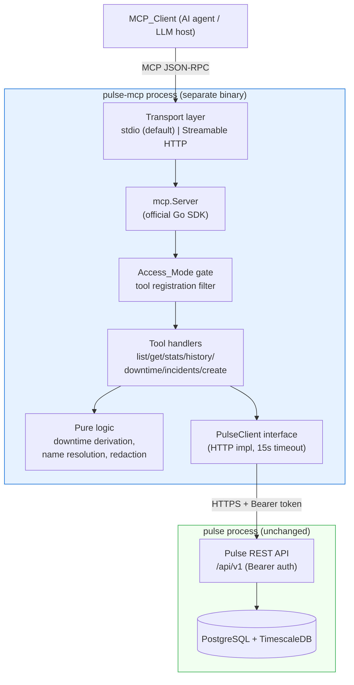
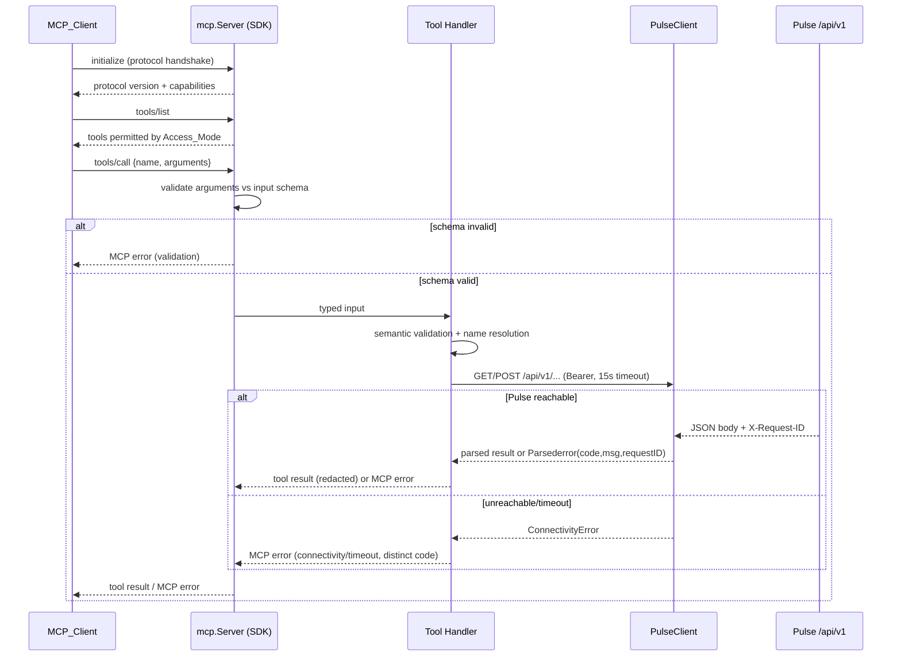

# Design Document

## Overview

The Pulse MCP server (`pulse-mcp`) is a small, standalone service that exposes a curated
subset of Pulse's operational surface to MCP-compatible AI clients. It implements the Model
Context Protocol using the official Go SDK and talks to Pulse **only** through the existing
REST API under `/api/v1`, authenticating with a Pulse Bearer API token. It never touches the
Pulse databases and shares no process with the main Pulse binary.

The first version is intentionally narrow. It ships seven tools: six read tools
(`list-monitors`, `get-monitor`, `monitor-stats`, `monitor-history`, `downtime-summary`,
`list-incidents`) and one write tool (`create-monitor`, gated behind read-write access mode).
The anchor scenarios are: "what is monitor X doing right now?", "did monitor X have downtime in
the last 24 hours?", and "create a simple health check for this service."

This design resolves the two questions the requirements deferred:

1. **Transport** — the server defaults to **stdio** (simple, local, single-client), with an
   optional Streamable HTTP transport selectable by configuration for shared/networked use. Both
   are provided by the official SDK, so supporting both is a configuration flag, not extra
   protocol code. Rationale and tradeoffs are in [Architecture](#transport-decision).
2. **create-monitor inputs** — the minimal required and optional inputs per Simple_Monitor_Type
   (HTTP, TCP, UDP, ICMP) are mapped against Pulse's `POST /monitors` contract in
   [create-monitor](#tool-7-create-monitor-write).

### Research Summary

- **MCP Go SDK**: The official SDK is `github.com/modelcontextprotocol/go-sdk` (maintained in
  collaboration with Google, ~4.8k stars, v1.x line). It is the clear choice over third-party
  libraries (`mark3labs/mcp-go`, `metoro-io/mcp-golang`) because it is the reference
  implementation, tracks the spec closely, and provides typed tool registration with automatic
  JSON Schema generation. Source: [modelcontextprotocol/go-sdk](https://github.com/modelcontextprotocol/go-sdk).
  Content was rephrased for compliance with licensing restrictions.
- **SDK API shape**: A server is built with `mcp.NewServer(&mcp.Implementation{...}, nil)`, tools
  are registered with `mcp.AddTool(server, &mcp.Tool{Name, Description}, handler)` where the
  handler is a typed `func(ctx, *mcp.CallToolRequest, In) (*mcp.CallToolResult, Out, error)`.
  Input/output structs use `jsonschema:"..."` struct tags; the SDK derives the tool input schema
  and validates inbound arguments against it automatically. Source:
  [go-sdk quick start](https://go.sdk.modelcontextprotocol.io/).
- **Transports**: The SDK ships `mcp.StdioTransport` and a Streamable HTTP transport
  (`examples/http`). The MCP spec states clients SHOULD support stdio whenever possible, and the
  Streamable HTTP server operates as an independent process handling multiple client connections.
  Source: [MCP transports spec](https://modelcontextprotocol.io/specification/latest/basic/transports).
- **Schema validation is free**: Because the SDK validates arguments against the generated input
  schema before our handler runs, Requirement 1.5 (reject inputs that violate the schema) is
  satisfied structurally, and our handlers focus on semantic validation (ranges, enum membership,
  name resolution) that the schema cannot express.

## Architecture

### Repository Placement

The MCP server lives in the same monorepo as Pulse but as a **separate Go module** (`mcp/`) at
the project root, with its own `go.mod`. This gives it complete dependency independence from the
backend — it never imports backend packages and carries only its own dependency graph (the MCP
SDK, an HTTP client, rapid for testing). The separation is both logical (top-level directory
alongside `backend/` and `frontend/`) and structural (own module boundary).

```
pulse/                    # project root
  backend/                # existing Pulse API + monitoring engine (own go.mod)
  frontend/               # SvelteKit frontend
  mcp/                    # NEW: MCP server (own go.mod, independent module)
    cmd/pulse-mcp/        # entrypoint (main.go)
    internal/
      config/             # env parsing, Access_Mode, transport selection
      pulseapi/           # Pulse REST API client (interface + HTTP impl + fakes)
      tools/              # one file per tool: schema, handler, endpoint mapping
      downtime/           # Downtime_Summary derivation (pure functions)
      resolve/            # name-to-identifier resolution (pure functions)
      redact/             # secret redaction + log sanitization
      mcperr/             # MCP error mapping (Pulse envelope + connectivity/timeout)
      server/             # wiring: build mcp.Server, register tools by Access_Mode, run transport
    go.mod
    go.sum
    Makefile              # build-mcp, test-mcp targets
    README.md             # setup instructions and MCP client config examples
```

Placement rationale: a separate Go module at the project root makes the "independent service"
decision visible at a glance — `mcp/` is a peer of `backend/`, not a subdirectory of it. Its own
`go.mod` guarantees that no one accidentally imports `backend/internal/...` packages (the Go
toolchain enforces module boundaries). The MCP server's only link to Pulse is HTTP calls to
`/api/v1`. This satisfies Requirement 2.2 (REST-only access, no direct DB) and Requirement
2.1/2.3 (independent lifecycle) at the source-structure level. If the MCP server ever needs to
become its own repo, the extraction is trivial — move the `mcp/` directory out.

### Component Diagram



### Request Flow



### Transport Decision

**Decision: default to stdio; support Streamable HTTP as a configuration option.**

The requirements state the intent is "very simple to start" and note the primary usage pattern
(local single-client agent vs. shared networked service) was unconfirmed. The official SDK gives
us both transports behind the same `mcp.Server`, so the choice is a runtime flag rather than a
code fork.

| Aspect | stdio (default) | Streamable HTTP (opt-in) |
|--------|-----------------|--------------------------|
| Setup complexity | Lowest — client launches the binary and speaks over stdin/stdout | Requires binding a port, network exposure, and its own auth story |
| Concurrency | One client per process | Multiple concurrent clients |
| Deployment | Runs on the same host as the agent (desktop LLM host, local CLI) | Runs as a shared service |
| Security surface | No open port; inherits OS process isolation | Open listener — must be protected (network policy / reverse proxy); MCP-client auth is out of scope for v1 |
| Fit for v1 | Matches "simple to start" and the single configured API_Token model | Useful later for shared team access |

Rationale: stdio has the smallest operational footprint and no network attack surface, which
aligns with the "isolated, low-risk first capability" framing and the single-token access model
(Requirement 3, Requirement 10 non-goal of multi-tenant scoping). Streamable HTTP is retained as
a config switch (`PULSE_MCP_TRANSPORT=http`) so a networked deployment does not require rework,
but it is **not** the default. When HTTP is selected, the server binds `PULSE_MCP_HTTP_ADDR` and
the startup log records the transport (Requirement 12.5). Client-facing authentication for the
HTTP transport is explicitly deferred (recorded as a design tradeoff); operators must protect the
listener at the network layer for v1.

## Components and Interfaces

### PulseClient (Pulse API abstraction)

All Pulse access flows through one interface. This keeps tool handlers testable (fakes in unit
and property tests) and centralizes auth, timeout, error-envelope parsing, and X-Request-ID
handling.

```go
// Package pulseapi is the sole bridge between the MCP server and Pulse.
type PulseClient interface {
    ListMonitors(ctx context.Context, q MonitorQuery) (MonitorPage, error)
    GetMonitor(ctx context.Context, id string) (Monitor, error)
    GetMonitorStats(ctx context.Context, id string) (MonitorStats, error)
    GetMonitorHistory(ctx context.Context, id string, r TimeRange) (History, error)
    ListIncidents(ctx context.Context, q IncidentQuery) (IncidentPage, error)
    CreateMonitor(ctx context.Context, in CreateMonitorInput) (Monitor, error)
}

type MonitorQuery struct {
    Type  string   // optional; already normalized to a canonical Pulse type
    Tags  []string // optional; "key:value" form, AND semantics
    Page  int
    Limit int
}

type IncidentQuery struct {
    MonitorID string // optional; empty => global /incidents
    OpenOnly  bool   // maps to ?status=open
    Page      int
    Limit     int
}

type TimeRange struct {
    From time.Time
    To   time.Time
}
```

**HTTP implementation (`httpClient`) responsibilities:**

- **Base URL & auth**: prefix every path with the configured base URL (default
  `http://localhost:8080/api/v1`); set `Authorization: Bearer <API_Token>` on every request.
- **Timeout**: use a per-request `context.WithTimeout` of `PULSE_MCP_REQUEST_TIMEOUT`
  (default 15s). The underlying `http.Client` timeout is set to the same value as a backstop.
- **X-Request-ID propagation**: read `X-Request-ID` from every Pulse response and attach it to
  both success results (for diagnostics) and parsed errors (Requirement 12.3).
- **Error-envelope parsing**: on non-2xx, decode `{ "error": { "code", "message" } }` into a
  `*PulseError{Code, Message, RequestID, HTTPStatus}`. If the body is not a valid envelope, fall
  back to a synthetic code derived from the HTTP status.
- **Connectivity/timeout mapping**: dial errors, connection refused, and context-deadline
  timeouts are wrapped as `*ConnectivityError{Reason}` — a type **distinct** from `PulseError`
  so the error mapper can emit a distinct MCP code (Requirement 2.4, 12.4).
- **401 handling**: a 401/`UNAUTHORIZED` from Pulse is surfaced as an unauthorized MCP error and
  is **never retried** with the same token (Requirement 3.5).
- **Never retries** write operations; read operations are also single-shot in v1 to keep behavior
  predictable.

```go
type PulseError struct {
    Code       string
    Message    string
    RequestID  string
    HTTPStatus int
}
func (e *PulseError) Error() string { return e.Code + ": " + e.Message }

type ConnectivityError struct {
    Reason string // "timeout" | "connection_refused" | "dial_error"
}
func (e *ConnectivityError) Error() string { return "pulse api unreachable: " + e.Reason }
```

### Tool Registration and Access-Mode Gate

The `server` package builds one `mcp.Server` and registers tools according to the effective
Access_Mode. Read tools are always registered; write tools are registered **only** in read-write
mode. Because a tool that is not registered is neither advertised in `tools/list` nor invocable,
this single mechanism satisfies Requirements 10.3, 10.5, and 10.6.

```go
func Register(s *mcp.Server, deps Deps, mode config.AccessMode) {
    // Read tools — always available.
    mcp.AddTool(s, listMonitorsTool, deps.ListMonitors)
    mcp.AddTool(s, getMonitorTool, deps.GetMonitor)
    mcp.AddTool(s, monitorStatsTool, deps.MonitorStats)
    mcp.AddTool(s, monitorHistoryTool, deps.MonitorHistory)
    mcp.AddTool(s, downtimeSummaryTool, deps.DowntimeSummary)
    mcp.AddTool(s, listIncidentsTool, deps.ListIncidents)

    // Write tools — read-write mode only.
    if mode == config.ReadWrite {
        mcp.AddTool(s, createMonitorTool, deps.CreateMonitor)
    }
}
```

As a defense-in-depth measure for Requirement 10.4 (reject write-tool invocation while
read-only), the `create-monitor` handler also checks the mode at call time and returns a
`WRITE_DISABLED` MCP error before any Pulse call, in case a client crafts a call to an
unadvertised tool.

### Tools

Each tool below lists its input schema (with validation bounds), output shape, and the Pulse
endpoint(s) it calls. Input structs are validated against the SDK-generated JSON Schema before the
handler runs; the listed bounds beyond basic types (ranges, enums, name resolution) are enforced
in the handler and produce MCP validation errors.

#### Tool 1: `list-monitors` (read)

- **Endpoint**: `GET /monitors?page&limit&type&tag`
- **Input**:
  | Field | Type | Bounds / default | Notes |
  |-------|------|------------------|-------|
  | `type` | string? | one of recognized types, case-insensitive | HTTP, HTTPS, HTTP/3, TCP, UDP, WebSocket, gRPC, DNS, ICMP, SMTP |
  | `tags` | string[]? | each `key:value` | AND semantics |
  | `page` | int | ≥1, default 1 | |
  | `limit` | int | 1–100, default 50 | |
- **Validation**: unrecognized `type` → MCP error listing recognized types, no Pulse call
  (Req 4.5). `page`/`limit` out of range → MCP error stating accepted range (Req 4.8). The type is
  normalized to Pulse's canonical wire form (e.g. `HTTP/3` → `http3`, `WebSocket` → `websocket`)
  before the request.
- **Output**: `{ monitors: [{ id, name, type, target, status, state }], page, limit, total, total_pages, has_next_page }`. `status` ∈ {up, down, pending}; `state` ∈ {active, paused}. Empty match → `monitors: []`, `total: 0` (Req 4.6).

#### Tool 2: `get-monitor` (read)

- **Endpoint**: `GET /monitors/{id}` (after name resolution)
- **Input**: `{ monitor: string }` — a UUID or an exact monitor name (1–255 chars).
- **Output**: full monitor config + current status, including latest check state and most recent
  check timestamp: `{ id, name, type, target, interval_seconds, timeout_seconds, status, state, last_checked_at, next_check_at, tags, created_at, updated_at }`.
- **Errors**: not found (Req 5.6/5.7), ambiguous name (Req 5.5). See
  [name resolution](#name-to-identifier-resolution).

#### Tool 3: `monitor-stats` (read)

- **Endpoint**: `GET /monitors/{id}/stats`
- **Input**: `{ monitor: string }` (UUID or name).
- **Output**: `{ monitor_id, uptime_percent_7d, last_error?: { message, checked_at }, ssl?: { expires_at, days_remaining } }`.
  - `uptime_percent_7d` is the trailing-7-day uptime (Req 5.2). Pulse's stats endpoint returns
    `uptime_24h` and `uptime_30d`; the 7-day figure is obtained by deriving from history or by the
    stats endpoint's window — see [Data Models](#uptime-window-note).
  - `ssl` is **included only when present** in the Pulse response (TLS monitors); omitted
    otherwise (Req 5.3).
  - `last_error` omitted when there is no recent recorded error.

#### Tool 4: `monitor-history` (read)

- **Endpoint**: `GET /monitors/{id}/history?from&to`
- **Input**:
  | Field | Type | Bounds / default |
  |-------|------|------------------|
  | `monitor` | string | UUID or name |
  | `from` | string? (RFC3339) | default: now − 24h |
  | `to` | string? (RFC3339) | default: now |
- **Validation**: `from > to` → invalid-range MCP error, no history (Req 6.4). Malformed
  identifier → invalid-identifier error (Req 6.6). Not found → not-found error (Req 6.5).
- **Output**: `{ monitor_id, from, to, truncated, points: [{ state, latency_ms?, status_code?, error?, checked_at }] }`.
  - `truncated` reflects Pulse's retention clamping (Req 6.3); the server passes through Pulse's
    `truncated` flag and the effective `from`/`to`.
  - No points in range → `points: []` (Req 6.7).

#### Tool 5: `downtime-summary` (read)

- **Endpoint**: `GET /monitors/{id}/history` over the effective window (raw points).
- **Input**:
  | Field | Type | Bounds / default |
  |-------|------|------------------|
  | `monitor` | string | UUID or name |
  | `window_seconds` | int? | ≥60 and ≤ retention window; default 86400 (24h) |
- **Validation**: malformed / non-positive / < 60s window → invalid-window MCP error (Req 7.7).
- **Output**:
  ```json
  {
    "monitor_id": "…",
    "had_downtime": true,
    "downtime_period_count": 2,
    "total_downtime_seconds": 930,
    "window_start": "…",
    "window_end": "…",
    "truncated": false,
    "periods": [{ "start": "…", "end": "…", "duration_seconds": 780 }]
  }
  ```
- **Derivation**: see [Downtime derivation algorithm](#downtime_summary-derivation).

#### Tool 6: `list-incidents` (read)

- **Endpoint**: `GET /incidents?page&limit&status` (global) or `GET /monitors/{id}/incidents?page&limit` (per-monitor).
- **Input**:
  | Field | Type | Bounds / default |
  |-------|------|------------------|
  | `monitor` | string? | UUID or name; when present → per-monitor endpoint |
  | `open_only` | bool? | default false; maps to `?status=open` (global endpoint) |
  | `page` | int | ≥1, default 1 |
  | `limit` | int | 1–100, default 20 |
- **Combined filters**: when both `monitor` and `open_only` are given, results are filtered by
  monitor and then open-only is applied client-side over the per-monitor result if the per-monitor
  endpoint does not support `status` (Req 8.3). (The per-monitor endpoint does not accept
  `status`; open-only is applied by the handler after fetching.)
- **Output**: incidents ordered by start time descending: `{ incidents: [{ id, monitor_id, status, started_at, resolved_at? }], page, limit, total, total_pages, has_next_page }`. `status` ∈ {open, resolved}; `resolved_at` present only when resolved (Req 8.6). Empty → `incidents: []`, `total: 0` (Req 8.5).
- **Errors**: invalid/nonexistent monitor id, or page/limit out of range → MCP error stating the
  invalid parameter (Req 8.7).

#### Tool 7: `create-monitor` (write)

- **Endpoint**: `POST /monitors`
- **Access**: read-write mode only (not registered in read-only; also rejected at call time).
- **Common input**:
  | Field | Type | Bounds / default | Maps to |
  |-------|------|------------------|---------|
  | `type` | string | one of HTTP, TCP, UDP, ICMP (case-insensitive) | `type` (canonical `http`/`tcp`/`udp`/`icmp`) |
  | `name` | string | 1–255 chars, not blank | `name` |
  | `target` | string | non-empty, type-specific format | `target` |
  | `interval_seconds` | int? | ≥1; omitted → Pulse default (60) | `interval_seconds` |
  | `timeout_seconds` | int? | ≥1; omitted → Pulse default (10) | `timeout_seconds` |

- **Per-type target contract** (validated against `POST /monitors` behavior, mirroring
  `internal/target/normalize.go`):

  | Type | `target` required form | Optional inputs | Pulse `settings` produced |
  |------|------------------------|-----------------|---------------------------|
  | **HTTP** | URL or bare host (bare host → `https://host`); explicit `http://`/`https://` kept | `http_expected_statuses: int[]?` (each 100–599) | `{ "expected_statuses": [...] }` when provided; otherwise `{}` and Pulse applies its 200–399 default |
  | **TCP** | `host:port` (no scheme) | none | `{}` |
  | **UDP** | `host:port` (no scheme) | none | `{}` |
  | **ICMP** | hostname or IP, no port, no scheme | none | `{}` |

  Rationale for minimalism: Pulse already applies sensible defaults — HTTP treats any 2xx/3xx
  (200–399) as up unless `expected_statuses` is set, and TCP/UDP/ICMP require no settings to run.
  So the **only** universally required create input is `name` + `target` (+ `type`), matching the
  requirement's "1–255 char name and a non-empty target" (Req 9.1). `interval_seconds` and
  `timeout_seconds` are optional and, when omitted, Pulse's defaults are applied and reflected in
  the returned record (Req 9.2). HTTP optionally accepts an expected-status list because that is
  the one commonly-needed knob for a health check; TCP/UDP/ICMP expose no extra knobs in v1.

- **Validation order** (all before any Pulse call where possible):
  1. Read-only mode → `WRITE_DISABLED` error, no Pulse call (Req 9.5).
  2. `type` not in {HTTP, TCP, UDP, ICMP} → error listing supported types, no Pulse call (Req 9.3).
  3. `name` missing/blank/>255 → name-validation error, no Pulse call (Req 9.6).
  4. Type-specific target shape is checked locally (mirrors normalization) to give fast feedback;
     the authoritative validation is still Pulse's. If Pulse rejects the target, the server returns
     an MCP error **preserving the Pulse code and message** and creates nothing (Req 9.4).
- **Output**: `{ id, name, type, target, status, state, interval_seconds, timeout_seconds }` from
  the created monitor (Req 9.1, 9.2).

### Name-to-Identifier Resolution

`resolve.Monitor(ctx, client, ref)` turns a `monitor` argument (used by get-monitor,
monitor-stats, monitor-history, downtime-summary, and the per-monitor incidents filter) into a
concrete monitor id:

1. If `ref` parses as a UUID → treat it as an id and use it directly (the endpoint returns
   not-found if it does not exist).
2. Otherwise treat `ref` as a name. Page through `GET /monitors` and collect monitors whose
   `name` equals `ref` under a **case-sensitive exact string comparison** (Req 5.4).
3. Exactly one match → return its id.
4. Zero matches → `NOT_FOUND` MCP error (Req 5.7).
5. Two or more matches → `AMBIGUOUS_NAME` MCP error listing the ids of all matches; return no data
   (Req 5.5).

For `monitor-history`, a syntactically invalid identifier (not a UUID and, per tool contract,
required to be a UUID) yields an `INVALID_IDENTIFIER` error (Req 6.6). For tools that accept
names, a non-UUID string is treated as a name rather than an invalid identifier.

### Downtime_Summary Derivation

`downtime.Summarize(points, windowStart, windowEnd, truncated)` computes the summary from the
ordered raw check history for the effective window. Points come from
`GET /monitors/{id}/history` (ascending by `checked_at`), each carrying a `state`
(`up` | `down` | `pending`) and timestamp.

Definition (Req 7.2): a **downtime period** is one contiguous down-state interval bounded by an
up→down and down→up transition, or by a window edge.

Algorithm:

1. Clamp the requested window to the retention window. If the requested start is earlier than the
   earliest retained data, set `truncated = true` and report the effective (clamped)
   `window_start`/`window_end` (Req 7.5). This mirrors the history endpoint's `truncated` flag.
2. Consider only points with `checked_at` inside `[window_start, window_end]`, in ascending order.
   Treat `pending` as **not down** (only `down` contributes to downtime).
3. Walk the points, tracking whether we are currently inside a down interval:
   - On the first `down` point (or a transition up→down), open a period. Its start is the
     timestamp of that down point (or `window_start` if the series begins already down).
   - On a down→up transition, close the period; its end is the timestamp of the first non-down
     point after the down run.
   - If the series is still in a down state at the last point, close the open period at
     `window_end` (window-edge bound).
4. `downtime_period_count` = number of closed periods. `total_downtime_seconds` = sum of
   `floor(end - start)` per period, in whole seconds. `had_downtime = period_count > 0`.
5. No down points → `had_downtime = false`, `period_count = 0`, `total = 0` (Req 7.4).

Invariants this guarantees (used later as correctness properties): total downtime is never
negative and never exceeds the covered window length; period count is zero iff total is zero iff
`had_downtime` is false; periods are non-overlapping and ordered.

Note on incidents vs. history: Pulse also records incidents (start/resolve), which would give a
coarser period view. History is chosen as the derivation source because it matches the
requirement's transition-based definition exactly and handles window-edge truncation cleanly.

### Secret Redaction and Log Sanitization

Two layers, both in package `redact`:

1. **Output redaction** — before any tool result is returned, it passes through a whitelist
   projection: each tool constructs its output struct from an explicit set of non-secret fields.
   No pass-through of arbitrary Pulse JSON. Fields designated secret/credential/token/password/
   encryption-key are never copied into output structs (Req 11.1, 11.3). If a needed field would
   carry a secret, it is omitted and the result includes a `withheld_fields: [...]` note
   (Req 11.5). Because Pulse itself never returns raw secrets, this layer is defense-in-depth.
2. **Log sanitization** — a logging wrapper redacts before writing. It strips `Authorization`/
   `Bearer` headers and known secret field names, replacing each value with a fixed placeholder
   (`"[REDACTED]"`) that shares no characters with the original (Req 11.2). If a value marked
   secret cannot be safely redacted, the **entire log entry is suppressed** and a
   redaction-failure marker (carrying no secret content) is emitted instead (Req 11.4). The API
   token is never logged in any form (Req 3.6).

### Configuration Model

All configuration is via environment variables using the Pulse `PULSE_` prefix convention. No
secrets on the command line.

| Env var | Required | Default | Meaning |
|---------|----------|---------|---------|
| `PULSE_MCP_API_BASE_URL` | no | `http://localhost:8080/api/v1` | Base URL of the Pulse REST API |
| `PULSE_MCP_API_TOKEN` | **yes** | — | Pulse Bearer API token (from Pulse settings) |
| `PULSE_MCP_ACCESS_MODE` | no | `read-only` | `read-only` \| `read-write`; unrecognized/empty → `read-only` |
| `PULSE_MCP_TRANSPORT` | no | `stdio` | `stdio` \| `http` |
| `PULSE_MCP_HTTP_ADDR` | no | `:9090` | Bind address when transport is `http` |
| `PULSE_MCP_REQUEST_TIMEOUT` | no | `15s` | Per-request timeout to the Pulse API |

Startup rules:
- If `PULSE_MCP_API_TOKEN` is absent, empty, or whitespace-only → **abort before opening the
  transport listener** with an error stating a Pulse API token is required (Req 3.3, 3.4).
- Access_Mode parsing: any value other than the two recognized ones resolves to `read-only`
  (Req 10.1, 10.2).
- On successful startup, emit **exactly one** startup log line stating the configured transport
  and Access_Mode (Req 12.5).

## Data Models

### Internal DTOs (pulseapi package)

```go
type Monitor struct {
    ID              string
    Name            string
    Type            string // canonical Pulse type: http, tcp, udp, icmp, ...
    Target          string
    IntervalSeconds int
    TimeoutSeconds  int
    Status          string    // up | down | pending
    State           string    // active | paused
    LastCheckedAt   *time.Time
    NextCheckAt     *time.Time
    Tags            []Tag
    CreatedAt       time.Time
    UpdatedAt       time.Time
}

type MonitorStats struct {
    MonitorID       string
    UptimePercent7d float64
    LastError       *CheckError // nil when none
    SSL             *SSLInfo    // nil for non-TLS monitors
}

type HistoryPoint struct {
    State      string // up | down | pending
    LatencyMs  *int32
    StatusCode *int32
    Error      *string
    CheckedAt  time.Time
}

type History struct {
    MonitorID string
    From, To  time.Time
    Truncated bool
    Points    []HistoryPoint
}

type Incident struct {
    ID         string
    MonitorID  string
    Status     string // open | resolved
    StartedAt  time.Time
    ResolvedAt *time.Time
}

type CreateMonitorInput struct {
    Type            string
    Name            string
    Target          string
    IntervalSeconds *int
    TimeoutSeconds  *int
    Settings        map[string]any // e.g. {"expected_statuses":[200]} for HTTP
}
```

### Pagination Model

Pulse list endpoints return `{ data, total, page, limit, total_pages }`. The MCP tools re-expose
this as `{ items…, page, limit, total, total_pages, has_next_page }` where
`has_next_page = page < total_pages`. This gives clients the "how to request the next page" signal
required by Requirements 4.4 and 8.4 (increment `page`).

<a name="uptime-window-note"></a>
### Uptime Window Note

Requirement 5.2 asks for a trailing **7-day** uptime percentage. The current Pulse stats endpoint
exposes `uptime_24h` and `uptime_30d`. The design computes the 7-day figure by requesting
`GET /monitors/{id}/history` over the trailing 7 days and computing `up_checks / total_checks`
(consistent with how Pulse computes window uptime as up-checks over total-checks). This keeps the
MCP server dependent only on existing endpoints and avoids requiring a Pulse API change. If a
`?window=7d` parameter is later added to the stats endpoint, the tool can switch to it without
changing its output shape.

## Correctness Properties

*A property is a characteristic or behavior that should hold true across all valid executions of a
system — essentially, a formal statement about what the system should do. Properties serve as the
bridge between human-readable specifications and machine-verifiable correctness guarantees.*

The MCP server contains substantial pure logic — downtime derivation, name resolution, pagination
mapping, type normalization, input validation, and redaction — that is well suited to
property-based testing. The properties below are derived from the prework analysis of the
acceptance criteria. Tool handlers use a fake `PulseClient` so properties test our logic, not the
network.

### Property 1: Pagination arithmetic is consistent

*For any* non-negative `total`, `limit` in 1–100, and `page` ≥ 1, the tool's pagination metadata
satisfies `total_pages == ceil(total / limit)` (with `total_pages == 0` when `total == 0`) and
`has_next_page == (page < total_pages)`.

**Validates: Requirements 4.4, 8.4**

### Property 2: Out-of-range page/limit is rejected without calling Pulse

*For any* `page < 1` or `limit` outside 1–100, a list tool (list-monitors or list-incidents)
returns an MCP error stating the accepted range and makes zero calls to the Pulse API.

**Validates: Requirements 4.8, 8.7**

### Property 3: Empty match returns an empty set, not an error

*For any* valid list query whose backing Pulse page is empty, the tool returns an empty items
list with `total == 0` and no error.

**Validates: Requirements 4.6, 8.5**

### Property 4: Monitor-type filter normalizes case-insensitively

*For any* recognized monitor type written in any letter case, the list-monitors tool normalizes it
to Pulse's canonical wire type and issues the request with that canonical type.

**Validates: Requirements 4.2**

### Property 5: Unrecognized type filter is rejected without calling Pulse

*For any* string that does not case-insensitively equal a recognized monitor type, the
list-monitors tool returns an MCP error listing the recognized types and returns no monitor set
(zero Pulse calls).

**Validates: Requirements 4.5**

### Property 6: Case-sensitive exact name resolution

*For any* set of monitors with distinct names, resolving a name equal (byte-for-byte) to exactly
one monitor returns that monitor's id, and resolving a string that differs only in letter case
does not resolve to that monitor.

**Validates: Requirements 5.4**

### Property 7: Ambiguous name reports all matching ids and no data

*For any* set of monitors in which two or more share a name, resolving that name returns an
ambiguity MCP error whose id list equals exactly the set of matching monitor ids, and returns no
monitor data.

**Validates: Requirements 5.5**

### Property 8: Unknown id or name yields not-found and no data

*For any* reference (UUID or name) absent from the monitor set, a monitor tool returns a
not-found MCP error and returns no monitor data.

**Validates: Requirements 5.6, 5.7, 6.5**

### Property 9: Monitor projection preserves non-secret fields faithfully

*For any* monitor returned by the Pulse client, the get-monitor output reproduces its id, name,
type, target, status, state, and last-check timestamp unchanged.

**Validates: Requirements 5.1**

### Property 10: SSL info is included exactly when the monitor is TLS-based

*For any* stats response, the monitor-stats output includes certificate expiry information if and
only if the source response carries SSL information.

**Validates: Requirements 5.3**

### Property 11: History returns exactly the points within the range

*For any* set of history points and any valid range (`from ≤ to`), the monitor-history output
contains every point whose timestamp falls within `[from, to]` and no point outside it; an empty
selection returns an empty list rather than an error.

**Validates: Requirements 6.1, 6.7**

### Property 12: from > to is rejected without calling Pulse

*For any* range with `from > to`, the monitor-history tool returns an invalid-range MCP error,
returns no points, and makes zero Pulse calls.

**Validates: Requirements 6.4**

### Property 13: Malformed monitor identifier is rejected

*For any* string that is not a well-formed UUID, the monitor-history tool returns an
invalid-identifier MCP error and makes zero Pulse calls.

**Validates: Requirements 6.6**

### Property 14: Downtime summary invariants hold

*For any* ordered series of check points over a window, the computed Downtime_Summary satisfies:
`total_downtime_seconds ≥ 0` and `≤` the covered window length; the reconstructed periods are
non-overlapping, ordered, and their durations sum to `total_downtime_seconds`;
`downtime_period_count == 0` if and only if `total_downtime_seconds == 0` if and only if
`had_downtime == false`.

**Validates: Requirements 7.2, 7.4**

### Property 15: Window clamping sets truncation and reports the effective window

*For any* requested downtime window, the effective window lies within the available retention
window, and the truncation indicator is set if and only if the requested window extended earlier
than the retained data; the reported `window_start`/`window_end` reflect the effective window.

**Validates: Requirements 7.3, 7.5**

### Property 16: Invalid window is rejected without calling Pulse

*For any* `window_seconds` that is non-positive or shorter than 60 seconds, the downtime-summary
tool returns an invalid-window MCP error, returns no summary, and makes zero Pulse calls.

**Validates: Requirements 7.7**

### Property 17: Incidents are ordered by start time descending

*For any* incident collection, the list-incidents output is ordered by `started_at` descending and
each incident carries its id, associated monitor, status, and start time.

**Validates: Requirements 8.1**

### Property 18: Incident filters are applied conjunctively

*For any* incident collection, when `open_only` is set every returned incident has status `open`;
when both `open_only` and a monitor filter are set, every returned incident belongs to that
monitor and has status `open`, and no incident violating an active filter is returned.

**Validates: Requirements 8.2, 8.3**

### Property 19: resolved_at present exactly when resolved

*For any* incident, the output includes `resolved_at` if and only if its status is `resolved`.

**Validates: Requirements 8.6**

### Property 20: create-monitor builds the correct payload and reflects defaults

*For any* valid Simple_Monitor_Type, non-blank name (1–255), and type-valid target, the
create-monitor tool (in read-write mode) issues exactly one POST whose payload matches the inputs,
omits `interval_seconds`/`timeout_seconds` from the request when not supplied, and produces output
that mirrors the monitor returned by Pulse (including Pulse-applied defaults).

**Validates: Requirements 9.1, 9.2**

### Property 21: Non-simple monitor type is rejected without calling Pulse

*For any* monitor type not in {HTTP, TCP, UDP, ICMP} (including otherwise-valid Pulse types such
as gRPC or DNS), the create-monitor tool returns an MCP error listing the supported types and
makes zero Pulse calls.

**Validates: Requirements 9.3**

### Property 22: Access-mode gate blocks writes in read-only mode

*For any* valid create-monitor input, when the server is in read-only mode the tool returns a
write-disabled MCP error and makes zero Pulse calls.

**Validates: Requirements 9.5, 10.4**

### Property 23: Invalid monitor name is rejected without calling Pulse

*For any* name that is empty, whitespace-only, or longer than 255 characters, the create-monitor
tool returns a name-validation MCP error and makes zero Pulse calls; any non-blank name of length
1–255 passes this check.

**Validates: Requirements 9.6**

### Property 24: Access_Mode parsing defaults to read-only

*For any* configuration string, the parsed Access_Mode is read-write if and only if the string is
exactly the canonical read-write value; every other value (including empty) yields read-only.

**Validates: Requirements 10.1, 10.2**

### Property 25: Advertised tools match the Access_Mode exactly

*For any* Access_Mode, the advertised tool set contains all read tools, and contains the
`create-monitor` write tool if and only if the mode is read-write.

**Validates: Requirements 10.3, 10.5, 10.6**

### Property 26: Secrets and tokens never leak, and placeholders are disjoint

*For any* text or structure containing the API token or a secret-designated value, the sanitized
log output and every field of every tool result contain neither the token nor the secret value,
and the fixed redaction placeholder shares no characters with any redacted value.

**Validates: Requirements 3.6, 11.1, 11.2, 11.3, 11.4**

### Property 27: Secret-bearing fields are omitted with a withheld indication

*For any* resource carrying credential/secret-designated fields, the tool result omits those
fields and includes a `withheld_fields` indication naming them, while returning the remaining
non-secret fields.

**Validates: Requirements 11.3, 11.5**

### Property 28: Pulse error envelope is preserved verbatim with request id

*For any* Pulse error envelope (arbitrary code, message, and X-Request-ID), the resulting MCP
error has a code equal to the Pulse code and a message equal to the Pulse message, both without
alteration or truncation, and carries the X-Request-ID for correlation.

**Validates: Requirements 9.4, 12.1, 12.3**

### Property 29: Connectivity/timeout failures map to a distinct error

*For any* tool and any connectivity failure (dial error, connection refused, or request timeout),
the resulting MCP error uses the connectivity/timeout error code, which is never equal to any
Pulse-origin error code, and leaves server state unchanged.

**Validates: Requirements 1.7, 2.4, 12.4**

### Property 30: Every MCP error carries a code and a message

*For any* error the server emits — whether Pulse-origin or connectivity/timeout — both a
machine-readable code field and a human-readable message field are present and non-empty.

**Validates: Requirements 12.2**

## Error Handling

Error mapping lives in package `mcperr` and is the single place that turns internal failures into
MCP errors. Every MCP error carries a non-empty `code` and `message` (Req 12.2).

| Source | Detection | MCP error code | Notes |
|--------|-----------|----------------|-------|
| Pulse error envelope | non-2xx with `{ error: { code, message } }` | **equals the Pulse code** | message equals the Pulse message verbatim; includes `X-Request-ID` (Req 12.1, 12.3) |
| Pulse non-envelope non-2xx | non-2xx, unparsable body | synthetic `PULSE_HTTP_<status>` | preserves status and request id |
| Unauthorized | HTTP 401 / `UNAUTHORIZED` | `PULSE_UNAUTHORIZED` | never retried with the same token (Req 3.5) |
| Connectivity | dial error / connection refused | `PULSE_UNREACHABLE` | distinct from any Pulse code (Req 2.4, 12.4) |
| Timeout | context deadline exceeded (15s) | `PULSE_TIMEOUT` | distinct connectivity-class code (Req 2.4, 12.4) |
| Unknown tool | SDK | SDK unknown-tool error | no tool executed (Req 1.4) |
| Schema-invalid input | SDK | SDK validation error | handler never runs (Req 1.5) |
| Semantic validation | handler (range, enum, name, window) | `VALIDATION_ERROR`, `INVALID_TYPE`, `AMBIGUOUS_NAME`, `NOT_FOUND`, `INVALID_RANGE`, `INVALID_IDENTIFIER`, `INVALID_WINDOW`, `WRITE_DISABLED` | rejected before any Pulse call |

Key guarantees:
- **Distinctness**: connectivity/timeout codes (`PULSE_UNREACHABLE`, `PULSE_TIMEOUT`) are reserved
  and never collide with Pulse-origin codes, so a caller can always distinguish "Pulse said no"
  from "couldn't reach Pulse."
- **No state change on error**: all validation errors and connectivity errors occur before or
  instead of a state-changing Pulse call, so failures leave server and Pulse state unchanged
  (Req 1.4, 1.7, 9.x).
- **Diagnostics**: startup emits exactly one log line naming the transport and Access_Mode
  (Req 12.5). Per-request logs (sanitized) include the tool name and, on Pulse errors, the
  X-Request-ID.

## Deployment and Packaging

- **Separate binary**: built from `mcp/cmd/pulse-mcp`. From the `mcp/` directory: `make build`
  → `go build -o bin/pulse-mcp ./cmd/pulse-mcp`. Ships as its own artifact; the main `pulse`
  image is unchanged.
- **Local binary deployment (default for v1)**: build with `make build` from the `mcp/`
  directory, then configure the MCP client to launch the binary. No container required for v1.
- **stdio deployment (default)**: the MCP client (desktop LLM host or agent runtime) launches
  `pulse-mcp` as a subprocess and speaks over stdin/stdout. Configuration is passed via
  environment. Example client config:
  ```json
  {
    "command": "./mcp/bin/pulse-mcp",
    "env": {
      "PULSE_MCP_API_BASE_URL": "http://localhost:8080/api/v1",
      "PULSE_MCP_API_TOKEN": "…",
      "PULSE_MCP_ACCESS_MODE": "read-only"
    }
  }
  ```
- **HTTP deployment (opt-in, future)**: `PULSE_MCP_TRANSPORT=http` with
  `PULSE_MCP_HTTP_ADDR=:9090`. Run as a standalone networked service alongside Pulse. The
  listener must be protected at the network layer (v1 has no MCP-client auth). Containerization
  (Dockerfile, docker-compose) is deferred to a later iteration when networked deployment is
  needed.
- **`.env.example`**: extend with the `PULSE_MCP_*` variables documented in the config table.

## Testing Strategy

The MCP server has a large pure-logic core, so it is a strong fit for property-based testing.
The project already uses property-based testing (`pgregory.net/rapid` in the Go backend,
`fast-check` in the frontend). The Go MCP server uses **`pgregory.net/rapid`** for property tests
and standard table-driven tests for examples and edge cases.

### Dual approach

- **Property tests** cover the universal properties in the Correctness Properties section:
  pagination arithmetic, type normalization, name resolution, history filtering, downtime
  invariants and window clamping, incident filtering/ordering, access-mode gating, error
  preservation and connectivity mapping, and redaction. Each property test uses a **fake
  `PulseClient`** so it exercises our logic (not the network) and can assert call counts (e.g.
  "zero Pulse calls" for pre-validation rejections).
- **Unit / example tests** cover: tool-list constraints per mode (Req 1.2), unknown-tool and
  schema-invalid handling (Req 1.4, 1.5), default 24h window request (Req 6.2), truncation
  pass-through (Req 6.3), single startup log line (Req 12.5), and the blank-token startup abort
  (Req 3.3, 3.4).
- **Integration / conformance tests** (few, representative): drive the assembled server through
  the SDK's own client over an in-memory transport to confirm handshake, capability declaration,
  and tool-result-format conformance (Req 1.1, 1.3); and one test that starts the server with no
  Pulse reachable and asserts it still accepts connections and returns connectivity errors
  (Req 2.1, 2.5). These use 1–3 examples, not property iteration.

### Property test configuration

- Each property runs a **minimum of 100 iterations** (rapid's default check count is well above
  this; configure explicitly where needed).
- The property-based testing library is **not** implemented from scratch — `pgregory.net/rapid`
  is used.
- Each property test is tagged with a comment referencing its design property, in the format:
  **Feature: mcp-server, Property {number}: {property_text}**.
- Each Correctness Property is implemented by a **single** property-based test.

### What is NOT property-tested (and why)

- Transport wiring, handshake latency, and MCP result-format conformance — provided by the SDK;
  covered by conformance/integration tests.
- Process lifecycle (independent startup, staying up while Pulse is down) — covered by
  example/integration tests.
- The one startup log line — deterministic; example test.

## Requirements Coverage Summary

- **Property-tested**: 1.7, 2.4, 3.6, 4.2, 4.4, 4.5, 4.6, 4.8, 5.1, 5.3, 5.4, 5.5, 5.6, 5.7, 6.1,
  6.4, 6.5, 6.6, 6.7, 7.2, 7.3, 7.4, 7.5, 7.7, 8.1, 8.2, 8.3, 8.4, 8.5, 8.6, 9.1, 9.2, 9.3, 9.4,
  9.5, 9.6, 10.1, 10.2, 10.3, 10.4, 10.5, 10.6, 11.1, 11.2, 11.3, 11.4, 11.5, 12.1, 12.2, 12.3,
  12.4.
- **Example / edge / integration**: 1.1, 1.2, 1.3, 1.4, 1.5, 1.6, 2.1, 2.2, 2.3, 2.5, 3.1, 3.2,
  3.3, 3.4, 3.5, 6.2, 6.3, 12.5.
