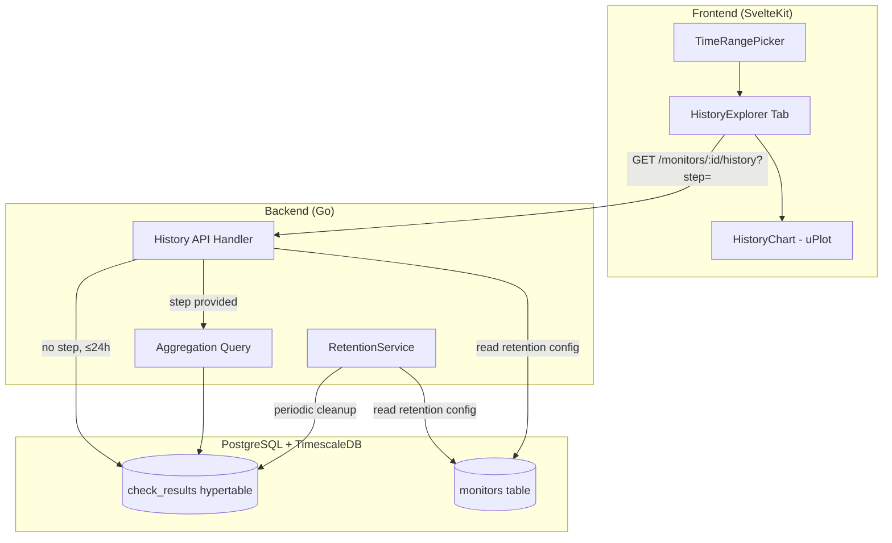

# Design Document

## Overview

Monitor History Explorer extends Pulse with per-monitor retention configuration, automated data lifecycle management, and a dedicated UI for investigating historical uptime and latency data over configurable time periods up to 365 days.

The feature introduces three interconnected subsystems:

1. **Retention Configuration** — a new `history_retention_days` column on monitors with validation, defaulting, and API surface updates
2. **Retention Service** — a background Go service that periodically deletes expired check results in bounded batches, with Prometheus observability
3. **History Explorer UI** — a tabbed interface on the monitor detail page with a time range picker, aggregated/raw history API, and interactive uPlot chart with zoom

The current 7-day hardcoded limit on the history endpoint is removed in favor of per-monitor retention boundaries with server-side downsampling to keep response sizes bounded.

## Architecture



### Key Design Decisions

1. **TimescaleDB `time_bucket` for downsampling** — rather than pre-materializing continuous aggregates, we use on-demand `time_bucket()` queries. At 500 monitors × 30-day retention × 1 check/minute = ~21.6M rows total, a time_bucket query over a single monitor's data (max ~43K rows for 30 days at 1-min interval) completes well within acceptable latency. This avoids schema complexity and storage overhead for continuous aggregates.

2. **Retention via DELETE in batches** — TimescaleDB's `drop_chunks()` operates on chunk boundaries (7 days by default) and can't target per-monitor retention. We use batched DELETE with `LIMIT` to avoid long-running transactions while respecting per-monitor boundaries.

3. **Tab-based UI with state preservation** — the existing monitor detail page content moves into an "Overview" tab, and a new "History" tab is added. Tab state (selected range) is preserved in component state so switching tabs doesn't reset the user's investigation context.

4. **Auto-step calculation** — when `step` is omitted and range > 24h, the API auto-selects `ceil(range_seconds / 1000)` to cap responses at ~1000 data points. This keeps network payloads bounded while preserving enough resolution for visual analysis.

## Components and Interfaces

### Backend Components

#### 1. Migration (011_monitor_retention.up.sql)

```sql
ALTER TABLE monitors
  ADD COLUMN history_retention_days INTEGER DEFAULT 30
  CHECK (history_retention_days >= 1 AND history_retention_days <= 365);
```

#### 2. Monitor API Extension

The `CreateMonitorRequest` and `PutMonitorRequest` structs gain an optional `HistoryRetentionDays *int32` field. Validation logic:
- If nil → stored as default (30)
- If value in [1, 365] → stored as-is
- Otherwise → return `INVALID_RETENTION_PERIOD` error

#### 3. RetentionService (`backend/internal/retention/service.go`)

```go
type RetentionService struct {
    pool            *pgxpool.Pool
    queries         *db.Queries
    interval        time.Duration
    batchSize       int           // max monitors per transaction (100)
    deleteLimit     int           // max rows per batch delete (10,000)
    running         atomic.Bool   // overlap guard
    rowsDeleted     prometheus.Counter
}

func (s *RetentionService) Start(ctx context.Context)
func (s *RetentionService) runCycle(ctx context.Context) error
```

Configuration via `PULSE_RETENTION_CHECK_INTERVAL` (Go duration, default `1h`, min `1m`, max `168h`).

The service iterates all monitors in pages of 100, computing the cutoff timestamp per monitor (`now - retention_days`), then issues a batched DELETE capped at 10,000 rows per batch. If a batch fails, it logs and continues.

#### 4. History API Handler Extension

The existing `GetHistory` handler is extended:
- Accept optional `step` query parameter (int, seconds, [60, 86400])
- Remove the 7-day max window validation
- Add retention boundary clamping: if `from` < `now - retention_days`, clamp and set `truncated: true`
- Route to raw query (existing) or aggregation query based on step presence/auto-calculation

#### 5. TimescaleDB Aggregation Query (`backend/internal/store/timescale/`)

New method on the Store:

```go
type AggregatedPoint struct {
    Timestamp   time.Time
    MinLatency  *int32
    MaxLatency  *int32
    AvgLatency  *int32
    CheckCount  int32
    UptimeRatio float64
}

func (s *Store) QueryHistoryAggregated(
    ctx context.Context,
    monitorID uuid.UUID,
    start, end time.Time,
    stepSeconds int,
) ([]AggregatedPoint, error)
```

SQL using TimescaleDB `time_bucket`:

```sql
SELECT
    time_bucket($4::interval, checked_at) AS bucket,
    MIN(latency_ms) AS min_latency_ms,
    MAX(latency_ms) AS max_latency_ms,
    AVG(latency_ms)::integer AS avg_latency_ms,
    COUNT(*) AS check_count,
    COUNT(*) FILTER (WHERE state = 'up')::float / COUNT(*) AS uptime_ratio
FROM check_results
WHERE monitor_id = $1
  AND checked_at >= $2
  AND checked_at < $3
GROUP BY bucket
ORDER BY bucket ASC
```

### Frontend Components

#### 1. Monitor Detail Page Refactor

The existing `+page.svelte` gains a tab system:
- Tab state managed with a `$state` variable (`'overview' | 'history'`)
- Existing content wrapped in the "Overview" tab
- New "History" tab renders the `HistoryExplorer` component
- URL hash not used (state is ephemeral, per requirement to preserve on tab switch)

#### 2. HistoryExplorer Component (`frontend/src/components/HistoryExplorer.svelte`)

Props: `monitorId: string`, `retentionDays: number`

Responsibilities:
- Manages selected time range state
- Fetches data from history API with appropriate `step` parameter
- Renders TimeRangePicker + HistoryChart (enhanced)
- Handles loading/error/empty states

#### 3. TimeRangePicker Component (`frontend/src/components/TimeRangePicker.svelte`)

Props: `selected`, `retentionDays`, `onchange` callback

Features:
- Preset buttons: 1h, 6h, 24h, 7d, 30d
- Custom range mode with `<input type="datetime-local">` (minute granularity)
- Validation: start < end, end clamped to now
- Retention notice when selected range > retention

#### 4. Enhanced HistoryChart

The existing `HistoryChart.svelte` is extended (or a new `HistoryChartExplorer.svelte` is created) to support:
- Dual series: latency line + uptime color band
- Aggregated data (min/max/avg displayed as a band with avg line)
- Tooltip with timestamp, latency (or min/max/avg for aggregated), and state
- Click-and-drag zoom with 1-minute minimum window
- "Reset zoom" button
- 250px skeleton loader during data fetch

#### 5. API Client Extension (`frontend/src/lib/api.ts`)

```typescript
export interface AggregatedHistoryPoint {
  timestamp: string;
  min_latency_ms: number | null;
  max_latency_ms: number | null;
  avg_latency_ms: number | null;
  check_count: number;
  uptime_ratio: number;
}

export interface HistoryResponseExtended {
  monitor_id: string;
  from: string;
  to: string;
  points?: HistoryPoint[];
  aggregated_points?: AggregatedHistoryPoint[];
  step?: number;
  truncated?: boolean;
}

export async function getMonitorHistoryExtended(
  id: string,
  from: string,
  to: string,
  step?: number
): Promise<HistoryResponseExtended>
```

## Data Models

### Database Schema Change

```sql
-- Migration 011_monitor_retention.up.sql
ALTER TABLE monitors
  ADD COLUMN history_retention_days INTEGER NOT NULL DEFAULT 30
  CONSTRAINT chk_retention_range CHECK (history_retention_days >= 1 AND history_retention_days <= 365);
```

### Updated Monitor Model (sqlc)

```go
type Monitor struct {
    // ... existing fields ...
    HistoryRetentionDays int32 `db:"history_retention_days" json:"history_retention_days"`
}
```

### API Response Models

**Extended History Response:**
```json
{
  "monitor_id": "uuid",
  "from": "2024-01-01T00:00:00Z",
  "to": "2024-01-31T00:00:00Z",
  "step": 2592,
  "truncated": false,
  "points": [],
  "aggregated_points": [
    {
      "timestamp": "2024-01-01T00:00:00Z",
      "min_latency_ms": 42,
      "max_latency_ms": 310,
      "avg_latency_ms": 87,
      "check_count": 43,
      "uptime_ratio": 0.98
    }
  ]
}
```

When `step` is used (explicit or auto-calculated), the response uses `aggregated_points`. When no aggregation is needed (range ≤ 24h, no `step`), the response uses `points` (existing format).

### Frontend Types

```typescript
export interface Monitor {
  // ... existing fields ...
  history_retention_days: number;
}
```

## Correctness Properties

*A property is a characteristic or behavior that should hold true across all valid executions of a system — essentially, a formal statement about what the system should do. Properties serve as the bridge between human-readable specifications and machine-verifiable correctness guarantees.*

### Property 1: Retention period storage round-trip

*For any* monitor creation or update request, if `history_retention_days` is provided with a value in [1, 365], the stored and subsequently retrieved value SHALL equal the provided value; if omitted, the effective value SHALL be 30.

**Validates: Requirements 1.1, 1.2, 1.3**

### Property 2: Retention period validation rejects invalid values

*For any* integer value outside the range [1, 365] (including 0, negatives, and values > 365), the Monitor API SHALL return an error response with code `INVALID_RETENTION_PERIOD` and the monitor state SHALL remain unchanged.

**Validates: Requirements 1.4**

### Property 3: Retention cleanup removes only expired rows

*For any* monitor with retention period R days and a set of check_result rows with varying `checked_at` timestamps, after a retention cleanup cycle completes, all rows where `checked_at < now - R days` SHALL be deleted, and all rows where `checked_at >= now - R days` SHALL remain intact.

**Validates: Requirements 1.5, 1.6, 2.3**

### Property 4: Retention interval config validation

*For any* string value for `PULSE_RETENTION_CHECK_INTERVAL`, if it is a valid Go duration in [1m, 168h], the service SHALL start successfully; otherwise it SHALL fail to start.

**Validates: Requirements 2.1, 2.2**

### Property 5: Step parameter validation

*For any* integer value provided as the `step` query parameter, the History API SHALL accept the request if and only if the value is in [60, 86400]; values outside this range SHALL result in a 400 error response.

**Validates: Requirements 5.1, 5.6**

### Property 6: Aggregation bucket correctness

*For any* set of check_result rows within a time range and a valid step value S, each aggregated bucket SHALL have: `min_latency_ms <= avg_latency_ms <= max_latency_ms`, `check_count` equal to the number of rows in that bucket, `uptime_ratio` equal to the count of rows with state "up" divided by `check_count`, and the response SHALL include a `step` field equal to S.

**Validates: Requirements 5.2, 5.7**

### Property 7: Auto-step calculation bounds response size

*For any* history request where `step` is not provided and the time range exceeds 24 hours, the API SHALL use a step value equal to `ceil(range_seconds / 1000)` and the number of returned aggregated points SHALL not exceed 1000.

**Validates: Requirements 5.3**

### Property 8: Retention boundary enforcement

*For any* history request, if the requested `from` timestamp is earlier than `now - monitor.history_retention_days`, the API SHALL clamp `from` to the retention boundary and include `truncated: true` in the response; otherwise `truncated` SHALL be false (or absent).

**Validates: Requirements 5.4, 5.5**

### Property 9: Time range preset computation

*For any* preset selection (1h, 6h, 24h, 7d, 30d), the computed time range SHALL have duration equal to the preset's specified duration and the end time SHALL be within 1 second of the current time.

**Validates: Requirements 4.3**

### Property 10: Start-before-end validation

*For any* time range where start ≥ end, the Time Range Picker SHALL display a validation error and SHALL NOT trigger an API request.

**Validates: Requirements 4.5**

### Property 11: Future end-time clamping

*For any* custom time range where end time is in the future, the actual API request SHALL use an end time clamped to the current time (within 1 second tolerance).

**Validates: Requirements 4.6**

### Property 12: Retention notice visibility

*For any* selected time range whose duration exceeds the monitor's configured `history_retention_days`, the History Explorer SHALL display a notice indicating data may be incomplete; for ranges within retention, no such notice SHALL appear.

**Validates: Requirements 4.4**

## Error Handling

### Backend

| Error Condition | Response | Recovery |
|----------------|----------|----------|
| Invalid `history_retention_days` (out of range) | 400 `INVALID_RETENTION_PERIOD` | Client corrects value |
| Invalid `step` parameter | 400 `INVALID_STEP` | Client corrects value |
| Monitor not found | 404 `NOT_FOUND` | — |
| `from` ≥ `to` | 400 `VALIDATION_ERROR` | Client corrects range |
| Database error during history query | 500 `DB_ERROR` | Client retries |
| RetentionService batch failure | Log error, skip batch | Retry next cycle |
| RetentionService overlap (still running) | Log warning, skip cycle | Runs on next trigger |
| Invalid `PULSE_RETENTION_CHECK_INTERVAL` | Fail startup with log | Operator fixes config |

### Frontend

| Error Condition | UI Behavior |
|----------------|-------------|
| History API returns 400 | Show error message in chart area, preserve time range for correction |
| History API returns 500 or timeout | Show error with "Retry" button, preserve selected range |
| Empty dataset | Show "No data available for the selected period" message |
| Network error | Show connection error, retry on reconnection |
| Range exceeds retention | Show informational notice (non-blocking), data may be partial |

## Testing Strategy

### Backend Testing

**Unit Tests (Go):**
- RetentionService configuration parsing (valid/invalid intervals)
- Step parameter validation in handler
- Retention period validation logic
- Auto-step calculation function
- Response serialization for aggregated vs raw points

**Property-Based Tests (Go, `rapid` library):**
- Property 1: Retention storage round-trip
- Property 2: Retention validation rejects invalid
- Property 3: Cleanup correctness (using test database with generated data)
- Property 4: Config interval validation
- Property 5: Step parameter validation
- Property 6: Aggregation bucket invariants
- Property 7: Auto-step bounds
- Property 8: Retention boundary clamping

Each property test runs minimum 100 iterations. Tests are tagged:
```go
// Feature: monitor-history-explorer, Property 6: Aggregation bucket correctness
```

**Integration Tests:**
- End-to-end retention cycle with real TimescaleDB
- History API with step parameter against real data
- Batch size limits respected under load

### Frontend Testing

**Property-Based Tests (Vitest + fast-check):**
- Property 9: Preset time computation
- Property 10: Start-before-end validation
- Property 11: Future end-time clamping
- Property 12: Retention notice visibility

Each property test runs minimum 100 iterations. Tests are tagged:
```typescript
// Feature: monitor-history-explorer, Property 9: Time range preset computation
```

**Unit Tests (Vitest + @testing-library/svelte):**
- Tab rendering and switching (Overview/History)
- TimeRangePicker preset rendering and custom mode
- Loading skeleton display during fetch
- Error state rendering with retry
- Empty state message
- Zoom reset button visibility
- Chart tooltip content

**Example-Based Tests:**
- Tab state preservation across switches
- Default "24 hours" selection on first open
- Tooltip format "YYYY-MM-DD HH:mm:ss"
