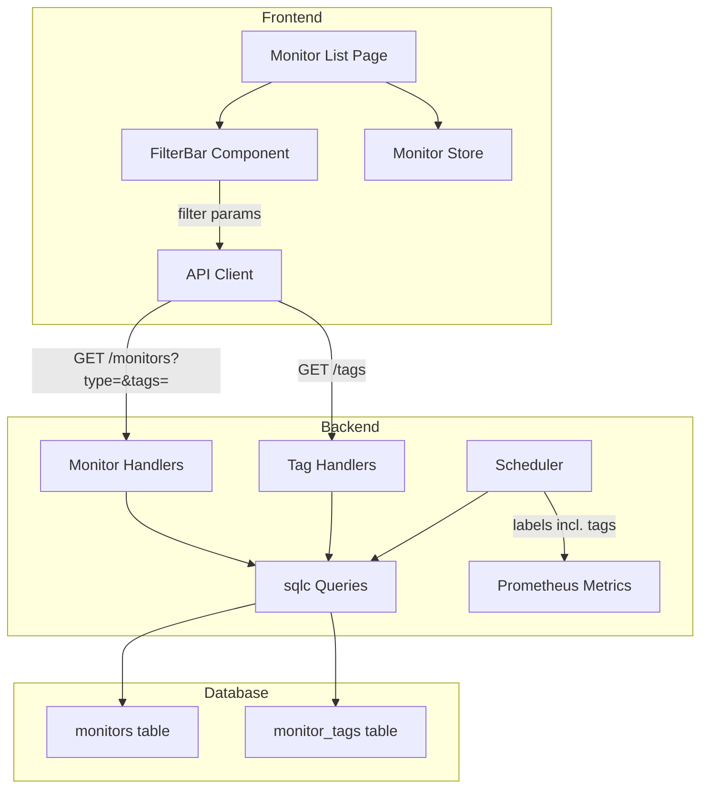
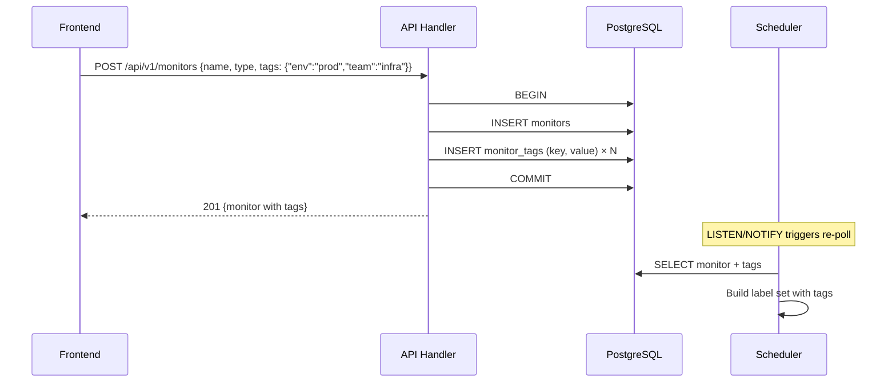
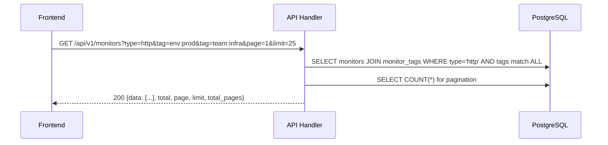
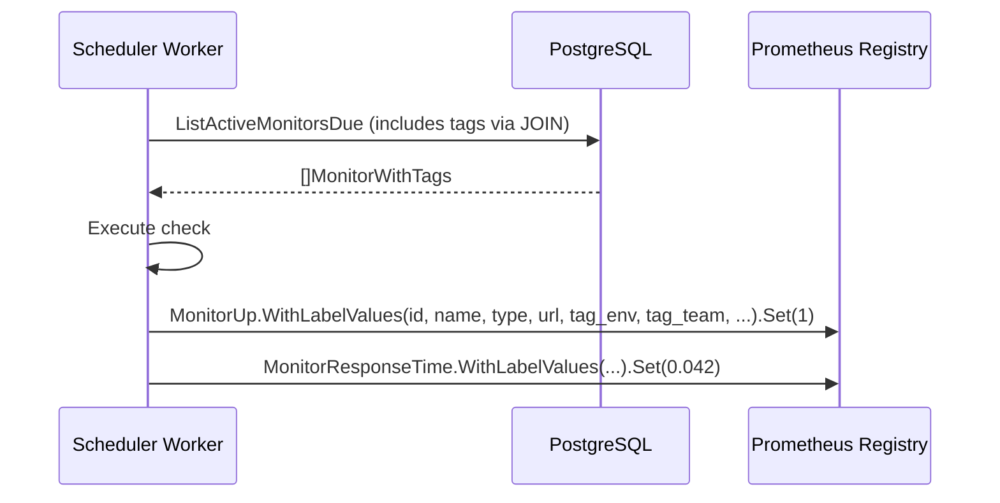

# Design Document: Monitor Tagging

## Overview

Monitor Tagging adds key-value tag pairs to monitors in Pulse. Tags serve two purposes: they are promoted as Prometheus metric labels on existing `pulse_monitor_up` and `pulse_monitor_response_time_seconds` gauges, enabling metric filtering/grouping in Grafana; and they power a minimalistic frontend filter bar on the monitor list view alongside the existing monitor type filter.

Tags are stored in a dedicated `monitor_tags` join table for efficient querying. The backend exposes CRUD operations through the existing monitor endpoints (tags are embedded in the monitor payload), a dedicated tags listing endpoint for autocomplete, and filtered list queries. The frontend adds a compact, collapsible filter bar with type pills and tag chips — designed to stay out of the way until the user needs it.

The design handles 500+ monitors efficiently by keeping tag filtering server-side (paginated), using GIN indexes for JSONB-free tag lookups, and maintaining the existing VirtualList for rendering.

## Architecture



## Sequence Diagrams

### Monitor Creation with Tags



### Filtered Monitor List



### Prometheus Metric Emission



## Components and Interfaces

### Component 1: Tag Storage Layer (PostgreSQL + sqlc)

**Purpose**: Persist key-value tags per monitor with efficient filtering.

**Interface**:
```go
// New sqlc queries for monitor_tags
type MonitorTag struct {
    ID        uuid.UUID `db:"id" json:"id"`
    MonitorID uuid.UUID `db:"monitor_id" json:"monitor_id"`
    Key       string    `db:"key" json:"key"`
    Value     string    `db:"value" json:"value"`
}

// Query interfaces (sqlc-generated)
type Querier interface {
    // existing...
    SetMonitorTags(ctx context.Context, monitorID uuid.UUID, tags []MonitorTag) error
    ListTagsByMonitor(ctx context.Context, monitorID uuid.UUID) ([]MonitorTag, error)
    ListAllTagKeys(ctx context.Context) ([]string, error)
    ListTagValues(ctx context.Context, key string) ([]string, error)
    ListMonitorsFiltered(ctx context.Context, arg ListMonitorsFilteredParams) ([]MonitorWithTags, error)
    CountMonitorsFiltered(ctx context.Context, arg CountMonitorsFilteredParams) (int64, error)
}
```

**Responsibilities**:
- Store tags in normalized form (one row per key-value pair per monitor)
- Support efficient AND-filtering (monitors matching ALL specified tags)
- Provide distinct tag key/value lists for frontend autocomplete
- Cascade-delete tags when monitor is deleted

### Component 2: API Handlers (Tag CRUD + Filtered List)

**Purpose**: Expose tag management via REST endpoints integrated with existing monitor CRUD.

**Interface**:
```go
// Tag representation in API payloads
type TagResponse struct {
    Key   string `json:"key"`
    Value string `json:"value"`
}

// Extended monitor response includes tags
type MonitorResponse struct {
    // ...existing fields...
    Tags []TagResponse `json:"tags"`
}

// Monitor create/update request includes optional tags
type MonitorRequest struct {
    // ...existing fields...
    Tags []TagResponse `json:"tags,omitempty"`
}

// New endpoints
// GET  /api/v1/tags           → list distinct tag keys
// GET  /api/v1/tags/:key      → list values for a key
// GET  /api/v1/monitors       → extended with ?type=&tag=key:value query params
```

**Responsibilities**:
- Accept tags on monitor create/update (transactional with monitor write)
- Return tags in monitor responses (list and detail)
- Provide tag autocomplete data (keys and values)
- Validate tag constraints (key/value length, character set, max tags per monitor)

### Component 3: Prometheus Label Promotion

**Purpose**: Attach tag key-value pairs as dynamic labels on existing metric vectors.

**Interface**:
```go
// DynamicMetrics replaces the static Metrics struct for tag-aware labels
type DynamicMetrics struct {
    registry       *prometheus.Registry
    monitorUp      *prometheus.GaugeVec
    responseTime   *prometheus.GaugeVec
    monitorsTotal  prometheus.Gauge
    labelNames     []string // ["monitor_id", "monitor_name", "monitor_type", "monitor_url", "tag_env", "tag_team", ...]
    mu             sync.RWMutex
}

// RecordCheck updates metrics for a monitor with its current tag set
func (dm *DynamicMetrics) RecordCheck(monitorID, name, mType, url string, tags map[string]string, up bool, latencySeconds float64)

// RebuildLabels is called when the set of tag keys changes (monitor created/updated)
// Re-registers metric vectors with updated label set
func (dm *DynamicMetrics) RebuildLabels(allTagKeys []string)

// CleanupMonitor removes stale time series for a deleted/updated monitor
func (dm *DynamicMetrics) CleanupMonitor(labelValues []string)
```

**Responsibilities**:
- Promote tag keys as label names (prefixed with `tag_`) on gauge vectors
- Handle label cardinality changes when new tag keys are introduced
- Clean up stale metric series when monitors are deleted or tags changed
- Enforce a maximum number of promoted tag keys to prevent label explosion

### Component 4: Frontend FilterBar Component

**Purpose**: Minimalistic, collapsible filter UI for the monitor list.

**Interface**:
```typescript
// FilterBar.svelte props
interface FilterBarProps {
    availableTypes: MonitorType[];
    availableTags: TagOption[];
    activeFilters: ActiveFilters;
    onFilterChange: (filters: ActiveFilters) => void;
}

interface TagOption {
    key: string;
    values: string[];
}

interface ActiveFilters {
    types: MonitorType[];
    tags: Record<string, string[]>; // key → selected values
}
```

**Responsibilities**:
- Render type filter as horizontal pill toggles
- Render tag filter as compact chip selectors (key: value)
- Collapse to a single "Filter" button when no filters active
- Emit filter changes to parent for server-side query
- Fetch available tags on mount (cached)

### Component 5: WebSocket Patch Extension

**Purpose**: Include tag changes in real-time patches when tags are modified.

**Interface**:
```go
// Extended MonitorStatusPayload (only on tag-change events, not every check)
type MonitorTagsChangedPayload struct {
    MonitorID string        `json:"monitor_id"`
    Tags      []TagResponse `json:"tags"`
    Timestamp string        `json:"timestamp"`
}

// New message type
const TypeMonitorTagsChanged = "monitor_tags_changed"
```

**Responsibilities**:
- Broadcast `monitor_tags_changed` when tags are modified via API
- Clients update their local monitor cache with new tags
- Regular `monitor_status` checks do NOT include tags (keep patches minimal)

## Data Models

### Database: `monitor_tags` table

```sql
CREATE TABLE monitor_tags (
    id         UUID PRIMARY KEY DEFAULT gen_random_uuid(),
    monitor_id UUID NOT NULL REFERENCES monitors(id) ON DELETE CASCADE,
    key        TEXT NOT NULL,
    value      TEXT NOT NULL,
    UNIQUE (monitor_id, key, value)
);

CREATE INDEX idx_monitor_tags_monitor_id ON monitor_tags(monitor_id);
CREATE INDEX idx_monitor_tags_key_value ON monitor_tags(key, value);
CREATE INDEX idx_monitor_tags_key ON monitor_tags(key);
```

**Validation Rules**:
- `key`: 1–64 characters, lowercase alphanumeric + hyphens + underscores, must start with letter
- `value`: 1–256 characters, printable UTF-8, no control characters
- Maximum 20 tags per monitor
- Keys prefixed with `__` are reserved (system use)

### TypeScript: Extended Types

```typescript
export interface Tag {
    key: string;
    value: string;
}

// Monitor type extended with tags
export interface Monitor {
    // ...existing fields...
    tags: Tag[];
}

// Filter state
export interface MonitorFilters {
    types: MonitorType[];
    tags: Tag[]; // AND semantics: monitor must have ALL specified tags
    page: number;
    limit: number;
}
```

## Algorithmic Pseudocode

### Tag-Filtered Monitor Query

```go
// ListMonitorsFiltered builds a dynamic query with optional type and tag filters.
// Uses AND semantics: monitors must match ALL specified tags.
//
// Preconditions:
//   - params.Limit > 0 && params.Limit <= 100
//   - params.Offset >= 0
//   - Each tag in params.Tags has non-empty Key and Value
//
// Postconditions:
//   - Returns monitors matching ALL filter criteria
//   - Results ordered by created_at DESC
//   - len(result) <= params.Limit
//
// SQL approach (sqlc raw query):
//
// SELECT m.* FROM monitors m
// WHERE ($1::text IS NULL OR m.type = $1)
//   AND (
//     cardinality($2::text[]) = 0
//     OR m.id IN (
//       SELECT mt.monitor_id FROM monitor_tags mt
//       WHERE (mt.key || ':' || mt.value) = ANY($2::text[])
//       GROUP BY mt.monitor_id
//       HAVING COUNT(DISTINCT mt.key || ':' || mt.value) = cardinality($2::text[])
//     )
//   )
// ORDER BY m.created_at DESC
// LIMIT $3 OFFSET $4
```

### Prometheus Label Rebuild Algorithm

```go
// RebuildLabels updates the metric vector label set when tag keys change.
//
// Preconditions:
//   - allTagKeys contains all distinct tag keys currently in use
//   - dm.mu write lock is held by caller
//
// Postconditions:
//   - dm.labelNames contains base labels + "tag_" prefixed tag keys
//   - Previous metric vectors are unregistered
//   - New metric vectors are registered with updated labels
//   - Existing time series data is lost (acceptable: Prometheus scrapes rebuild)
//
// Loop Invariant:
//   - At any point, dm.monitorUp and dm.responseTime have identical label sets

func (dm *DynamicMetrics) RebuildLabels(allTagKeys []string) {
    dm.mu.Lock()
    defer dm.mu.Unlock()

    // Step 1: Build new label set
    baseLabels := []string{"monitor_id", "monitor_name", "monitor_type", "monitor_url"}
    newLabels := make([]string, 0, len(baseLabels)+len(allTagKeys))
    newLabels = append(newLabels, baseLabels...)
    for _, key := range allTagKeys {
        newLabels = append(newLabels, "tag_"+key)
    }

    // Step 2: Skip if unchanged
    if slicesEqual(dm.labelNames, newLabels) {
        return
    }

    // Step 3: Unregister old vectors
    if dm.monitorUp != nil {
        dm.registry.Unregister(dm.monitorUp)
    }
    if dm.responseTime != nil {
        dm.registry.Unregister(dm.responseTime)
    }

    // Step 4: Create and register new vectors
    dm.monitorUp = prometheus.NewGaugeVec(
        prometheus.GaugeOpts{Name: "pulse_monitor_up", Help: "Whether the monitor is up (1) or down (0)."},
        newLabels,
    )
    dm.responseTime = prometheus.NewGaugeVec(
        prometheus.GaugeOpts{Name: "pulse_monitor_response_time_seconds", Help: "Last recorded response time in seconds."},
        newLabels,
    )
    dm.registry.MustRegister(dm.monitorUp, dm.responseTime)
    dm.labelNames = newLabels
}
```

### Tag Set Synchronization (Create/Update)

```go
// SetMonitorTags replaces all tags for a monitor within a transaction.
//
// Preconditions:
//   - tx is an active database transaction
//   - monitorID exists in the monitors table
//   - len(tags) <= 20
//   - Each tag key matches ^[a-z][a-z0-9_-]{0,63}$
//   - Each tag value is 1-256 chars, printable UTF-8
//
// Postconditions:
//   - All previous tags for monitorID are removed
//   - Exactly len(tags) rows exist in monitor_tags for monitorID
//   - No duplicate (key, value) pairs
//
// Approach: DELETE + batch INSERT (simpler than diffing for ≤20 tags)

func SetMonitorTags(ctx context.Context, tx pgx.Tx, monitorID uuid.UUID, tags []Tag) error {
    // Delete existing
    _, err := tx.Exec(ctx, "DELETE FROM monitor_tags WHERE monitor_id = $1", monitorID)
    if err != nil {
        return err
    }

    // Batch insert new tags
    if len(tags) == 0 {
        return nil
    }
    
    // Build batch insert: INSERT INTO monitor_tags (monitor_id, key, value) VALUES ($1,$2,$3), ...
    query, args := buildBatchInsert(monitorID, tags)
    _, err = tx.Exec(ctx, query, args...)
    return err
}
```

## Key Functions with Formal Specifications

### `RecordCheck` — Prometheus metric update with tags

```go
func (dm *DynamicMetrics) RecordCheck(
    monitorID, name, mType, url string,
    tags map[string]string,
    up bool,
    latencySeconds float64,
)
```

**Preconditions:**
- `monitorID` is a valid UUID string
- `name` is non-empty
- `mType` is one of: "http", "tcp", "udp", "websocket"
- `tags` keys match the currently registered label keys (subset of dm.labelNames)
- `latencySeconds` >= 0

**Postconditions:**
- `pulse_monitor_up{...}` gauge set to 1.0 (up) or 0.0 (down)
- `pulse_monitor_response_time_seconds{...}` gauge set to `latencySeconds`
- Missing tag keys filled with empty string ("") as label value
- No panic on unknown label names (graceful handling)

**Loop Invariants:** N/A

### `ValidateTags` — Tag input validation

```go
func ValidateTags(tags []TagRequest) error
```

**Preconditions:**
- `tags` is a non-nil slice (may be empty)

**Postconditions:**
- Returns nil if all tags are valid
- Returns error with descriptive message if:
  - len(tags) > 20
  - Any key doesn't match `^[a-z][a-z0-9_-]{0,63}$`
  - Any key starts with `__`
  - Any value is empty or > 256 chars
  - Duplicate (key, value) pairs exist in the input
- Validation is pure (no side effects)

**Loop Invariants:**
- All previously validated tags in the slice are conformant

### `buildFilterQuery` — Dynamic SQL for filtered monitor listing

```go
func buildFilterQuery(params ListMonitorsFilteredParams) (string, []interface{})
```

**Preconditions:**
- `params.Limit` in range [1, 100]
- `params.Offset` >= 0
- `params.Tags` entries are pre-validated (valid key:value format)
- `params.Type` is either empty or a valid MonitorType

**Postconditions:**
- Returns a parameterized SQL query (no SQL injection possible)
- Query uses AND semantics for tags
- Query includes ORDER BY created_at DESC
- Query includes LIMIT/OFFSET for pagination
- Number of returned args matches placeholders in query

## Example Usage

### API: Create Monitor with Tags

```bash
# Create a monitor with tags
curl -X POST http://localhost:8080/api/v1/monitors \
  -H "Authorization: Bearer <token>" \
  -H "Content-Type: application/json" \
  -d '{
    "name": "Production API",
    "type": "http",
    "target": "https://api.example.com/health",
    "interval_seconds": 30,
    "timeout_seconds": 10,
    "tags": [
      {"key": "env", "value": "production"},
      {"key": "team", "value": "platform"},
      {"key": "region", "value": "us-east-1"}
    ]
  }'
```

### API: List Monitors with Filters

```bash
# Filter by type AND tags (AND semantics)
curl "http://localhost:8080/api/v1/monitors?type=http&tag=env:production&tag=team:platform&page=1&limit=25" \
  -H "Authorization: Bearer <token>"
```

### API: List Available Tags

```bash
# Get all tag keys
curl http://localhost:8080/api/v1/tags \
  -H "Authorization: Bearer <token>"
# Response: {"data": ["env", "team", "region", "service"]}

# Get values for a key
curl http://localhost:8080/api/v1/tags/env \
  -H "Authorization: Bearer <token>"
# Response: {"data": ["production", "staging", "development"]}
```

### Prometheus Metrics Output

```
# HELP pulse_monitor_up Whether the monitor is up (1) or down (0).
# TYPE pulse_monitor_up gauge
pulse_monitor_up{monitor_id="abc-123",monitor_name="Production API",monitor_type="http",monitor_url="https://api.example.com/health",tag_env="production",tag_team="platform",tag_region="us-east-1"} 1
pulse_monitor_up{monitor_id="def-456",monitor_name="Staging DB",monitor_type="tcp",monitor_url="staging-db:5432",tag_env="staging",tag_team="data"} 0
```

### Frontend: FilterBar Usage

```typescript
// In monitor list page
import FilterBar from '$components/FilterBar.svelte';

const filters = $state<ActiveFilters>({ types: [], tags: {} });

function handleFilterChange(newFilters: ActiveFilters) {
    filters = newFilters;
    // Triggers re-fetch with new query params
    fetchMonitors({ ...newFilters, page: 1, limit: 25 });
}
```

## Correctness Properties

*A property is a characteristic or behavior that should hold true across all valid executions of a system — essentially, a formal statement about what the system should do. Properties serve as the bridge between human-readable specifications and machine-verifiable correctness guarantees.*

### Property 1: Tag Persistence Round-Trip

*For any* valid monitor and valid tag set T, creating or updating the monitor with T then retrieving the monitor SHALL return exactly the set T — no extra tags, no missing tags, identical keys and values.

**Validates: Requirements 3.1, 3.2, 3.4, 3.5**

### Property 2: Tag Key Validation Correctness

*For any* string S, the Tag_Validator SHALL accept S as a key if and only if S matches `^[a-z][a-z0-9_-]{0,63}$` and does not start with `__`.

**Validates: Requirements 2.1, 2.2**

### Property 3: Tag Value Validation Correctness

*For any* string S, the Tag_Validator SHALL accept S as a value if and only if S has length between 1 and 256 (inclusive) and contains only printable UTF-8 characters (no control characters).

**Validates: Requirements 2.3, 2.4**

### Property 4: Tag Set Constraint Validation

*For any* tag set T, the Tag_Validator SHALL reject T if len(T) > 20 or T contains duplicate (key, value) pairs, and accept T (regarding these constraints) otherwise.

**Validates: Requirements 2.5, 2.6**

### Property 5: Tag Validation Determinism

*For any* input tag set T, calling ValidateTags(T) multiple times SHALL always produce the same result (pure function, no side effects).

**Validates: Requirements 2.8**

### Property 6: Filter Completeness and Soundness (AND Semantics)

*For any* set of monitors in the database and any combined filter F (type + tags), a monitor appears in the filtered result set if and only if: (a) its type matches the type filter (or type filter is empty), AND (b) it possesses ALL tags specified in F.

**Validates: Requirements 5.1, 5.2, 5.3**

### Property 7: Pagination Correctness

*For any* valid page/limit parameters applied to a filtered result set, the number of returned monitors SHALL be at most `limit`, and the pagination metadata (total, total_pages) SHALL be consistent with the full result count.

**Validates: Requirements 5.4, 5.5**

### Property 8: Filtered Result Ordering

*For any* filtered result set with more than one monitor, each monitor's created_at timestamp SHALL be greater than or equal to the next monitor's created_at in the response (descending order).

**Validates: Requirements 5.6**

### Property 9: Prometheus Label Prefix Transformation

*For any* tag key K promoted to a Prometheus label, the resulting label name SHALL equal `"tag_" + K`.

**Validates: Requirements 6.1**

### Property 10: Prometheus Label Set Invariant

*For any* monitor at any point in time, the label set on `pulse_monitor_up` and `pulse_monitor_response_time_seconds` SHALL be identical.

**Validates: Requirements 6.2**

### Property 11: Prometheus Missing Tag Fill

*For any* monitor whose tag keys are a strict subset of the global promoted label set, the missing label values SHALL be set to empty string.

**Validates: Requirements 6.3**

### Property 12: Prometheus Label Cardinality Cap

*For any* configuration of monitors and tags, the number of `tag_`-prefixed label names on metric vectors SHALL never exceed 10.

**Validates: Requirements 6.4**

### Property 13: Cascade Delete Integrity

*For any* monitor that is deleted, the count of rows in `monitor_tags` with that monitor's ID SHALL be zero after deletion.

**Validates: Requirements 1.3**

### Property 14: Tag Autocomplete Completeness

*For any* set of monitors with tags in the database, GET `/api/v1/tags` SHALL return exactly the distinct set of keys present across all monitors, and GET `/api/v1/tags/:key` SHALL return exactly the distinct values for that key.

**Validates: Requirements 4.1, 4.2**

### Property 15: WebSocket Patch Minimality

*For any* `monitor_status` message emitted during a regular health check, the payload SHALL NOT contain a tags field. Tags are only broadcast via `monitor_tags_changed` messages.

**Validates: Requirements 8.3**

### Property 16: Tag Change Notification Completeness

*For any* tag modification via the API, the resulting `monitor_tags_changed` WebSocket message SHALL contain the monitor_id, the complete updated tags array, and a timestamp.

**Validates: Requirements 8.1, 8.2**

## Error Handling

### Error Scenario 1: Tag Validation Failure

**Condition**: Client sends tags that violate constraints (invalid key format, too many tags, value too long)
**Response**: 400 Bad Request with error envelope: `{"error": {"code": "INVALID_TAGS", "message": "tag key 'Env' must be lowercase alphanumeric..."}}`
**Recovery**: Client corrects input and retries

### Error Scenario 2: Label Cardinality Explosion

**Condition**: Users create monitors with too many distinct tag keys, causing Prometheus label cardinality to grow unbounded
**Response**: Enforce a global limit of 10 promotable tag keys. Tags beyond this limit are stored but not promoted to metrics.
**Recovery**: Admin configures `PULSE_MAX_METRIC_TAG_KEYS` env var (default: 10). Excess tag keys emit a warning log.

### Error Scenario 3: Metric Re-registration Failure

**Condition**: Prometheus registry rejects re-registration of metrics with new label set during RebuildLabels
**Response**: Log error, keep previous metric vectors active
**Recovery**: On next scheduler tick, retry rebuild. If persistent, operator must restart the service.

### Error Scenario 4: Concurrent Tag Modification

**Condition**: Two API calls modify tags for the same monitor simultaneously
**Response**: Transaction isolation (SERIALIZABLE or row-level lock) ensures one wins. The loser gets a 409 Conflict or retries transparently.
**Recovery**: Client retries with fresh state (optimistic concurrency via `updated_at`)

## Testing Strategy

### Unit Testing Approach

- `ValidateTags`: Table-driven tests covering all validation rules (valid keys, edge lengths, reserved prefixes, duplicates)
- `buildFilterQuery`: Verify generated SQL for various filter combinations
- `SetMonitorTags`: Mock transaction, verify DELETE + INSERT sequence
- `applyMonitorPatch` (frontend): Verify tags field preserved during state patches
- `FilterBar` component: Verify filter emission, chip rendering, collapse behavior

### Property-Based Testing Approach

**Property Test Library**: fast-check (frontend), testing/quick (backend)

- **Round-trip property**: For any valid tag set T, `SetMonitorTags(m, T)` followed by `ListTagsByMonitor(m)` returns exactly T
- **Filter AND property**: For any monitor m and filter F, m appears in results ⟺ m has ALL tags in F AND (type filter empty OR m.type matches)
- **Validation completeness**: For any random string pair (key, value), ValidateTags either accepts (conforming to regex) or rejects with specific error
- **Label consistency**: For any tag map, RecordCheck produces identical label sets on both metric vectors

### Integration Testing Approach

- Full API flow: create monitor with tags → list with filter → verify results
- WebSocket: modify tags via API → verify `monitor_tags_changed` broadcast received
- Prometheus: create tagged monitor → trigger check → scrape /metrics → verify labels present
- Migration: run 008 migration up/down on test database

## Performance Considerations

- **Tag query efficiency**: GIN index on `(key, value)` enables fast tag lookups. The HAVING/COUNT approach for AND-filtering is O(N×M) where N = monitors with any matching tag and M = number of filter tags — acceptable for 500 monitors.
- **Prometheus label cardinality**: Capped at 10 promoted tag keys. With 500 monitors and 10 tag keys, worst case is 5000 unique time series per metric — well within Prometheus limits.
- **Tag storage**: Maximum 20 tags × 500 monitors = 10,000 rows in `monitor_tags` — trivial for PostgreSQL.
- **Frontend**: Tag autocomplete fetched once on filter bar mount, cached in memory. Filter changes trigger server-side paginated queries (no client-side filtering of 500+ monitors).
- **Scheduler hot path**: Tags loaded via JOIN in `ListActiveMonitorsDue` — single query, no N+1.

## Security Considerations

- **Tag key/value sanitization**: Strict regex validation prevents injection in Prometheus label names. Tag values are escaped when used as label values (Prometheus client handles this).
- **No secrets in tags**: Documentation warns users not to store sensitive data in tags. Tags are visible in API responses and Prometheus metrics endpoint.
- **Authorization**: Tag operations inherit monitor authorization (same JWT/API token auth). No separate tag permissions.
- **Rate limiting**: Tag autocomplete endpoint shares existing API rate limits.

## Dependencies

- **Existing**: PostgreSQL, pgx/v5, sqlc, prometheus/client_golang, gin, SvelteKit 5, Tailwind CSS
- **New migration**: `008_monitor_tags.up.sql` / `008_monitor_tags.down.sql`
- **New sqlc queries**: `monitor_tags.sql` in queries directory
- **No new external dependencies** — everything built with existing stack
