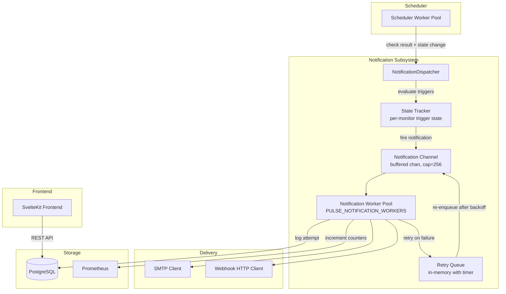

# Design Document: Notification Channels

## Overview

The notification channels feature adds asynchronous alerting to Pulse. When a monitor changes state (down, up, degraded, SSL expiring, consecutive failures), the system dispatches notifications through user-configured channels (email or webhook) without blocking the monitoring scheduler.

The design introduces three new backend packages (`notification`, `smtp`, `webhook`), three database tables, a dedicated goroutine-pool dispatcher, and a new frontend Notifications page with per-monitor binding configuration.

**Key design decisions:**
- **Dedicated dispatcher pool** — separate from the scheduler worker pool to isolate notification failures from monitoring reliability.
- **Buffered channel with drop semantics** — mirrors the Hub pattern; scheduler never blocks on notification delivery.
- **State-tracking in memory** — prevents duplicate notifications for ongoing conditions (degraded, SSL expiring, n_failures_in_row) without additional DB queries per check.
- **Go `text/template`** — chosen over `html/template` for webhook bodies since webhook payloads are typically JSON, not HTML. Validated at creation time.
- **Instance-level SMTP via env vars** — consistent with existing config pattern (PULSE_PORT, PULSE_SECRET_KEY, etc.).

## Architecture

### System Component Diagram



### Data Flow

1. **Scheduler** completes a check → calls `Dispatcher.Evaluate(monitorID, checkResult, previousState)`.
2. **Dispatcher.Evaluate** looks up bindings for the monitor (cached with short TTL), checks state tracker for deduplication, and enqueues matching notifications onto the buffered channel.
3. **Worker goroutines** dequeue notifications, render the payload (email template or Go template for webhook), attempt delivery, and log the result.
4. **On failure**, the worker schedules a retry with exponential backoff (30s, 60s, 120s) via an in-memory timer that re-enqueues onto the same channel.
5. **Reminder policy** is handled by a separate ticker goroutine that periodically scans active reminders and re-enqueues notifications at the configured interval.

## Components and Interfaces

### Backend Packages

| Package | Path | Responsibility |
|---------|------|----------------|
| `notification` | `backend/internal/notification/` | Dispatcher, state tracker, retry logic, worker pool |
| `smtp` | `backend/internal/notification/smtp/` | SMTP client, HTML email rendering |
| `webhook` | `backend/internal/notification/webhook/` | Template rendering, HTTP delivery |
| handlers | `backend/internal/api/handlers/notification_*.go` | REST API for channels, bindings, test, template vars, SMTP status |

### Key Interfaces

```go
// Dispatcher is the main notification orchestrator.
type Dispatcher struct {
    cfg         DispatcherConfig
    queries     *db.Queries
    pool        *pgxpool.Pool
    smtpClient  *smtp.Client       // nil if SMTP not configured
    httpClient  *http.Client
    jobs        chan DeliveryJob
    metrics     *Metrics
    state       *StateTracker
    reminders   *ReminderScheduler
    done        chan struct{}
}

// DispatcherConfig holds tunable parameters.
type DispatcherConfig struct {
    Workers      int           // PULSE_NOTIFICATION_WORKERS
    BufferSize   int           // 256
    DrainTimeout time.Duration // PULSE_NOTIFICATION_DRAIN_TIMEOUT
}

// DeliveryJob represents a single notification to deliver.
type DeliveryJob struct {
    ID          uuid.UUID
    ChannelID   uuid.UUID
    MonitorID   uuid.UUID
    BindingID   uuid.UUID
    TriggerType string
    Attempt     int
    MaxAttempts int
    Payload     TemplateData
    ScheduledAt time.Time
}

// TemplateData holds all template variables available for rendering.
type TemplateData struct {
    Monitor  MonitorData
    Status         string
    PreviousStatus string
    ResponseTime   int32
    Incident IncidentData
    Timestamp      time.Time
}

// StateTracker prevents duplicate notifications for ongoing conditions.
type StateTracker struct {
    mu     sync.RWMutex
    states map[uuid.UUID]*MonitorNotifState // keyed by monitor ID
}

// MonitorNotifState tracks per-monitor notification dedup state.
type MonitorNotifState struct {
    IsDegraded         bool
    SSLWarned          bool
    ConsecFailuresFired bool
    LastReminderSent   map[uuid.UUID]time.Time // keyed by binding ID
}
```

### Handler Registration Pattern

Following the existing project convention (e.g., `IncidentHandler.Register`):

```go
type NotificationChannelHandler struct {
    queries    *db.Queries
    pool       *pgxpool.Pool
    dispatcher *notification.Dispatcher
    secretKey  []byte
}

func (h *NotificationChannelHandler) Register(rg *gin.RouterGroup) {
    // Channel CRUD
    rg.POST("/notifications/channels", h.Create)
    rg.GET("/notifications/channels", h.List)
    rg.GET("/notifications/channels/:id", h.Get)
    rg.PUT("/notifications/channels/:id", h.Update)
    rg.DELETE("/notifications/channels/:id", h.Delete)

    // Test notification
    rg.POST("/notifications/channels/:id/test", h.Test)

    // Template variable reference
    rg.GET("/notifications/template-variables", h.TemplateVariables)

    // SMTP settings (UI-managed)
    rg.GET("/notifications/smtp-settings", h.GetSMTPSettings)
    rg.PUT("/notifications/smtp-settings", h.UpdateSMTPSettings)
    rg.DELETE("/notifications/smtp-settings", h.DeleteSMTPSettings)
    rg.POST("/notifications/smtp-settings/test", h.TestSMTPConnection)
}

type NotificationBindingHandler struct {
    queries *db.Queries
}

func (h *NotificationBindingHandler) Register(rg *gin.RouterGroup) {
    rg.POST("/monitors/:id/notification-bindings", h.Create)
    rg.GET("/monitors/:id/notification-bindings", h.List)
    rg.PUT("/monitors/:id/notification-bindings/:bindingId", h.Update)
    rg.DELETE("/monitors/:id/notification-bindings/:bindingId", h.Delete)
}
```

### Integration with Existing Scheduler

The scheduler's `executeCheck` method gains a single call after persisting state:

```go
// After UpdateMonitorState and hub broadcast:
if s.dispatcher != nil {
    s.dispatcher.Evaluate(ctx, m.ID, previousState, result)
}
```

The `Dispatcher.Evaluate` method is non-blocking — it writes to a buffered channel and returns immediately.

## Data Models

### Database Schema

#### Table: `notification_channels`

```sql
CREATE TABLE notification_channels (
    id              UUID PRIMARY KEY DEFAULT gen_random_uuid(),
    name            VARCHAR(100) NOT NULL,
    channel_type    VARCHAR(20) NOT NULL CHECK (channel_type IN ('email', 'webhook')),
    config          JSONB NOT NULL,
    created_at      TIMESTAMPTZ NOT NULL DEFAULT now(),
    updated_at      TIMESTAMPTZ NOT NULL DEFAULT now()
);
```

The `config` JSONB column stores type-specific configuration:

**Email config:**
```json
{
  "recipients": ["admin@example.com", "oncall@example.com"]
}
```

**Webhook config:**
```json
{
  "url": "https://hooks.slack.com/services/...",
  "method": "POST",
  "body_template": "{ \"text\": \"{{.Monitor.Name}} is {{.Status}}\" }",
  "headers": [
    { "name": "X-Custom", "value": "<encrypted>" }
  ]
}
```

**Secure storage of sensitive fields:**

Custom header values are encrypted at rest using AES-256-GCM (same key as `PULSE_SECRET_KEY`), consistent with the existing secrets/token encryption pattern in Pulse:

| Channel Type | Field | Storage | Rationale |
|---|---|---|---|
| Webhook | `config.url` | **Plaintext** | URL is retrievable for display/edit — not a secret by itself |
| Webhook | `config.headers[].value` | **Encrypted (AES-256-GCM)** | Authorization headers, API keys, bearer tokens — these are credentials |
| SMTP | `password` | **Encrypted (AES-256-GCM)** | SMTP password stored in DB, managed through UI, write-only via API |

**Encryption/decryption flow:**
- On **create/update**: the API handler encrypts header values before persisting to the `config` JSONB column. URL is stored as plaintext.
- On **GET**: the API returns `url` and all non-sensitive fields in cleartext. Header values are replaced with a `"[REDACTED]"` placeholder — raw values are never returned via API.
- On **dispatch**: the dispatcher decrypts header values from the stored config before making the HTTP request.
- The `secretKey` is passed to both the handler (for encrypt on write) and dispatcher (for decrypt on read), identical to how `PULSE_SECRET_KEY` is used for the existing secrets module.

**Design decision — URL stored plaintext:** The webhook URL is not treated as a secret. Users need to see and edit it freely. If users embed tokens in the URL itself (e.g., Slack webhook URLs), that's their responsibility — we don't enforce URL encryption because it would break the UX of URL editing and validation.

**Design decision — Header values as secrets:** Auth headers (Authorization, X-API-Key, etc.) are the primary credential vector for webhook integrations. These are write-only from the API perspective — once stored, they can only be overwritten, never retrieved. This matches how Pulse already handles API tokens and secret values.

**Design decision — SMTP credentials:** SMTP configuration is managed through the UI and stored in the database (in the `smtp_settings` table). The password field is encrypted at rest with AES-256-GCM. The API never returns the raw password — only a boolean `password_set: true/false` indicator. This allows non-technical admins to configure SMTP without server access, and keeps the configuration portable (survives container restarts without env var management).

#### Table: `channel_bindings`

```sql
CREATE TABLE channel_bindings (
    id              UUID PRIMARY KEY DEFAULT gen_random_uuid(),
    channel_id      UUID NOT NULL REFERENCES notification_channels(id) ON DELETE CASCADE,
    monitor_id      UUID NOT NULL REFERENCES monitors(id) ON DELETE CASCADE,
    triggers        JSONB NOT NULL,
    reminder_interval_minutes INT,
    created_at      TIMESTAMPTZ NOT NULL DEFAULT now(),
    updated_at      TIMESTAMPTZ NOT NULL DEFAULT now(),
    CONSTRAINT uq_channel_monitor UNIQUE (channel_id, monitor_id)
);

CREATE INDEX idx_channel_bindings_monitor_id ON channel_bindings(monitor_id);
```

The `triggers` JSONB column stores an array of trigger configurations:
```json
[
  { "type": "monitor_down" },
  { "type": "monitor_up" },
  { "type": "degraded", "threshold_ms": 5000 },
  { "type": "ssl_expiring", "days_before": 14 },
  { "type": "n_failures_in_row", "count": 5 }
]
```

**Design decision:** Using a single `UNIQUE(channel_id, monitor_id)` constraint rather than per-trigger uniqueness. Multiple triggers are stored within a single binding row. This simplifies the data model — one binding row per channel-monitor pair holds all trigger conditions for that pairing.

#### Table: `delivery_logs`

```sql
CREATE TABLE delivery_logs (
    id              UUID PRIMARY KEY DEFAULT gen_random_uuid(),
    channel_id      UUID NOT NULL REFERENCES notification_channels(id) ON DELETE CASCADE,
    monitor_id      UUID NOT NULL,
    binding_id      UUID,
    trigger_type    VARCHAR(50) NOT NULL,
    attempt         INT NOT NULL DEFAULT 1,
    status          VARCHAR(20) NOT NULL CHECK (status IN ('success', 'failure')),
    error_detail    VARCHAR(1024),
    created_at      TIMESTAMPTZ NOT NULL DEFAULT now()
);

CREATE INDEX idx_delivery_logs_channel_created ON delivery_logs(channel_id, created_at);
CREATE INDEX idx_delivery_logs_monitor ON delivery_logs(monitor_id);
```

**Note:** `monitor_id` does not have a foreign key to `monitors` because delivery logs should persist even after monitor deletion (audit trail). The `binding_id` is nullable for the same reason — the binding may be deleted.

#### Migration: `014_notification_channels`

Follows the existing `golang-migrate` convention with `014_notification_channels.up.sql` and `014_notification_channels.down.sql`.

### Webhook Template Validation

Template validation at channel creation/update:

```go
func ValidateWebhookTemplate(tmplStr string) error {
    tmpl, err := template.New("webhook").Parse(tmplStr)
    if err != nil {
        return fmt.Errorf("template parse error: %w", err)
    }

    // Walk the template tree to extract referenced variables
    // and validate against the known TemplateVariable set.
    vars := extractTemplateVars(tmpl)
    for _, v := range vars {
        if !isKnownTemplateVar(v) {
            return fmt.Errorf("unknown template variable: %s", v)
        }
    }
    return nil
}
```

### SMTP Configuration Model

SMTP settings are stored in a dedicated database table and managed through the UI/API:

```sql
CREATE TABLE smtp_settings (
    id              UUID PRIMARY KEY DEFAULT gen_random_uuid(),
    host            VARCHAR(255) NOT NULL,
    port            INT NOT NULL CHECK (port BETWEEN 1 AND 65535),
    username        VARCHAR(255),
    password_enc    BYTEA,          -- AES-256-GCM encrypted
    from_address    VARCHAR(254) NOT NULL,
    tls_enabled     BOOLEAN NOT NULL DEFAULT true,
    created_at      TIMESTAMPTZ NOT NULL DEFAULT now(),
    updated_at      TIMESTAMPTZ NOT NULL DEFAULT now()
);
```

Only one row exists (singleton pattern — enforced by application logic, not DB constraint, for simplicity).

```go
type SMTPConfig struct {
    ID          uuid.UUID
    Host        string
    Port        int
    Username    string // optional
    Password    string // decrypted in-memory only, never returned via API
    FromAddress string
    TLSEnabled  bool
}

func (c *SMTPConfig) IsConfigured() bool {
    return c.Host != "" && c.Port > 0 && c.FromAddress != ""
}
```

**API endpoints for SMTP settings:**
- `GET /api/v1/notifications/smtp-settings` — returns host, port, username, from_address, tls_enabled, `password_set: bool` (never returns raw password)
- `PUT /api/v1/notifications/smtp-settings` — create or update SMTP config; password encrypted before storage
- `POST /api/v1/notifications/smtp-settings/test` — test SMTP connectivity (TCP + EHLO + optional AUTH), returns success/failure synchronously
- `DELETE /api/v1/notifications/smtp-settings` — removes SMTP config, disabling email notifications

**Startup behavior:** On startup, the system reads SMTP settings from DB. If configured, it validates connectivity (EHLO handshake, 10s timeout) and logs the result. If not configured or validation fails, email notifications are disabled with a warning log. No env vars required for SMTP.

### Prometheus Metrics

```go
type Metrics struct {
    DeliveriesTotal *prometheus.CounterVec // labels: channel_type, outcome
    DroppedTotal    *prometheus.CounterVec // labels: channel_type
    InFlight        prometheus.Gauge
    RetryQueueSize  prometheus.Gauge
}
```

Metric names:
- `pulse_notification_deliveries_total{channel_type="email|webhook", outcome="success|failure"}`
- `pulse_notification_dropped_total{channel_type="email|webhook"}`
- `pulse_notification_in_flight`
- `pulse_notification_retry_queue_size`


## Correctness Properties

*A property is a characteristic or behavior that should hold true across all valid executions of a system — essentially, a formal statement about what the system should do. Properties serve as the bridge between human-readable specifications and machine-verifiable correctness guarantees.*

### Property 1: Channel creation validation

*For any* channel creation payload with a name between 1-100 characters, a valid type ("email" or "webhook"), and type-correct config (valid emails for email type; valid URL + method + template for webhook type; 0-20 headers within size limits), the API SHALL accept the request and return a resource with a valid UUID. *For any* payload violating any of these constraints, the API SHALL reject with a validation error containing the failing field name.

**Validates: Requirements 1.1, 1.2, 1.3, 1.6, 1.7, 1.8**

### Property 2: Webhook template validation round-trip

*For any* Go template string composed exclusively of known Template_Variables (monitor.Name, monitor.URL, monitor.Target, Status, PreviousStatus, ResponseTime, Incident.StartedAt, Incident.Duration, Incident.ID, Timestamp), the validator SHALL accept the template. *For any* template string referencing a variable NOT in the known set, the validator SHALL reject with an error identifying the unknown variable.

**Validates: Requirements 1.4, 1.5**

### Property 3: Channel update is full replacement

*For any* existing channel and any valid new configuration, performing a PUT followed by a GET SHALL return the new configuration exactly (with header values redacted), with no remnants of the previous configuration.

**Validates: Requirements 2.2, 2.4**

### Property 4: Failed update preserves state

*For any* existing channel and any invalid update payload, the PUT SHALL return a validation error AND a subsequent GET SHALL return the original channel configuration unchanged.

**Validates: Requirements 2.6**

### Property 5: Trigger threshold boundary validation

*For any* trigger of type "degraded" with a threshold value in [1, 60000], or "ssl_expiring" with a value in [1, 365], or "n_failures_in_row" with a value in [1, 100], the binding creation SHALL accept the trigger. *For any* value outside the respective range, the API SHALL reject with a validation error.

**Validates: Requirements 3.3, 3.4, 3.5, 3.10**

### Property 6: Trigger type validation

*For any* binding request, the API SHALL accept only triggers from the set {monitor_down, monitor_up, degraded, ssl_expiring, n_failures_in_row}. *For any* trigger type string not in this set, the API SHALL reject with a validation error.

**Validates: Requirements 3.2**

### Property 7: Binding uniqueness constraint

*For any* channel-monitor pair, the system SHALL allow at most one binding row. A second binding request for the same pair SHALL be rejected (or merged), while distinct channel-monitor pairs SHALL be accepted independently.

**Validates: Requirements 3.8**

### Property 8: State transition notification — exactly once

*For any* sequence of monitor check results where the state transitions from non-down to down (or down to up), the dispatcher SHALL produce exactly one notification per transition event. Consecutive checks with the same state SHALL NOT produce additional notifications.

**Validates: Requirements 4.1, 4.2**

### Property 9: Ongoing condition deduplication

*For any* monitor with a degraded/ssl_expiring/n_failures_in_row trigger, the dispatcher SHALL fire exactly one notification when the condition first becomes true. *For any* subsequent check where the condition persists without recovery, no additional notification SHALL fire (excluding reminders). After recovery and re-trigger, exactly one new notification SHALL fire.

**Validates: Requirements 4.3, 4.4, 4.5**

### Property 10: Non-blocking dispatch

*For any* notification enqueue operation, the Evaluate method SHALL return within a bounded time (< 1ms) regardless of delivery latency, buffer state, or worker availability. When the buffer is full, the notification SHALL be dropped (not blocked).

**Validates: Requirements 4.6, 14.2**

### Property 11: Reminder interval correctness

*For any* active reminder policy with interval I minutes, the dispatcher SHALL produce reminder notifications at intervals no shorter than I minutes and no longer than I + (one tick interval) minutes while the triggering condition persists. After condition resolution, no further reminders SHALL fire.

**Validates: Requirements 4.7, 4.8**

### Property 12: Independent fan-out delivery

*For any* set of N bindings matching a trigger condition, the dispatcher SHALL attempt delivery to all N bindings. A failure in binding K SHALL NOT prevent delivery attempts to bindings ≠ K.

**Validates: Requirements 4.9**

### Property 13: Email rendering completeness

*For any* TemplateData with non-empty fields, the rendered email HTML SHALL contain the monitor name, target URL, status description, response time, incident ID, started-at timestamp, and duration. The email subject SHALL contain the monitor name and event type.

**Validates: Requirements 5.2, 5.3, 5.7**

### Property 14: Webhook request construction

*For any* webhook channel configuration (URL, method, headers, body template) and valid TemplateData, the constructed HTTP request SHALL use the configured method, include all custom headers, set Content-Type to "application/json" when no explicit Content-Type header is configured, and have a rendered body not exceeding 1 MB.

**Validates: Requirements 6.1, 6.2**

### Property 15: Exponential backoff retry

*For any* notification delivery that fails with a retryable error, retries SHALL follow delays of 30s, 60s, 120s (multiplier of 2). After 3 retry failures (4 total attempts), the delivery SHALL be marked permanently failed with no further retries.

**Validates: Requirements 7.1, 7.3**

### Property 16: Delivery log completeness

*For any* delivery attempt (initial or retry), the system SHALL record a delivery_log entry with timestamp, channel_id, monitor_id, trigger_type, attempt number, status (success/failure), and error detail (truncated to 1024 chars). The number of log entries SHALL equal the total number of attempts made.

**Validates: Requirements 7.2**

### Property 17: Panic recovery continuity

*For any* notification delivery that panics, the worker SHALL recover, record a failure in the delivery log, and continue processing subsequent notifications from the queue without interruption.

**Validates: Requirements 7.5**

### Property 18: Non-retryable failure classification

*For any* delivery failure caused by invalid channel configuration or template rendering error, the dispatcher SHALL mark the delivery as permanently failed immediately without scheduling any retry. *For any* failure caused by network error or non-2xx response, the dispatcher SHALL schedule a retry.

**Validates: Requirements 7.6, 6.7**

### Property 19: Test notification isolation

*For any* test notification execution, the system SHALL NOT create delivery_log records and SHALL NOT enqueue failed test deliveries for retry, regardless of the delivery outcome.

**Validates: Requirements 8.6**

### Property 20: SMTP status redaction

*For any* SMTP configuration state, the status endpoint response SHALL never include the SMTP username or password values. When configured, it SHALL include only host, port, and sender address.

**Validates: Requirements 12.5**

### Property 21: Graceful shutdown drain

*For any* set of pending notifications at shutdown time, the dispatcher SHALL attempt to drain all pending notifications within the configured drain timeout. If the timeout expires, remaining notifications SHALL be cancelled and their count logged.

**Validates: Requirements 14.4, 14.5**

## Error Handling

### API Layer Errors

| Scenario | HTTP Status | Error Code | Details |
|----------|-------------|------------|---------|
| Invalid channel config | 400 | `VALIDATION_ERROR` | Field-level errors in `details` array |
| Unknown channel type | 400 | `VALIDATION_ERROR` | `"field": "channel_type"` |
| Invalid template syntax | 400 | `TEMPLATE_ERROR` | Parse error message |
| Unknown template variable | 400 | `TEMPLATE_ERROR` | Variable name in message |
| Channel not found | 404 | `NOT_FOUND` | Channel UUID in message |
| Monitor not found | 404 | `NOT_FOUND` | Monitor UUID in message |
| Duplicate binding | 409 | `CONFLICT` | Channel + monitor IDs |
| Test delivery timeout | 504 | `TIMEOUT` | 10s exceeded |
| Database error | 500 | `DB_ERROR` | Generic message (no internals) |

Error response format follows existing convention:
```json
{
  "error": {
    "code": "VALIDATION_ERROR",
    "message": "channel configuration is invalid",
    "details": [
      { "field": "config.recipients", "message": "must contain 1-50 valid email addresses" }
    ]
  }
}
```

### Dispatcher Error Handling

| Scenario | Behavior |
|----------|----------|
| Buffer full | Drop notification, increment counter, log warning |
| SMTP not configured | Log warning, skip delivery, no retry |
| SMTP connection timeout | Log error, queue for retry |
| SMTP auth failure | Log error, mark non-retryable |
| Webhook connection refused | Log error, queue for retry |
| Webhook non-2xx response | Log error, queue for retry |
| Webhook body > 1MB | Log error, mark non-retryable |
| Template render failure | Log error, mark non-retryable, record in delivery_log |
| Worker panic | Recover, log panic, record failure, continue processing |
| All retries exhausted | Mark permanently failed, stop retrying |
| URL/header decryption failure | Log error, mark non-retryable (key rotation issue) |

### SMTP Startup Errors

- No SMTP row in DB → log info "SMTP not configured, email notifications disabled", continue startup
- Invalid port in DB → log error "SMTP port invalid", treat as not configured
- Invalid From address in DB → log error "SMTP from address invalid", treat as not configured
- Decryption failure (key rotation) → log error "SMTP password decryption failed", treat as not configured
- Connection failure → log warning "SMTP connectivity check failed: {error}", mark unavailable, continue startup

## Testing Strategy

### Property-Based Tests (fast-check / rapid)

The project already uses `fast-check` for frontend property tests and Go's standard testing. For the backend, we'll use [`pgregory.net/rapid`](https://github.com/flyingmutant/rapid) — the Go property-based testing library.

**Configuration:**
- Minimum 100 iterations per property test
- Each test tagged with: `// Feature: notification-channels, Property N: <title>`

**Backend property tests** (`backend/internal/notification/*_property_test.go`):
- Property 2: Template validation (pure function — fast)
- Property 5: Threshold boundary validation (pure function)
- Property 6: Trigger type validation (pure function)
- Property 8: State transition notification logic (state machine — mock dispatcher)
- Property 9: Ongoing condition deduplication (state machine)
- Property 10: Non-blocking dispatch timing (concurrency)
- Property 11: Reminder interval correctness (time simulation)
- Property 12: Independent fan-out (mock delivery)
- Property 13: Email rendering completeness (template rendering)
- Property 14: Webhook request construction (pure function)
- Property 15: Exponential backoff retry (timing logic)
- Property 16: Delivery log completeness (mock DB)
- Property 17: Panic recovery (concurrency)
- Property 18: Non-retryable classification (pure function)
- Property 19: Test notification isolation (mock DB)
- Property 20: SMTP status redaction (pure function)
- Property 21: Graceful shutdown drain (concurrency)

**Frontend property tests** (`frontend/src/lib/stores/notifications.test.ts`):
- Property 1: Channel creation validation (form → payload mapping)
- Property 3: Update full replacement (store behavior)
- Property 4: Failed update preserves state (store behavior)
- Property 7: Binding uniqueness (store deduplication)

### Unit Tests (example-based)

- Template variable reference endpoint returns all variables with correct structure
- Test notification endpoint with sample data
- SMTP status endpoint response format
- Frontend: empty state rendering, navigation link, form field display per type
- Frontend: binding trigger form with correct field types
- Frontend: confirmation dialogs on delete

### Integration Tests

- Channel CRUD lifecycle with real PostgreSQL
- Binding cascade delete on channel/monitor deletion
- SMTP delivery with mock SMTP server
- Webhook delivery with httptest server
- Full dispatch flow: scheduler → dispatcher → delivery → log

### Smoke Tests

- Migration up/down cycle
- SMTP env var parsing
- Prometheus metric registration
- Worker pool startup with configured count
- OpenAPI spec validation
