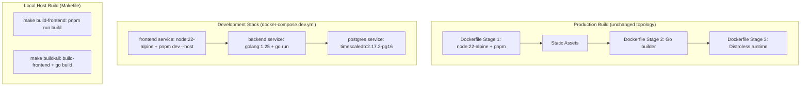

# Design Document: pnpm Frontend Dev Container Migration

## Overview

This design covers migrating the Pulse frontend package manager from npm to pnpm and introducing a dedicated frontend dev container in `docker-compose.dev.yml` with Vite HMR support. The migration touches build infrastructure (Dockerfile, Makefile, docker-compose) and all project documentation while preserving the production architecture: a single Go binary with embedded frontend assets.

The change is strictly a developer-experience improvement. No runtime behavior, API contracts, or production deployment topology changes.

### Goals

- Replace npm with pnpm across all build paths (Dockerfile, Makefile, local dev)
- Add a `frontend` service in `docker-compose.dev.yml` running Vite dev server with HMR
- Keep production `docker-compose.yml` and single-binary architecture unchanged
- Update README, AGENTS.md, copilot-instructions, and MILESTONES to reflect new tooling

### Non-Goals

- Changing frontend framework, dependencies, or application code
- Modifying the Go backend or its build process
- Adding CI/CD pipeline changes
- Changing the production deployment model

## Architecture

The migration affects three layers of the build/dev infrastructure:



### Key Architectural Decisions

1. **pnpm via corepack**: Node 22 ships with corepack. Running `corepack enable` activates pnpm without additional installation steps. This avoids `npm install -g pnpm` and keeps the approach aligned with Node.js project recommendations.

2. **Named volume for node_modules**: The frontend dev container bind-mounts `./frontend` to `/app` for file watching, but uses a named Docker volume (`frontend_node_modules`) at `/app/node_modules`. This prevents host-platform native binaries (e.g., macOS arm64) from conflicting with container-platform binaries (linux/amd64 alpine).

3. **No frontend-to-backend proxy in dev container**: The Vite dev server runs independently on port 5173. Developers access the frontend directly and configure the API base URL to point at the backend on port 8080. This matches the existing local dev workflow.

4. **Makefile pnpm guard**: The `build-frontend` target checks for `pnpm` in PATH before proceeding. This gives a clear error message rather than a cryptic "command not found" failure.

## Components and Interfaces

### 1. Dockerfile Frontend Stage (Stage 1)

**Before:**
```dockerfile
FROM node:22-alpine AS node-builder
WORKDIR /src/frontend
COPY frontend/package.json frontend/package-lock.json ./
RUN npm ci
COPY frontend/ ./
RUN npm run build
```

**After:**
```dockerfile
FROM node:22-alpine AS node-builder
WORKDIR /src/frontend
RUN corepack enable
COPY frontend/package.json frontend/pnpm-lock.yaml ./
RUN pnpm install --frozen-lockfile
COPY frontend/ ./
RUN pnpm run build
```

Key changes:
- `corepack enable` before any dependency commands
- Copy `pnpm-lock.yaml` instead of `package-lock.json`
- `pnpm install --frozen-lockfile` replaces `npm ci`
- `pnpm run build` replaces `npm run build`
- Output path remains `/src/frontend/build/` (unchanged, SvelteKit adapter-static default)

### 2. Frontend Dev Container (docker-compose.dev.yml)

New service definition:

```yaml
frontend:
  image: node:22-alpine
  container_name: pulse-frontend-dev
  working_dir: /app
  command: ["sh", "-c", "corepack enable && pnpm install && pnpm dev --host"]
  ports:
    - "5173:5173"
  volumes:
    - ./frontend:/app
    - frontend_node_modules:/app/node_modules
  depends_on:
    backend:
      condition: service_started
```

Volume declaration:
```yaml
volumes:
  pulse-postgres-dev-data:
  frontend_node_modules:
```

**Design rationale:**
- `--host` binds Vite to `0.0.0.0` so it's accessible from the host through the port mapping
- `corepack enable && pnpm install` runs on every container start to ensure deps are current
- If `pnpm install` fails, `sh -c` propagates the non-zero exit and Docker marks the container as exited
- The named volume `frontend_node_modules` shadows the bind-mounted `node_modules` from the host, isolating container dependencies

### 3. Makefile Changes

```makefile
# Pnpm availability check
build-frontend:
	@command -v pnpm >/dev/null 2>&1 || { echo "Error: pnpm is required but not found in PATH. Install it: https://pnpm.io/installation"; exit 1; }
	cd frontend && pnpm run build
	rm -rf backend/internal/frontend/dist
	mkdir -p backend/internal/frontend/dist
	cp -r frontend/build/* backend/internal/frontend/dist/
	cp backend/internal/frontend/dist/.gitkeep backend/internal/frontend/dist/.gitkeep 2>/dev/null || touch backend/internal/frontend/dist/.gitkeep
```

All `npm` references replaced with `pnpm`. The `build-all` target remains unchanged (it depends on `build-frontend`).

### 4. Lockfile Migration

- Generate `frontend/pnpm-lock.yaml` from existing `package.json` via `pnpm import` (converts `package-lock.json`) or `pnpm install`
- Delete `frontend/package-lock.json`
- Commit `pnpm-lock.yaml` to version control

### 5. Documentation Updates

| File | Changes |
|------|---------|
| `README.md` | Replace npm commands with pnpm, add pnpm to prerequisites, document frontend dev container |
| `AGENTS.md` | Add pnpm to Frontend Conventions, document frontend service in Infrastructure, add pnpm test/dev commands |
| `.github/copilot-instructions.md` | Add pnpm to Expected Stack, document frontend dev container, remove npm references |
| `docs/MILESTONES.md` | Add Post-MVP Enhancements section with pnpm migration entry |

## Data Models

No data model changes. This migration affects only build tooling and developer workflow configuration.

## Error Handling

| Scenario | Behavior |
|----------|----------|
| `pnpm` not in PATH during `make build-frontend` | Exit with non-zero status and error message: "Error: pnpm is required but not found in PATH" |
| `pnpm install` fails in frontend dev container | Container exits with non-zero status; `docker compose` reports the service as unhealthy/stopped |
| `pnpm install --frozen-lockfile` fails in Dockerfile | Docker build fails at that layer with pnpm's error output |
| Missing `pnpm-lock.yaml` in Dockerfile COPY | Docker build fails at COPY step (file not found) |
| Host node_modules conflict with container | Named volume shadows host node_modules; no conflict possible |

## Correctness Properties

*A property is a characteristic or behavior that should hold true across all valid executions of a system—essentially, a formal statement about what the system should do. Properties serve as the bridge between human-readable specifications and machine-verifiable correctness guarantees.*

This migration involves primarily declarative configuration (Docker/Compose YAML, Makefile), a package manager swap, and documentation updates. There are no pure functions, data transformations, parsers, serializers, or new business logic that would broadly benefit from property-based testing. However, the fundamental invariant of this migration—that existing functionality is preserved—can be expressed as a single property.

### Property 1: Existing frontend tests pass after migration

*For any* test in the existing frontend test suite (141 tests), running the suite with `pnpm test` after migration SHALL produce the same pass/fail result as running with `npm test` before migration.

**Validates: Requirements 1.1, 2.1, 3.1**

## Testing Strategy

### Why Property-Based Testing Does Not Apply

This feature involves:
- Docker/Compose configuration (declarative YAML)
- Makefile shell commands
- Documentation (Markdown files)
- Package manager swap (no application logic changes)

There are no pure functions, data transformations, parsers, or business logic introduced. All acceptance criteria are verifiable through smoke tests and manual/integration checks. Property-based testing is not appropriate here.

### Smoke Tests (Automated)

1. **Dockerfile builds successfully**: `docker build -t pulse:test .` completes without error
2. **Frontend dev container starts**: `docker compose -f docker-compose.dev.yml up frontend -d` reaches running state
3. **Makefile pnpm guard works**: Running `make build-frontend` without pnpm in PATH exits non-zero with error message
4. **pnpm lockfile exists**: `frontend/pnpm-lock.yaml` is present and valid
5. **package-lock.json removed**: `frontend/package-lock.json` does not exist

### Integration Tests (Manual Verification)

1. **HMR works**: Edit a `.svelte` file while the frontend dev container is running; browser updates within 2 seconds
2. **Production build**: `make build-all` produces a working Go binary with embedded frontend
3. **Full stack dev**: `make dev-local` starts backend + postgres + frontend, all services healthy
4. **Clean start**: `docker compose -f docker-compose.dev.yml down -v && docker compose -f docker-compose.dev.yml up --build` works from scratch

### Unit Tests

No new unit tests required. Existing 141 frontend unit tests must continue passing after migration (run with `pnpm test` instead of `npm test`).
