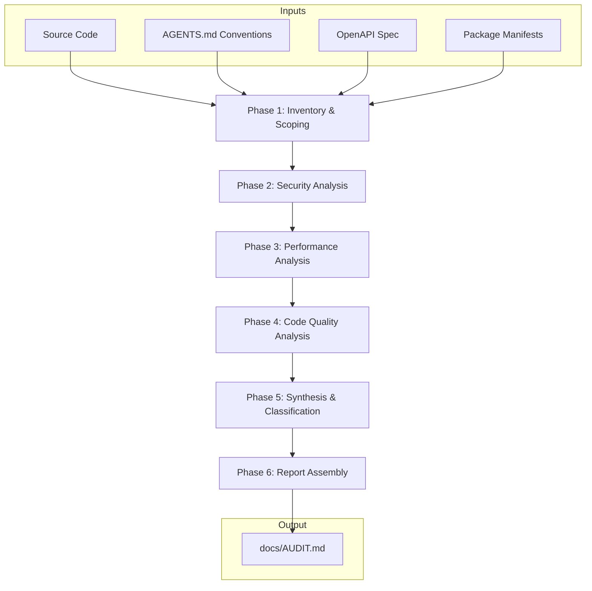

# Design Document

## Overview

This design describes the methodology, execution approach, and document structure for producing a comprehensive audit report (`docs/AUDIT.md`) of the Pulse uptime monitoring platform. The audit is a read-only analysis activity — no code changes are implemented. The deliverable is a single structured markdown document with findings categorized by severity across security, performance, and code quality domains.

The audit covers the full stack with frontend (SvelteKit 5) as primary focus and backend (Go) as secondary. The methodology combines static code analysis, architecture review, convention compliance checking, and manual inspection against established security and performance baselines.

## Architecture

The audit execution follows a phased pipeline architecture:



### Execution Phases

| Phase | Focus | Primary Techniques | Deliverable Section |
|-------|-------|-------------------|-------------------|
| 1. Inventory | Map all auditable surfaces | Directory traversal, dependency listing | Methodology |
| 2. Security | Auth, XSS, data exposure, secrets | Pattern grep, data flow tracing, code reading | Security Findings |
| 3. Performance | Rendering, bundle, network, concurrency | Static analysis, architecture review | Performance Findings |
| 4. Code Quality | TypeScript, Go patterns, conventions | AST-level inspection, convention matching | Code Quality Findings |
| 5. Synthesis | Classify, prioritize, consolidate | Risk matrix scoring | Improvements Catalog |
| 6. Assembly | Structure and format | Template population | Full Document |

### Audit Scope Boundaries

**In Scope:**
- Frontend: `frontend/src/` (components, routes, lib, stores, locales)
- Backend: `backend/internal/` (API handlers, crypto, hub, monitor, notification, store, token)
- Configuration: `docker-compose*.yml`, `.env.example`, `Dockerfile`
- Dependencies: `package.json`, `go.mod`
- API contract: `backend/api/openapi.yaml`

**Out of Scope:**
- Third-party library internals (only their usage is audited)
- Infrastructure beyond Docker Compose (no cloud provider review)
- MCP server (`mcp/`) — separate binary with independent lifecycle
- Test files — reviewed for coverage gaps, not audited for quality
- Generated code (`sqlc` output) — reviewed for usage patterns only

## Components and Interfaces

### Component 1: Audit Executor (Agent)

The agent performs the audit by reading source code, applying analysis techniques, and documenting findings.

**Interface:**
- Input: Project source tree, requirements document (acceptance criteria)
- Output: Populated `docs/AUDIT.md` following the template structure

### Component 2: Finding Classification Engine

A scoring system that assigns severity, effort, and priority to each finding.

**Severity Classification:**

| Level | Definition | Response |
|-------|-----------|----------|
| Critical | Active exploitability, data breach risk, production failure | Immediate remediation |
| High | Exploitable under attacker-controlled conditions, significant degradation | Urgent remediation |
| Medium | Suboptimal practice increasing attack surface or reducing performance | Planned remediation |
| Low | Defense-in-depth improvement, minor convention violation | Backlog |
| Informational | Observation without direct risk, future consideration | No action required |

**Priority Scoring (Risk Matrix):**

| | Almost Certain | Likely | Possible | Unlikely |
|---|---|---|---|---|
| **Critical** | 1 | 2 | 3 | 4 |
| **High** | 5 | 6 | 7 | 8 |
| **Medium** | 9 | 10 | 11 | 12 |
| **Low** | 13 | 14 | 15 | 16 |

### Component 3: Report Template

The structural template that organizes findings into the deliverable document.

**Finding Template:**

```markdown
### {CATEGORY}-{NNN}: {Title}

| Field | Value |
|-------|-------|
| **Severity** | Critical / High / Medium / Low / Informational |
| **Category** | {specific category} |
| **Effort** | Small (hours) / Medium (days) / Large (weeks) |
| **Priority** | {1-16} |

**Description:** {What the issue is and why it matters}

**Evidence:**
`{file_path}:{line_start}-{line_end}`
```{language}
{code snippet, max 10 lines}
```

**Impact:** {What could go wrong if not addressed}

**Remediation:** {Target state and security/performance property it restores}
```

### Component 4: Tooling Strategy

| Technique | Purpose | Applied To |
|-----------|---------|-----------|
| Grep/regex pattern search | Find dangerous patterns (`{@html}`, `any`, `console.log`, hardcoded secrets) | Frontend + Backend |
| AST-level code reading | Trace data flows, verify type safety, check error handling | Frontend + Backend |
| Dependency audit | Identify CVEs, outdated packages | `package.json`, `go.mod` |
| Convention matching | Compare code against AGENTS.md rules | Full codebase |
| Architecture review | Evaluate design decisions against requirements | System-wide |
| File/directory traversal | Map coverage, find dead code, identify untested modules | Full codebase |

## Data Models

### Finding Record

```typescript
interface Finding {
  id: string;              // Format: {CATEGORY}-{NNN} (SEC-001, PERF-001, QUAL-001)
  severity: 'Critical' | 'High' | 'Medium' | 'Low' | 'Informational';
  category: string;        // Specific subcategory (e.g., "token-handling", "xss", "bundle-size")
  title: string;           // One-line description
  description: string;     // Detailed explanation
  evidence: {
    filePath: string;
    lineRange: [number, number];
    snippet?: string;      // Max 10 lines
  };
  impact: string;          // What could go wrong
  remediation: string;     // Target state + property restored
  effort: 'Small' | 'Medium' | 'Large';
  priority: number;        // 1-16 from risk matrix
  likelihood: 'Almost Certain' | 'Likely' | 'Possible' | 'Unlikely';
}
```

### Improvement Item

```typescript
interface Improvement {
  title: string;
  description: string;
  affectedComponent: string;
  effort: 'Small' | 'Medium' | 'Large';
  impact: 'Security' | 'Performance' | 'Quality' | 'Reliability';
  priority: number;        // From risk matrix
  findingRefs: string[];   // Finding IDs this consolidates
}
```

### Roadmap Item

```typescript
interface RoadmapItem {
  title: string;
  description: string;
  timeframe: 'Short-term (1-3 months)' | 'Medium-term (3-6 months)' | 'Long-term (6-12 months)';
  category: 'Architecture' | 'Scalability' | 'Observability' | 'Security' | 'Developer Experience';
  dependencies: string[];  // Other roadmap items or improvements this depends on
}
```

## Correctness Properties

*A property is a characteristic or behavior that should hold true across all valid executions of a system — essentially, a formal statement about what the system should do. Properties serve as the bridge between human-readable specifications and machine-verifiable correctness guarantees.*

PBT does not apply to this feature in the traditional sense. The audit report is a read-only document produced by manual code analysis — there is no executable code being written, no functions with inputs and outputs, and no universal properties that hold "for all" inputs. The deliverable is a single markdown file (`docs/AUDIT.md`) assembled from human-driven inspection findings. This falls into the "side-effect-only operations" category where PBT is not the right tool.

However, the structural consistency of the report output can be expressed as a validation property:

### Property 1: Structural completeness of audit report

*For any* completed audit report, every finding record SHALL contain all required template fields (Finding ID, Severity, Category, Title, Description, Evidence with file path and line range, Impact, Remediation, and Effort estimate) and no field SHALL be empty or contain placeholder text.

**Validates: Requirements 13.3, 13.6**

## Error Handling

Since this is a document-generation task (not software), "error handling" maps to audit execution risks:

| Risk | Mitigation |
|------|-----------|
| File not accessible / missing | Document as "unable to verify" with scope limitation note |
| Ambiguous finding severity | Use conservative (higher) severity; note uncertainty in description |
| Conflicting evidence | Document both observations; classify based on worse-case interpretation |
| Convention not documented in AGENTS.md | Skip convention check; note as "undocumented convention" |
| Dependency CVE database unavailable | Note limitation; check `npm audit` / `govulncheck` output if available |
| Incomplete code path tracing | Document partial analysis with explicit "partial coverage" note |

## Testing Strategy

Property-based testing does NOT apply to this feature. The deliverable is a structured markdown document produced by manual analysis — there is no executable code being written, no functions with input/output behavior, and no universal properties to verify across inputs.

**Validation approach for the audit report:**

1. **Structural validation**: Verify the output document matches the required section ordering (Executive Summary → Methodology → Security Findings → Performance Findings → Code Quality Findings → Improvements Catalog → Future Roadmap → Appendices)

2. **Finding completeness check**: Each finding must contain all required template fields (ID, Severity, Category, Title, Description, Evidence, Impact, Remediation, Effort)

3. **Cross-reference consistency**: Every finding referenced in the Improvements Catalog must exist in its domain section; every improvement must trace back to one or more findings

4. **Priority ordering verification**: Within each domain section, findings must be ordered by severity (Critical → Informational), then by Finding ID for equal severity

5. **Requirements coverage matrix**: After report assembly, verify each acceptance criterion from requirements.md has been addressed by at least one finding or explicitly noted as "no issues found"

6. **Evidence verification**: Each code reference (file path + line range) must point to an actual location in the codebase

**Quality gates before delivery:**
- All 13 requirements have corresponding coverage in the report
- Finding IDs are sequential within each category (no gaps)
- Table of contents matches actual section headings
- No placeholder text remains in the final document
