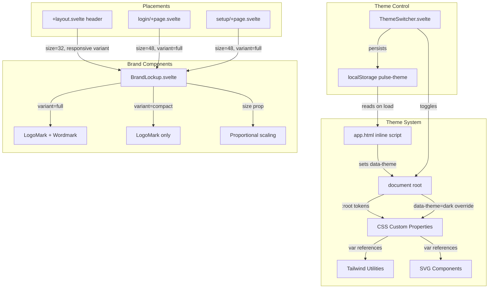

# Design Document: Pulse Branding

## Overview

This design introduces a cohesive visual identity system for Pulse, encompassing an ECG-inspired logo mark, wordmark typography, theme-aware color tokens, a light/dark theme switcher, and Tailwind integration. The implementation is entirely frontend — no backend changes required.

The approach uses CSS custom properties as the theming backbone, with a `data-theme` attribute on the document root driving color changes. This avoids JavaScript-driven class swaps and ensures theme transitions happen within a single repaint cycle. The BrandLockup is implemented as a single Svelte 5 component with `variant` and `size` props for all placement contexts.

**Key Design Decisions:**

1. **CSS Custom Properties over Tailwind dark: prefix** — Using `[data-theme="dark"]` selector with CSS variables gives us instant theme switching without class recalculation. Tailwind's `selector` dark mode strategy maps directly to this.
2. **Inline SVG over external SVG files for runtime rendering** — The BrandLockup component renders inline SVG so it inherits `currentColor` and CSS custom properties from the DOM context. Static exports in `frontend/static/brand/` are provided separately for external use.
3. **Inline script for FOUC prevention** — A small inline `<script>` in `app.html` reads localStorage and sets `data-theme` before the body renders, eliminating flash of incorrect theme.
4. **Self-hosted Inter font via @font-face** — Avoids Google Fonts dependency, ensures GDPR compliance, and works in air-gapped deployments.

## Architecture



## Components and Interfaces

### BrandLockup.svelte

Location: `frontend/src/components/BrandLockup.svelte`

```typescript
interface BrandLockupProps {
  /** Logo_Mark height in pixels. All dimensions scale proportionally. */
  size?: number; // default: 32
  /** "full" = Logo_Mark + Wordmark, "compact" = Logo_Mark only */
  variant?: 'full' | 'compact'; // default: 'full'
}
```

**Rendering logic:**
- Renders an inline `<svg>` for the Logo_Mark at `size × size` pixels
- When `variant="full"`, renders an adjacent `<span>` with the "Pulse" wordmark
- Gap between mark and wordmark: `size / 4` pixels
- Wordmark font-size: `size * 0.625` pixels (20px at size=32)
- Clear space (padding): `size / 2` on all sides (applied by consumers, documented)

**SVG Logo_Mark path:**
- ViewBox: `0 0 32 32` (normalized, scales via width/height attributes)
- Single stroked path depicting an ECG peak
- `stroke="currentColor"` with `fill="none"`
- `stroke-width`: 10% of viewBox (3.2 in a 32-unit box)
- `stroke-linecap="round"` and `stroke-linejoin="round"` for clean scaling
- The component wraps the SVG in a container that sets `color: var(--color-brand-primary, #0ea5e9)` ensuring the fallback

### ThemeSwitcher.svelte

Location: `frontend/src/components/ThemeSwitcher.svelte`

```typescript
// No external props — self-contained control
// Internal state derived from document.documentElement.dataset.theme
```

**Behavior:**
1. Reads current theme from `document.documentElement.dataset.theme`
2. On click: flips `light` ↔ `dark`, updates `data-theme`, writes to `localStorage`
3. Displays sun icon (☀️) when dark theme is active (indicating "switch to light")
4. Displays moon icon (🌙) when light theme is active (indicating "switch to dark")
5. Uses `aria-label` describing the action: "Switch to light theme" / "Switch to dark theme"

### Theme Initialization (inline script)

Location: Injected into `frontend/src/app.html` `<head>`

```javascript
// Inline in <head> before body renders — prevents FOUC
(function() {
  var stored = localStorage.getItem('pulse-theme');
  var theme = stored === 'dark' || stored === 'light'
    ? stored
    : (window.matchMedia('(prefers-color-scheme: dark)').matches ? 'dark' : 'light');
  document.documentElement.setAttribute('data-theme', theme);
})();
```

### Font Loading

Location: `frontend/src/app.css` (added @font-face declaration)

```css
@font-face {
  font-family: 'Inter';
  font-style: normal;
  font-weight: 600;
  font-display: swap;
  src: url('/fonts/inter-semibold.woff2') format('woff2');
}
```

Font file: `frontend/static/fonts/inter-semibold.woff2`

## Data Models

### CSS Custom Properties (Color Tokens)

Defined in `frontend/src/app.css`:

```css
:root,
[data-theme="light"] {
  --color-brand-primary: #0ea5e9;
  --color-brand-hover: #0284c7;
  --color-bg-page: #f8fafc;
  --color-bg-surface: #ffffff;
  --color-text-primary: #0f172a;
  --color-text-secondary: #475569;
  --color-border: #e2e8f0;
  --color-success: #10b981;
  --color-warning: #f59e0b;
  --color-error: #ef4444;

  /* Extended brand scale for Tailwind */
  --color-brand-50: #f0f9ff;
  --color-brand-100: #e0f2fe;
  --color-brand-200: #bae6fd;
  --color-brand-300: #7dd3fc;
  --color-brand-400: #38bdf8;
  --color-brand-500: #0ea5e9;
  --color-brand-600: #0284c7;
  --color-brand-700: #0369a1;
  --color-brand-800: #075985;
  --color-brand-900: #0c4a6e;
}

[data-theme="dark"] {
  --color-brand-primary: #22d3ee;
  --color-brand-hover: #06b6d4;
  --color-bg-page: #0f172a;
  --color-bg-surface: #1e293b;
  --color-text-primary: #f1f5f9;
  --color-text-secondary: #94a3b8;
  --color-border: #334155;
  --color-success: #34d399;
  --color-warning: #fbbf24;
  --color-error: #f87171;

  /* Extended brand scale — cyan family for dark */
  --color-brand-50: #ecfeff;
  --color-brand-100: #cffafe;
  --color-brand-200: #a5f3fc;
  --color-brand-300: #67e8f9;
  --color-brand-400: #22d3ee;
  --color-brand-500: #06b6d4;
  --color-brand-600: #0891b2;
  --color-brand-700: #0e7490;
  --color-brand-800: #155e75;
  --color-brand-900: #164e63;
}
```

### Tailwind Configuration

Updated `frontend/tailwind.config.cjs`:

```javascript
/** @type {import('tailwindcss').Config} */
module.exports = {
  content: ['./src/**/*.{html,js,svelte,ts}'],
  darkMode: ['selector', '[data-theme="dark"]'],
  theme: {
    extend: {
      colors: {
        brand: {
          50: 'var(--color-brand-50, #f0f9ff)',
          100: 'var(--color-brand-100, #e0f2fe)',
          200: 'var(--color-brand-200, #bae6fd)',
          300: 'var(--color-brand-300, #7dd3fc)',
          400: 'var(--color-brand-400, #38bdf8)',
          500: 'var(--color-brand-500, #0ea5e9)',
          600: 'var(--color-brand-600, #0284c7)',
          700: 'var(--color-brand-700, #0369a1)',
          800: 'var(--color-brand-800, #075985)',
          900: 'var(--color-brand-900, #0c4a6e)',
        },
        success: 'var(--color-success, #10b981)',
        warning: 'var(--color-warning, #f59e0b)',
        error: 'var(--color-error, #ef4444)',
      },
      fontFamily: {
        brand: ['Inter', 'system-ui', '-apple-system', 'sans-serif'],
      },
    },
  },
  plugins: [],
};
```

### Static Asset Structure

```
frontend/static/
├── brand/
│   ├── logo-mark.svg              # Standalone ECG peak SVG
│   ├── brand-lockup.svg           # Full lockup (mark + wordmark) for light bg
│   ├── brand-lockup-dark.svg      # Full lockup for dark backgrounds
│   ├── logo-mark-1x.png           # 64×64
│   ├── logo-mark-2x.png           # 128×128
│   ├── logo-mark-4x.png           # 256×256
│   └── README.md                  # Usage guidelines
├── fonts/
│   └── inter-semibold.woff2       # Self-hosted Inter 600
├── favicon.png                    # 32×32 PNG
├── apple-touch-icon.png           # 180×180 PNG
├── icon-192.png                   # PWA icon
├── icon-512.png                   # PWA splash icon
└── site.webmanifest               # Web app manifest
```

### Web App Manifest

`frontend/static/site.webmanifest`:

```json
{
  "name": "Pulse",
  "short_name": "Pulse",
  "icons": [
    { "src": "/icon-192.png", "sizes": "192x192", "type": "image/png", "purpose": "any" },
    { "src": "/icon-512.png", "sizes": "512x512", "type": "image/png", "purpose": "any" }
  ],
  "theme_color": "#0ea5e9",
  "background_color": "#f8fafc"
}
```

## Correctness Properties

*A property is a characteristic or behavior that should hold true across all valid executions of a system — essentially, a formal statement about what the system should do. Properties serve as the bridge between human-readable specifications and machine-verifiable correctness guarantees.*

### Property 1: Logo_Mark stroke width proportionality

*For any* valid viewBox dimension N, the Logo_Mark stroke-width SHALL be between 0.08×N and 0.12×N inclusive, ensuring the stroke scales proportionally with the icon size.

**Validates: Requirements 1.4**

### Property 2: BrandLockup proportional scaling

*For any* positive numeric `size` prop value S, the BrandLockup SHALL render with: gap = S/4, wordmark font-size proportional to S, and clear space = S/2. All internal dimensions must maintain a constant ratio to the size prop.

**Validates: Requirements 3.1, 3.2, 3.4**

### Property 3: Dark theme WCAG contrast compliance

*For any* color defined in the Dark_Theme token set (primary text, brand primary, success, warning, error), that color SHALL achieve a minimum contrast ratio of 4.5:1 against the dark page background color (`#0f172a`) per the WCAG 2.1 relative luminance formula.

**Validates: Requirements 5.5, 5.7**

### Property 4: Theme toggle round-trip persistence

*For any* initial theme state (light or dark), activating the Theme_Switcher SHALL: (a) set `document.documentElement.dataset.theme` to the opposite value, and (b) store that same opposite value in `localStorage.getItem('pulse-theme')`. Reading the stored value back produces the active theme.

**Validates: Requirements 6.1, 6.2**

### Property 5: Theme icon indicates target theme

*For any* active theme value T, the ThemeSwitcher icon displayed SHALL represent the OTHER theme (sun icon when T="dark", moon icon when T="light"), correctly indicating the theme the user will switch TO upon activation.

**Validates: Requirements 6.6**

### Property 6: Tailwind brand scale token mapping

*For any* shade value in {50, 100, 200, 300, 400, 500, 600, 700, 800, 900}, the Tailwind `brand-{shade}` color utility SHALL resolve to the CSS custom property `var(--color-brand-{shade})`, and the computed value SHALL match the corresponding hex value defined for the active theme.

**Validates: Requirements 11.1, 11.3**

## Error Handling

| Scenario | Handling |
|----------|----------|
| Inter WOFF2 fails to load | `font-display: swap` shows text immediately in fallback system font; wordmark preserves weight and tracking via inline styles |
| localStorage unavailable (private browsing) | ThemeSwitcher catches `SecurityError` on `setItem`, continues toggling `data-theme` for session-only theming |
| Invalid stored theme value (not "light"/"dark") | Initialization script falls through to OS `prefers-color-scheme`, defaulting to "light" if media query unsupported |
| SVG rendering without CSS variable support (email, static export) | `stroke` attribute includes hardcoded `#0ea5e9` fallback via CSS `var(--color-brand-primary, #0ea5e9)` pattern on the wrapper |
| Viewport narrower than lockup + clear space (login/setup) | `max-width: 100%` with `height: auto` on lockup container enables proportional scale-down |

## Testing Strategy

### Unit Tests (Vitest + @testing-library/svelte)

- **BrandLockup rendering**: Verify correct SVG structure for `variant="full"` and `variant="compact"`
- **BrandLockup size prop**: Verify dimensions, gap, and font-size calculations for specific size values
- **ThemeSwitcher toggle**: Mock `document.documentElement` and `localStorage`, verify toggle behavior
- **ThemeSwitcher icons**: Verify correct icon rendering for each theme state
- **Theme initialization**: Verify script logic handles all localStorage/media query combinations
- **Accessibility**: Verify `aria-label` values on lockup link and theme switcher button

### Property-Based Tests (Vitest + fast-check)

The project already uses `fast-check` (141 tests passing). Property tests will be added alongside unit tests.

- **Property 1** (stroke width): Generate random viewBox dimensions, verify stroke-width bounds
- **Property 2** (proportional scaling): Generate random positive size values, verify all ratios hold
- **Property 3** (WCAG contrast): Compute relative luminance for all dark theme colors, verify ≥ 4.5:1 against background
- **Property 4** (toggle round-trip): Generate random starting states, verify toggle + persistence
- **Property 5** (icon target): Generate random theme values, verify icon correctness
- **Property 6** (token mapping): Generate random shade selections, verify CSS variable resolution

**Configuration:**
- Minimum 100 iterations per property test
- Each test tagged: `// Feature: pulse-branding, Property {N}: {description}`
- Test file: `frontend/src/components/__tests__/branding.property.test.ts`

### Smoke Tests

- Static asset existence: favicon.png, apple-touch-icon.png, site.webmanifest, brand/ directory contents
- Web manifest schema validation
- Font file presence at expected path

### Integration Verification (Manual)

- Visual inspection of logo at 16px and 512px
- Theme switch with no FOUC on fresh page load
- Responsive breakpoint behavior (full → compact at 640px)
- Cross-browser font rendering with and without Inter loaded
