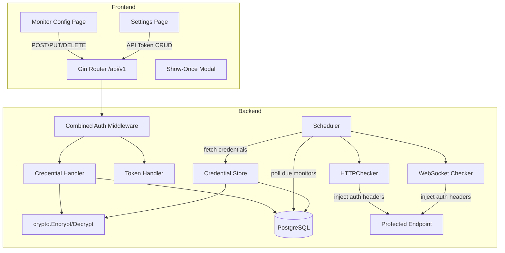
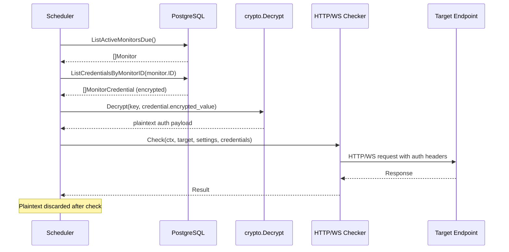

# Design Document: Secrets and Auth Rework

## Overview

This design separates the existing monolithic "secrets" concept into two distinct subsystems:

1. **Monitor Credentials** — Encrypted authentication artifacts (Bearer, Basic, Custom Header) tied to individual monitors and injected into outbound health-check requests by the HTTP and WebSocket checkers.
2. **API Tokens** — Bcrypt-hashed tokens for programmatic Pulse API access, managed in Settings with improved UI clarity.

The existing `secrets` table is retired. A new `monitor_credentials` table is introduced with a foreign key to `monitors` (ON DELETE CASCADE). The API tokens system (`api_tokens` table) remains unchanged at the data layer but gains clearer frontend presentation. The legacy `/api/v1/secrets` endpoints are removed and replaced with `/api/v1/monitors/{id}/credentials`.

### Key Design Decisions

| Decision | Rationale |
|----------|-----------|
| Store credentials per-monitor (not globally) | Avoids ambiguity about which monitor uses which secret; simplifies cascading deletion |
| Structured `encrypted_value` as JSON | A single encrypted blob containing all auth fields (token, username+password, or header name+value) keeps the schema simple while supporting all auth types |
| Decrypt only at check time | Minimizes window where plaintext exists in memory; aligns with existing security model |
| Reuse existing `crypto.Encrypt`/`Decrypt` | No need for a new encryption mechanism; AES-256-GCM with random nonce is already battle-tested in this codebase |
| Show-once modal for credential creation | Matches existing API token UX pattern; secret is returned in the POST response body once, then never again |
| Hide auth section for TCP/UDP monitors | These protocols don't support header-based auth; keeps UI focused |

## Architecture



### Request Flow: Health Check with Credentials



## Components and Interfaces

### 1. Credential Store (Backend Service Layer)

A new `CredentialHandler` in `backend/internal/api/handlers/credentials.go` providing CRUD operations for monitor credentials.

```go
// CredentialHandler manages monitor authentication credentials.
type CredentialHandler struct {
    queries *db.Queries
    key     []byte // AES-256-GCM encryption key
}

// Credential API types
type CreateCredentialRequest struct {
    AuthType    string  `json:"auth_type" binding:"required,oneof=bearer basic header"`
    Name        string  `json:"name" binding:"required"`
    // For bearer: token field
    Token       string  `json:"token,omitempty"`
    // For basic: username + password fields
    Username    string  `json:"username,omitempty"`
    Password    string  `json:"password,omitempty"`
    // For header: header_name + header_value fields
    HeaderName  string  `json:"header_name,omitempty"`
    HeaderValue string  `json:"header_value,omitempty"`
}

type UpdateCredentialRequest struct {
    Name        string  `json:"name,omitempty"`
    Token       string  `json:"token,omitempty"`
    Username    string  `json:"username,omitempty"`
    Password    string  `json:"password,omitempty"`
    HeaderName  string  `json:"header_name,omitempty"`
    HeaderValue string  `json:"header_value,omitempty"`
}

type CredentialResponse struct {
    ID         uuid.UUID `json:"id"`
    AuthType   string    `json:"auth_type"`
    Name       string    `json:"name"`
    HeaderName *string   `json:"header_name,omitempty"` // only for auth_type=header
    Username   *string   `json:"username,omitempty"`    // only for auth_type=basic
    CreatedAt  time.Time `json:"created_at"`
    UpdatedAt  time.Time `json:"updated_at"`
}
```

### 2. Credential Encryption Payload

The encrypted value stored in the database is a JSON structure serialized then encrypted as a single AES-256-GCM blob:

```go
// CredentialPayload is the plaintext structure encrypted at rest.
type CredentialPayload struct {
    Token       string `json:"token,omitempty"`        // bearer
    Username    string `json:"username,omitempty"`     // basic
    Password    string `json:"password,omitempty"`     // basic
    HeaderName  string `json:"header_name,omitempty"`  // header
    HeaderValue string `json:"header_value,omitempty"` // header
}
```

### 3. Checker Interface Extension

The `Checker` interface gains a `Credentials` parameter so the scheduler can pass decrypted credentials to checkers:

```go
// AuthCredential is a decrypted credential ready for injection into requests.
type AuthCredential struct {
    AuthType    string // "bearer", "basic", "header"
    Token       string // bearer token value
    Username    string // basic auth username
    Password    string // basic auth password
    HeaderName  string // custom header name
    HeaderValue string // custom header value
}

// Checker is the interface every protocol implementation must satisfy.
type Checker interface {
    Check(ctx context.Context, target string, settings json.RawMessage) Result
}

// AuthenticatedChecker extends Checker with credential injection support.
type AuthenticatedChecker interface {
    Checker
    CheckWithAuth(ctx context.Context, target string, settings json.RawMessage, creds []AuthCredential) Result
}
```

The scheduler calls `CheckWithAuth` when credentials exist for a monitor, falling back to `Check` when none are configured. This keeps TCP/UDP checkers unchanged.

### 4. Scheduler Credential Loading

The scheduler's `executeCheck` method is extended to load and decrypt credentials before invoking the checker:

```go
func (s *Scheduler) executeCheck(ctx context.Context, m db.Monitor) {
    checker, err := s.registry.Get(m.Type)
    // ... existing error handling ...

    // Load credentials for this monitor (HTTP and WebSocket only).
    var creds []AuthCredential
    if m.Type == "http" || m.Type == "websocket" {
        dbCreds, err := s.queries.ListCredentialsByMonitorID(ctx, m.ID)
        if err != nil {
            log.Printf("scheduler: monitor %s: load credentials: %v", m.ID, err)
        }
        for _, dc := range dbCreds {
            payload, err := decryptCredential(s.key, dc.EncryptedValue)
            if err != nil {
                // Report as down with credential error
                s.recordCredentialFailure(ctx, m, err)
                return
            }
            creds = append(creds, toAuthCredential(dc.AuthType, payload))
        }
    }

    // Use AuthenticatedChecker if credentials exist.
    if len(creds) > 0 {
        if ac, ok := checker.(AuthenticatedChecker); ok {
            result = ac.CheckWithAuth(checkCtx, m.Target, m.Settings, creds)
        }
    } else {
        result = checker.Check(checkCtx, m.Target, m.Settings)
    }
    // ... existing result handling ...
}
```

### 5. Frontend Components

| Component | Location | Purpose |
|-----------|----------|---------|
| `CredentialForm` | `frontend/src/components/CredentialForm.svelte` | Auth type selector + input fields for creating/updating credentials |
| `CredentialList` | `frontend/src/components/CredentialList.svelte` | Display existing credentials with delete/replace actions |
| `ShowOnceModal` | `frontend/src/components/ShowOnceModal.svelte` | Reusable modal for one-time secret display (used by both credentials and API tokens) |
| `AuthSection` | `frontend/src/components/AuthSection.svelte` | Container for credential management within monitor form |
| `ApiTokenSection` | `frontend/src/routes/settings/ApiTokenSection.svelte` | Renamed/clarified token management in Settings |

### 6. API Client Extension

```typescript
// frontend/src/lib/api.ts additions
export interface Credential {
    id: string;
    auth_type: 'bearer' | 'basic' | 'header';
    name: string;
    header_name?: string;
    username?: string;
    created_at: string;
    updated_at: string;
}

export interface CreateCredentialRequest {
    auth_type: 'bearer' | 'basic' | 'header';
    name: string;
    token?: string;
    username?: string;
    password?: string;
    header_name?: string;
    header_value?: string;
}

export async function createCredential(monitorId: string, req: CreateCredentialRequest): Promise<Credential>;
export async function listCredentials(monitorId: string): Promise<Credential[]>;
export async function updateCredential(monitorId: string, credId: string, req: Partial<CreateCredentialRequest>): Promise<Credential>;
export async function deleteCredential(monitorId: string, credId: string): Promise<void>;
```

## Data Models

### New Table: `monitor_credentials`

```sql
CREATE TABLE monitor_credentials (
    id              UUID        PRIMARY KEY DEFAULT gen_random_uuid(),
    monitor_id      UUID        NOT NULL REFERENCES monitors (id) ON DELETE CASCADE,
    auth_type       TEXT        NOT NULL CHECK (auth_type IN ('bearer', 'basic', 'header')),
    name            TEXT        NOT NULL,
    encrypted_value TEXT        NOT NULL,  -- base64(AES-256-GCM(JSON payload))
    created_at      TIMESTAMPTZ NOT NULL DEFAULT now(),
    updated_at      TIMESTAMPTZ NOT NULL DEFAULT now()
);

CREATE INDEX idx_monitor_credentials_monitor_id ON monitor_credentials (monitor_id);
```

### Migration Strategy

Migration `006_monitor_credentials.up.sql`:
1. Create `monitor_credentials` table.
2. The legacy `secrets` table is preserved but deprecated — no new writes.
3. A future migration (007) drops the `secrets` table after confirming no data loss.

Migration `006_monitor_credentials.down.sql`:
1. Drop `monitor_credentials` table.

### Encrypted Value Format

The `encrypted_value` column stores: `base64(nonce || AES-256-GCM(json_payload))`

Where `json_payload` varies by auth_type:

| auth_type | JSON payload |
|-----------|-------------|
| `bearer` | `{"token": "..."}` |
| `basic` | `{"username": "...", "password": "..."}` |
| `header` | `{"header_name": "...", "header_value": "..."}` |

### sqlc Queries

New file: `backend/internal/store/postgres/queries/credentials.sql`

```sql
-- name: CreateCredential :one
INSERT INTO monitor_credentials (monitor_id, auth_type, name, encrypted_value)
VALUES ($1, $2, $3, $4)
RETURNING id, monitor_id, auth_type, name, created_at, updated_at;

-- name: ListCredentialsByMonitorID :many
SELECT id, monitor_id, auth_type, name, encrypted_value, created_at, updated_at
FROM monitor_credentials
WHERE monitor_id = $1
ORDER BY created_at;

-- name: GetCredential :one
SELECT id, monitor_id, auth_type, name, encrypted_value, created_at, updated_at
FROM monitor_credentials
WHERE id = $1 AND monitor_id = $2;

-- name: UpdateCredential :one
UPDATE monitor_credentials
SET name = $3, encrypted_value = $4, updated_at = now()
WHERE id = $1 AND monitor_id = $2
RETURNING id, monitor_id, auth_type, name, created_at, updated_at;

-- name: DeleteCredential :exec
DELETE FROM monitor_credentials WHERE id = $1 AND monitor_id = $2;

-- name: ListCredentialsByMonitorIDInternal :many
-- Used by scheduler to fetch encrypted values for injection
SELECT id, auth_type, encrypted_value
FROM monitor_credentials
WHERE monitor_id = $1;

-- name: ListAllCredentials :many
-- Used by key rotation
SELECT id, encrypted_value FROM monitor_credentials ORDER BY id;

-- name: UpdateCredentialEncryptedValue :exec
-- Used by key rotation
UPDATE monitor_credentials SET encrypted_value = $2, updated_at = now() WHERE id = $1;
```

### OpenAPI Spec Additions

New paths added to `backend/api/openapi.yaml`:

- `POST /monitors/{id}/credentials` — Create credential
- `GET /monitors/{id}/credentials` — List credentials for monitor
- `PUT /monitors/{id}/credentials/{credentialId}` — Update credential
- `DELETE /monitors/{id}/credentials/{credentialId}` — Delete credential

New schemas: `MonitorCredential`, `CreateMonitorCredentialRequest`, `UpdateMonitorCredentialRequest`, `MonitorCredentialListResponse`

### Key Rotation Support

The existing `make rotate-key` mechanism is extended to also re-encrypt `monitor_credentials.encrypted_value` using the same transactional approach: load all rows, decrypt with old key, re-encrypt with new key, update in a single transaction.

## Correctness Properties

*A property is a characteristic or behavior that should hold true across all valid executions of a system — essentially, a formal statement about what the system should do. Properties serve as the bridge between human-readable specifications and machine-verifiable correctness guarantees.*

### Property 1: Credential encryption round-trip

*For any* valid credential payload (bearer token, basic username+password, or header name+value), encrypting the serialized JSON with `crypto.Encrypt` and then decrypting with `crypto.Decrypt` SHALL produce a byte-identical result to the original serialized JSON.

**Validates: Requirements 1.1, 1.2, 1.3, 10.1**

### Property 2: API responses never expose plaintext secrets

*For any* credential stored in the system (regardless of auth_type), all API responses (create, list, get, update) SHALL contain only metadata fields (id, auth_type, name, created_at, updated_at) and SHALL NOT contain the fields: token, password, header_value, or encrypted_value.

**Validates: Requirements 1.4, 2.1, 10.4**

### Property 3: Metadata includes correct non-secret fields per auth_type

*For any* credential of auth_type `header`, the API metadata response SHALL include the `header_name` field. *For any* credential of auth_type `basic`, the API metadata response SHALL include the `username` field but NOT the `password` field.

**Validates: Requirements 2.3, 2.4**

### Property 4: Invalid auth_type produces validation error

*For any* string that is not one of `{"bearer", "basic", "header"}`, submitting it as the `auth_type` field in a create credential request SHALL result in a 400 status code response.

**Validates: Requirements 1.7**

### Property 5: HTTP Checker injects all credentials correctly

*For any* set of monitor credentials (mix of bearer, basic, and header types), when the HTTP Checker executes `CheckWithAuth`, the outbound HTTP request SHALL contain: an `Authorization: Bearer <token>` header for each bearer credential, an `Authorization: Basic <base64(username:password)>` header for each basic credential, and a custom header with the correct name and value for each header credential.

**Validates: Requirements 5.1, 5.2, 5.3, 5.4**

### Property 6: WebSocket Checker injects all credentials correctly

*For any* set of monitor credentials, when the WebSocket Checker executes `CheckWithAuth`, the WebSocket upgrade request SHALL contain the same correctly-formatted headers as described in Property 5.

**Validates: Requirements 6.1, 6.2, 6.3**

### Property 7: Credential update replaces encrypted value

*For any* existing credential and any new secret value, after updating the credential with the new value, decrypting the stored `encrypted_value` SHALL yield the new value (not the old value), and `updated_at` SHALL be greater than or equal to the original `updated_at`.

**Validates: Requirements 3.1, 3.2**

### Property 8: Credential deletion removes from listing

*For any* monitor with one or more credentials, after deleting a specific credential, listing credentials for that monitor SHALL NOT include the deleted credential's ID, and the list length SHALL be exactly one less than before deletion.

**Validates: Requirements 4.1**

## Error Handling

| Scenario | HTTP Status | Error Code | Message |
|----------|-------------|------------|---------|
| Missing/invalid `auth_type` | 400 | `VALIDATION_ERROR` | "auth_type must be one of: bearer, basic, header" |
| Missing required fields for auth_type | 400 | `VALIDATION_ERROR` | "token is required for bearer auth_type" (etc.) |
| Non-existent monitor_id | 404 | `NOT_FOUND` | "monitor not found" |
| Non-existent credential_id | 404 | `NOT_FOUND` | "credential not found" |
| Encryption failure | 500 | `ENCRYPTION_ERROR` | "failed to encrypt credential value" |
| Decryption failure at check time | — | — | Check reports `state: "down"`, `error: "credential decryption failure"` |
| Database error | 500 | `DB_ERROR` | "failed to [create/update/delete] credential" |
| Unauthorized (no/invalid token) | 401 | `UNAUTHORIZED` | "invalid or expired token" |

### Decryption Failure Behavior

When the scheduler cannot decrypt a credential during check execution:
1. The check is reported as `state: "down"` with error `"credential decryption failure for monitor <id>"`.
2. The plaintext of the corrupted encrypted value is never logged.
3. The monitor continues to be scheduled — subsequent checks will retry decryption (useful if key rotation is in progress).

### Cascading Deletion Safety

The `ON DELETE CASCADE` constraint on `monitor_credentials.monitor_id` ensures no orphaned credential rows exist. This is enforced at the database level and requires no application-level cleanup code.

## Testing Strategy

### Unit Tests (Example-Based)

| Area | Test Cases |
|------|-----------|
| Credential Handler validation | Invalid auth_type, missing required fields per type, non-UUID monitor_id |
| Response shape | Verify no secret fields in create/list/get/update responses |
| Show-Once Modal | Appears on creation, copies to clipboard, clears state on dismiss |
| Auth section visibility | Shown for HTTP/WS monitors, hidden for TCP/UDP |
| Settings page | Shows "API Tokens" section, no "Secrets" section, no credential data |

### Property-Based Tests (fast-check for frontend, rapid for Go)

**Library**: 
- Backend: `pgregory.net/rapid` (Go property-based testing)
- Frontend: `fast-check` (already in use — 141 tests passing)

**Configuration**: Minimum 100 iterations per property test.

| Property | Tag | Module Under Test |
|----------|-----|-------------------|
| Property 1: Encryption round-trip | `Feature: secrets-and-auth-rework, Property 1: Credential encryption round-trip` | `internal/crypto` + credential payload serialization |
| Property 2: No plaintext in responses | `Feature: secrets-and-auth-rework, Property 2: API responses never expose plaintext secrets` | `internal/api/handlers/credentials.go` |
| Property 3: Correct metadata per auth_type | `Feature: secrets-and-auth-rework, Property 3: Metadata includes correct non-secret fields per auth_type` | `internal/api/handlers/credentials.go` |
| Property 4: Invalid auth_type rejected | `Feature: secrets-and-auth-rework, Property 4: Invalid auth_type produces validation error` | `internal/api/handlers/credentials.go` |
| Property 5: HTTP credential injection | `Feature: secrets-and-auth-rework, Property 5: HTTP Checker injects all credentials correctly` | `internal/monitor/http.go` |
| Property 6: WS credential injection | `Feature: secrets-and-auth-rework, Property 6: WebSocket Checker injects all credentials correctly` | `internal/monitor/websocket.go` |
| Property 7: Update replaces value | `Feature: secrets-and-auth-rework, Property 7: Credential update replaces encrypted value` | `internal/api/handlers/credentials.go` + `internal/crypto` |
| Property 8: Delete removes from listing | `Feature: secrets-and-auth-rework, Property 8: Credential deletion removes from listing` | `internal/api/handlers/credentials.go` |

### Integration Tests

| Test | Purpose |
|------|---------|
| Monitor deletion cascades to credentials | Verify FK ON DELETE CASCADE works end-to-end |
| Key rotation re-encrypts credentials | Rotate key, verify all credentials still decryptable |
| Revoked API token rejected | Revoke token, attempt API call, verify 401 |
| Full check flow with credentials | Create monitor + credentials, trigger check, verify auth headers in outbound request |

### Migration Tests

| Test | Purpose |
|------|---------|
| Migration 006 up/down | Verify schema changes apply and rollback cleanly |
| Legacy secrets preserved | If secrets table has data, it's not dropped during migration |

